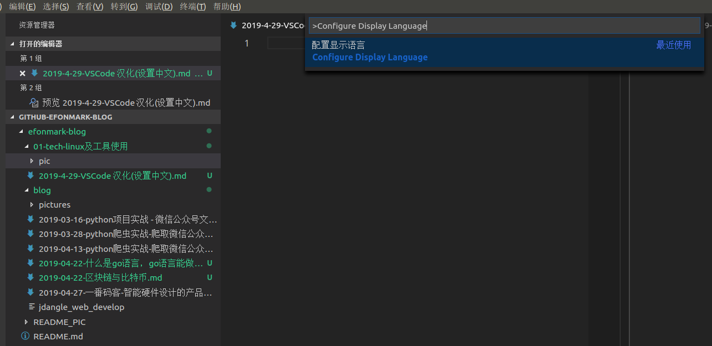

# 2019-04-30-VSCode配置与使用

> **https://github.com/efonmark/efonmark-blog**  
> 欢迎关注微信公众号“**一番码客**”获取**免费下载服务**与**源码**，并及时接收最新文章推送。
----
## 汉化(设置中文)

1. 在VSCode中按下快捷键“Ctrl + Shift + P”（显示命令面板 Show Command Palette）。  

2. 命令面板中输入“Configure Display Language”，回车进入。  

3. 选择"install additional languages..."  

4. 左边边侧栏选择Chinese（Simplified），点击install。  

5. 按下快捷键“Ctrl + Shift + P”，输入“Configure Display Language”，回车进入，下拉菜单中选择点击“zh-cn”,提示重启，选择重启
  

重启后发现成功了。切换其他语言步骤类似。  

## 快捷键

> 快速复制当前行到下一行：shift+alt+↓

## 插件

### Markdown All in One

1. hot key

|Key|Command
|:-:|:-:|
Ctrl + B|Toggle bold  
Ctrl + I|Toggle italic  
Ctrl + Shift + ]|Toggle heading (uplevel)  
Ctrl + Shift + [|Toggle heading (downlevel)  
Ctrl + M|Toggle math environment  
Alt + C|Check/Uncheck task list item  
Ctrl + Shift + V|Toggle preview  
Ctrl + K V|Toggle preview to side  
----

