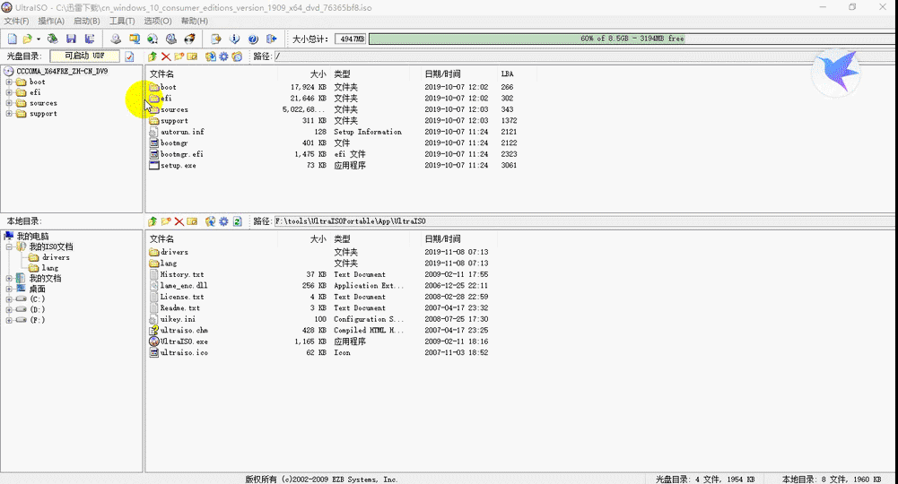
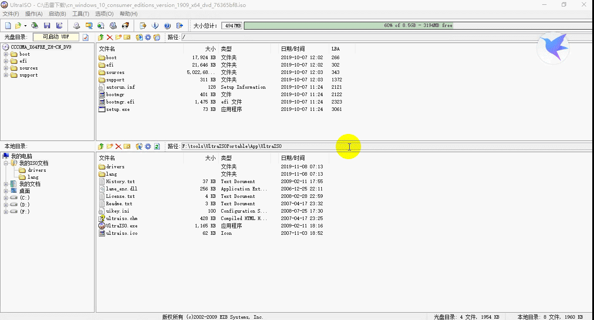

> **一番码客 : 挖掘你关心的亮点。**
> **http://www.efonmark.com**

本文目录：

[TOC]

## 前言

最近用了一段时间win10之后，有点对windows路转粉的意思，把所有的电脑都装成了win10系统，这里记录一下用U盘安装win10的过程和一些中间用到的工具，以及遇到的一些问题。

<!--more-->

## 工具准备

* win10专业版原版ISO镜像文件

> 迅雷下载链接：thunder://QUFodHRwOi8veHoxLmRhb2hhbmc0LmNvbS9jbl93aW5kb3dzXzEwX2NvbnN1bWVyX2VkaXRpb25zX3ZlcnNpb25fMTkwOV94NjRfZHZkXzc2MzY1YmY4Lmlzb1pa/
>
> 更多版本链接

* UltraISOPortable

> 作用：U盘启动盘制作工具。
>
> 链接：https://pan.baidu.com/s/1G1VNAVajPUfLbgP_7OuMcA  提取码：jbum 

* HEU_KMS_Activator_v11.1.0

> 作用：系统激活工具
>
> 链接：链接：https://pan.baidu.com/s/1ApozbpNnrCAAJYlimqtALQ 提取码：41p0 

## 制作启动盘

解压UltraISOPortable，以管理员身份打开UltraISOPortable.exe。

* 打开ISO文件，注意查看右上侧的大小总计，一般为4~5G比较正常。

* 插入U盘，启动→写入硬盘映像，注意这里会格式化清空U盘，注意U盘里的文件备份。

* 替换install.wim文件

  因为UltraISOPortable格式化U盘只能格式化为FAT32，而这个格式不支持4G以上的文件，install.wim在4G以上，所以需要用命令行先把U盘转换为NTFS格式（参考[解决使用UltraISO制作的启动U盘报错0x8007000D](http://blog.sina.cn/dpool/blog/s/blog_4d7f24990102x4sy.html?vt=4)），然后将ISO解压后把里面的 Sources\install.wim 替换到U盘里的 Sources\install.wim 文件。这才算是win10系统启动盘制作完成。

## 系统安装

重启电脑，选择启动盘（一般电脑按住F12或者deledte健可以选择），这时就进入U盘安装过程了。按照提示一步一步执行即可，整个安装过程大概半个小时左右。

## 系统激活

因为我们安装的是官方纯净版，需要激活，下载 HEU_KMS_Activator_v11.1.0 ，解压后运行可执行文件，选择“激活 Windows VL”，即可激活。

## 参考

* [解决使用UltraISO制作的启动U盘报错0x8007000D](http://blog.sina.cn/dpool/blog/s/blog_4d7f24990102x4sy.html?vt=4)
* [无法在驱动器0分区上安装windows解决方法](https://blog.csdn.net/Counting_Stars/article/details/81031102)

## 一番今日

一番早上起来给古董电脑装了系统，然后顺便写了这篇文章，虽然写的不尽人意，但还是花了两个多小时，主要是做实验比较花时间。一番后面准备好好经营下自己的个人博客，像经营企业一样的去经营。

> 一番雾语：暴富的人有，但一夜暴富的一定是个别，通常所谓的暴富都有一个积累期。

-------

> **免费知识星球： [一番码客-积累交流](http://www.efonmark.com/efonmark-blog/readme/zhishixingqiu1.png)**
> **微信公众号：[一番码客](http://www.efonmark.com/efonmark-blog/readme/guanzhu_1.jpg)**
> **微信：[Efon-fighting](http://www.efonmark.com/efonmark-blog/readme/weixin.jpg)**
> **网站： [http://www.efonmark.com](http://www.efonmark.com)**
