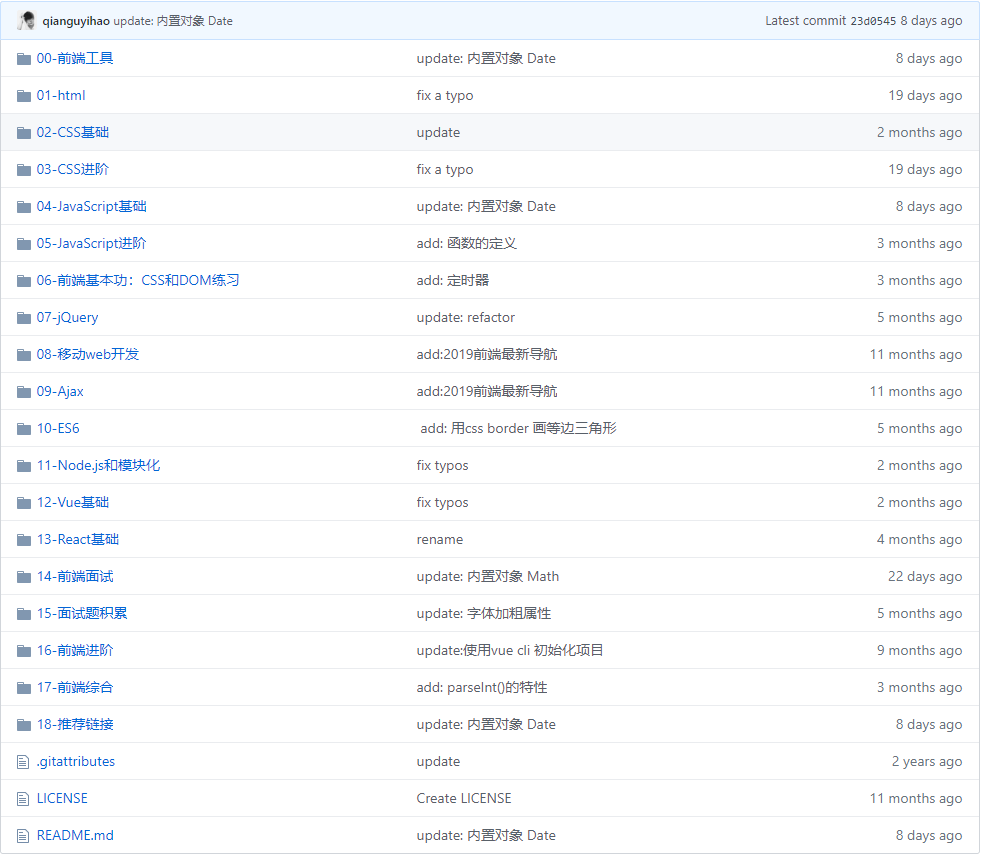

> **一番码客 : 挖掘你关心的亮点。**
> **http://www.efonmark.com**

本文目录：

[TOC]

<!--more-->

## 前言

微软出品，确实精品，现在VSCode在程序员领域里的各个行业、各种语言都有渗透，强大的插件库，让这个开发工具可以满足不同开发环境、语言环境的搭建。

所以，要想玩转VSCode，确实还需要不断摸索、使用。今天一番给大家介绍下在网上看到的两篇关于VSCode使用技巧比较全面的文章。

## vscode——无敌装B插件

<table>
    <td>
    文章地址： 
    
        <a>https://blog.csdn.net/weixin_39664337/article/details/93169450</a>
     
    </td>
</table>

> * beautiful UI
>
>     > 32个主题集合，具体使用看个人喜好。
>
> * winter is coming theme
>
>     > 一款主题插件。 
>
> * one drak pro
>
>     > 黑暗主题。 
>
> * better comments
>
>     > 通过使用警报、信息、待办事项等注释来改进代码注释。
>
> * auto close tag
>
>     > HTML自动补全标签。
>
> * bracket pair colorizer 2
>
>     > 用于对匹配括号上色的可自定义扩展。
>
> * code spell checker
>
>     > 对基本关键字拼写校验。
>
> * color info
>
>     > 提供有关CSS颜色的快速信息。
>
> * ESLint
>
>     > 借助 ESLint，可将 静态代码分析 和 问题代码协助修复 集成到 编码、提交 和 打包 过程中，及早发现并协助修复代码中。
>
> * git gistory
>
>     > 可以通过vscode直接pull put 代码。
>
> * markdown pdf
>
>     > pdf 查看。
>
> * material icon theme / vscode -icons
>
>     > Visual Studio代码的材料设计图标设计。
>
> * path inter llisense
>
>     > 路径补全。
>
> * smarty
>
>     > 语法关键字的突出显示。
>
> * xml tools
>
>     > 用于Visual Studio代码的ML格式、XQuery和XPath工具
>     > 功能很强大。
>
> * visual studio interllicode
>
>     > 人工智能辅助开发。

## 第一次使用VS Code时你应该知道的一切配置

<table>
    <td>
    文章地址： 
    
        <a>https://github.com/qianguyihao/Web/blob/master/00-前端工具/01-VS Code的使用.md</a>
     
    </td>
</table>

这篇文章就比较全了。

> 一、前言
> 二、VS Code 的介绍
> 三、VS Code快捷键
> 四、命令面板的使用
> 五、VS Code 的常见设置项
> 六、VS Code 设置-高级进阶
> 七、VS Code 插件推荐
> 八、主题插件
> 最后一段
> 参考链接

作者的博客文章放在github上，有9.9k的star，2.8k的fork，简直帅爆了！

> 一番雾语：千万开发者在用的优秀electron模板。

-------
<table>
<tr>
<td >

</td>
<td width="50%" align=left><b>
    免费知识星球：<a href="http://www.efonmark.com/efonmark-blog/readme/zhishixingqiu1.png">一番码客-积累交流</a> 
    微信公众号：<a href="http://www.efonmark.com/efonmark-blog/readme/guanzhu_1.jpg">一番码客</a> 
    微信：<a href="http://www.efonmark.com/efonmark-blog/readme/weixin.jpg">Efon-fighting</a> 
    网站：<a href="http://www.efonmark.com">http://www.efonmark.com</a> </b></td>
</tr>
</table>

