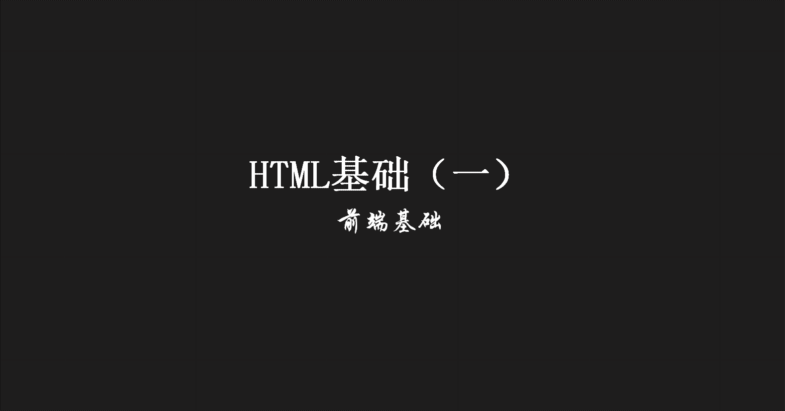
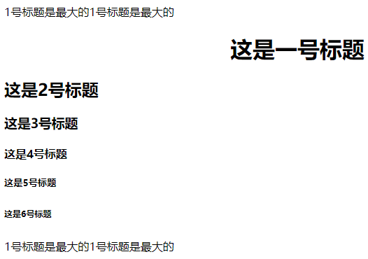
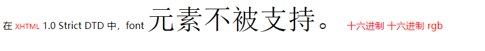
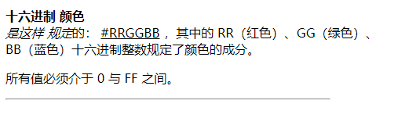

> **一番码客 : 挖掘你关心的亮点。**
> **http://efonfighting.imwork.net**

本文目录：

[TOC]



<!--more-->

## 基本结构

* `<!DOCTYPE>`声明：用来指定当前页面使用的HTML版本。
* 根标签`html`：声明当前文件是一个html文件。
* 子标签：
    * `head`：设置当前页面的信息，并不显示在页面上。
        * `charset`：指定当前页面使用的编码集。
        * `title`：网页的标题。
        * `description`：网页概述，给搜索引擎看的，一般写网页的关键字。
        * `keywords`：搜索引擎能搜索到的词，每个词之间用逗号隔开，必须是英文的逗号。
    * `body`：设置页面的内容。

* 注意：
    * 所有内容尽量放在标签中间。
    * 标签需要按照顺序进行正确的嵌套。
    * 标签可以有属性，属性格式为：属性名=“属性值”，属性值使用引号引起来；如果有多个属性使用空格进行分割。
    * 注释的写法：`<!--这是注释-->`。

## 文本相关标签

### h标签



```html
<!DOCTYPE html>
<html>
	<head>
		<meta charset="UTF-8">
        <title>标题标签</title>
        <meta name="description" content="描述内容，">
        <meta name="keywords" content="词1,词2,词3````````">
	</head>
	<body>
		<!--
			复制行: 光标停留某一行,按下Ctrl + C,粘贴 Ctrl + V
		-->
        
		<!--
			1号标题是最大的
			标题独占一行
			行间距比较大
			h : head
			属性的定义 : 写在开始标签中,
				格式 : 属性名="属性值"
		-->
		1号标题是最大的1号标题是最大的
		
		<h1 a align="right">这是一号标题</h1>
		<h2>这是2号标题</h2>
		<h3>这是3号标题</h3>
		<h4>这是4号标题</h4>
		<h5>这是5号标题</h5>
		<h6>这是6号标题</h6>

		1号标题是最大的1号标题是最大的
	</body>
</html>
```

* 标题标签，用于定义标题。
* 取值：1-6。
* 特点：字体加粗，上下留白，换行，h1最大，h6最小。
* 属性：align（设置对齐方式），默认值是left（左对齐），其他可选值right/center。

### 字体标签



```html
<!DOCTYPE html>
<html>

	<head>
		<meta charset="UTF-8">
		<title>字体标签</title>
		<style type="text/css">
			.f1 {
				/*color: rgb(255,0,0);*/
				color: rgb(100%,0%,0%);
			}
		</style>
	</head>

	<body>
		<!--
			color : 指定颜色
			face : 指定字体
			size: 指定字体大小,7是最大的
		-->
		在
		<font color="red" size="1">XHTML</font> 1.0 Strict DTD 中，font
		<font face="宋体" size="8">元素不被支持。</font>
		<!--
		取值范围是从00---ff
	-->
		<font color="#ff000f">十六进制</font>
		<font color="#f00">十六进制</font>
		<!--
			rgb方式只能用在CSS样式中
		-->
		<font class="f1">rgb</font>
	</body>

</html>
```

* 字体标签，用于定义文本字体、大小和颜色。
* 属性：
    * `color`：设置字体颜色；
    * `size`：设置字体大小；
    * `face`：设置字体；
* 颜色值的写法：
    * 十六进制颜色，例如#ffffff。
    * 使用英文单词，例如red。
    * RGB颜色，例如rgb(255,0,0)。

### 其他标签



```html
<!DOCTYPE html>
<html>
	<head>
		<meta charset="UTF-8">
		<title>其他标签</title>
	</head>
<!--
	换行的快捷键 : Shift + Enter
-->
	<body>
		<p><b>十六进制</b>
		<strong>颜色</strong><br/>
		<i>是这样</i>
		<em>规定</em>的：
		<u>#RRGGBB</u>
		，其中的 RR（红色）、GG（绿色）、BB（蓝色）十六进制整数规定了颜色的成分。</p>
		<p>所有值必须介于 0 与 FF 之间。</p>
		<hr width="80%" align="left"/>
		<!--
			自闭合标签,就是开始标签和结束标签是同一个
		-->
	</body>
</html>
```

* `b`：粗体。
* `strong`：粗体。把文本定义为语气更强的强调。
* `em`：把文本定义为强调的内容。
* `i`：斜体。
* `u`：下划线。
* `br`：换行。
* `p`：段落。
* `hr`：分割线。
    * 属性align，设置对齐方式。
    * 属性width，设置宽度，可以用百分比或像素值。

## 参考

* 黑马程序员 120天全栈区块链开发 开源教程

  > https://github.com/itheima1/BlockChain
  

----

> **一番雾语：学习一门技术，先概览建立认知，后练习孰能生巧。**

----------

> **免费知识星球： [一番码客-积累交流](http://efonfighting.imwork.net/efonmark-blog/%E7%AE%80%E4%BB%8B/zhishixingqiu1.png)**
> **微信公众号：[一番码客](http://efonfighting.imwork.net/efonmark-blog/%E7%AE%80%E4%BB%8B/guanzhu_1.jpg)**
> **微信：[Efon-fighting](http://efonfighting.imwork.net/efonmark-blog/%E7%AE%80%E4%BB%8B/weixin.jpg)**
> **网站： [http://efonfighting.imwork.net](http://efonfighting.imwork.net)**