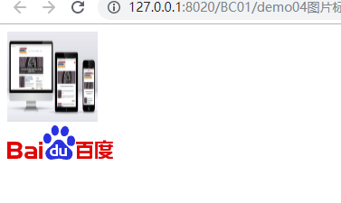
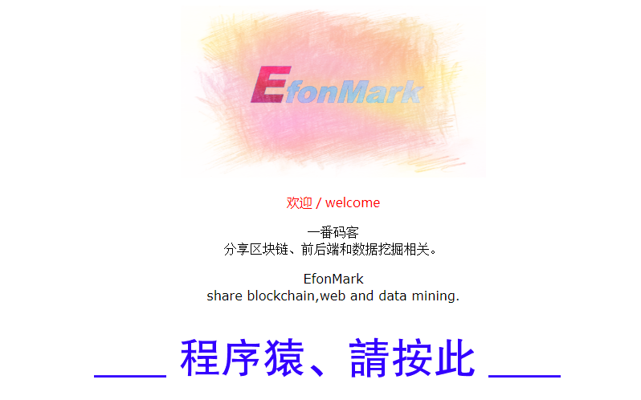
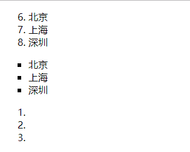
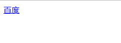
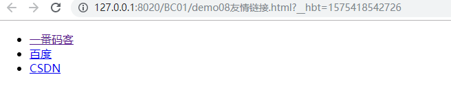
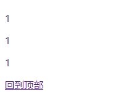

> **一番码客 : 挖掘你关心的亮点。**
> **http://efonfighting.imwork.net**

本文目录：

[TOC]


<!--more-->

## 图片标签



```html
<!DOCTYPE html>
<html>
	<head>
		<meta charset="UTF-8">
		<title>图片标签</title>
	</head>
	<body>
		<!--
			插入下一行 : Ctrl +Enter
			src : 图片的路径
				相对路径 : 参考自己
					./ : 同一级目录,可以省略
					../ : 上一级目录,不能省略
				绝对路径 : 带有协议或者盘符的路径
			alt : 图片加载失败的时候,显示的文本
		-->
        
		
	</body>
</html
```

* 图片标签，用来定义图片
* 属性：
    * `src`：图片路径。
    * `alt`：当图片显示不对时，代替图片显示的文字。
    * `width`：宽度。
    * `height`：高度。
* 路径：
    * 相对路径：`./`代表当前目录，可以省略。`../`代表上级目录，不能省略。
    * 绝对路径：带有协议或主机名。

### 示例



```html
<!DOCTYPE html>
<html>

	<head>
		<meta charset="UTF-8">
		<title>程序猿</title>
	</head>

	<body>
		<p align="center">
			</p>
			
		<p align="center">
			<font color="red">欢迎 / welcome</font>
		</p>
		
		<p align="center">
			<font face="宋体">
			一番码客<br /> 分享区块链、前后端和数据挖掘相关。</font>
		</p>
		
		<p align="center">
			<font face="Verdana">
			EfonMark<br /> share blockchain,web and data mining. </font></p>
		<p align="center"> </p>
	</body>

</html>
```

## 列表标签



```html
<!DOCTYPE html>
<html>

	<head>
		<meta charset="UTF-8">
		<title>列表标签</title>
	</head>

	<body>
		<!--
			ol : ordered list
			li : list item
			ul : unordered list
			type : 指定类型
			start : 指定起始值
		-->
		<ol type="1" start="6">
			<li>北京</li>
			<li>上海</li>
			<li>深圳</li>
		</ol>
		<ul type="square">
			<li>北京</li>
			<li>上海</li>
			<li>深圳</li>
		</ul>
		
		<ol>
			<li></li>
			<li></li>
			<li></li>
		</ol>
		
	</body>

</html>
```

* `ol`标签：有序列表。
    * `type`属性，取值1（默认值），a，A，i，I。
* `ul`标签：无序列表
    * `type`属性，取值disc（默认值，实心圆），circle（空心圆），square（实心方块）。
* `li`标签：列表项

## a标签



```html
<!DOCTYPE html>
<html>
	<head>
		<meta charset="UTF-8">
		<title>a标签</title>
	</head>
	<body>
		<!--
			href : 跳转的地址.不清楚超链接要跳转到那里去的时候,也要写一个占位符
			target : 指定使用什么样的方式打开新的页面
		-->
		<a href="#"></a>
		<a href="http://www.baidu.com" target="_blank">百度</a>
	</body>
</html>
```

* 用于定义超链接。
* 属性：
    * `href`：指定链接地址。
    * `target`：指定如何打开页面。取值\_blank，\_parent，\_self，_top。

### 示例：友情链接



```html
<!DOCTYPE html>
<html>

	<head>
		<meta charset="UTF-8">
		<title>友情链接</title>
	</head>

	<body>

		<ul>
			<li>
				<a href="http://efonfighting.imwork.net">一番码客</a>
			</li>
			<li>
				<a href="http://www.baidu.com">百度</a>
			</li>
			<li>
				<a href="http://www.csdn.net">CSDN</a>
			</li>
		</ul>

	</body>

</html>
```

* 快捷创建：`>ul>li*3>a` + `tab`

### 示例：回到顶部



```html
<!DOCTYPE html>
<html>

	<head>
		<meta charset="UTF-8">
		<title>回到顶部</title>
	</head>

	<body>
		<p id="top">1</p>
		<p>1</p>
		<p>1</p>
		<p>1</p>
		<p>1</p>
		<p>1</p>
		<p>1</p>
		<p>1</p>
		<p>1</p>
		<p>1</p>
		<p>1</p>
		<p>1</p>
		<p>1</p>
		<p>1</p>
		<p>1</p>
		<p>1</p>
		<p>1</p>
		<p>1</p>
		<p>1</p>
		<p>1</p>
		<p>1</p>
		<p>1</p>
		<p>1</p>
		<p>1</p>
		<p>1</p>
		<p>1</p>
		<p>1</p>
		<p>1</p>
		<p>1</p>
		<p>1</p>
		<p>1</p>
		<p>1</p>
		<p>1</p>
		<p>1</p>
		<p>1</p>
		<p>1</p>
		<p>1</p>
		<p>1</p>
		<p>1</p>
		<p>1</p>
		<p>1</p>
		<p>1</p>
		<p>1</p>
		<p>1</p>
		<p>1</p>
		<p>1</p>
		<p>1</p>
		<p>1</p>
		<p>1</p>
		<p>1</p>
		<p>1</p>
		<p>1</p>
		<p>1</p>
		<p>1</p>
		<p>1</p>
		<p>1</p>
		<p>1</p>
		<p>1</p>
		<p>1</p>
		<p>1</p>
		<p>1</p>
		<a href="#top">回到顶部</a>
		
	</body>

</html>
```

* id选择器

## 参考

* 黑马程序员 120天全栈区块链开发 开源教程

  > https://github.com/itheima1/BlockChain
  

----

> **一番雾语：计算机技术是一门实践实践性很强的技术。**

----------

> **免费知识星球： [一番码客-积累交流](http://efonfighting.imwork.net/efonmark-blog/%E7%AE%80%E4%BB%8B/zhishixingqiu1.png)**
> **微信公众号：[一番码客](http://efonfighting.imwork.net/efonmark-blog/%E7%AE%80%E4%BB%8B/guanzhu_1.jpg)**
> **微信：[Efon-fighting](http://efonfighting.imwork.net/efonmark-blog/%E7%AE%80%E4%BB%8B/weixin.jpg)**
> **网站： [http://efonfighting.imwork.net](http://efonfighting.imwork.net)**