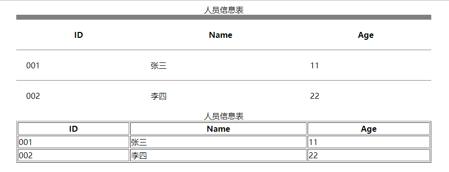
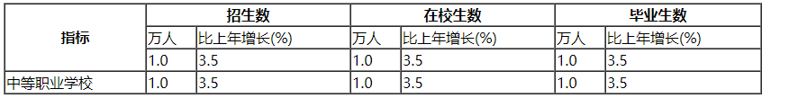

> **一番码客 : 挖掘你关心的亮点。**
> **http://www.efonmark.com**

本文目录：

[TOC]


<!--more-->

## 表格标签



```html
<!DOCTYPE html>
<html>

	<head>
		<meta charset="UTF-8">
		<title>表格标签</title>
	</head>

	<body>
		<!--
			代表是一个表格
			tr : table row 行
			td : table data 数据格
			th : table header 表头
		-->
		<!--
			table的属性
				align : 对齐方式
				border : 边框的宽度
				width : 表格的宽度
				padding : 内边距
				cellpadding : 格子里的内容和格子的间距
				cellspacing : 格子和格子之间的间距
				frame : 外边框的显示
				rules : 内边框的显示
		-->
		<table rules="rows" frame="above" border="10px" align="center" width="90%" cellpadding="20px" cellspacing="0">
			<!--
				指定标题
				caption标签必须写在 table标签之后
			-->
			<caption>人员信息表</caption>
			<tr>
				<th>ID</th>
				<th>Name</th>
				<th>Age</th>
			</tr>
			<tr>
				<td>001</td>
				<td>张三</td>
				<td>11</td>
			</tr>
			<tr>
				<td>002</td>
				<td>李四</td>
				<td>22</td>
			</tr>
		</table>
		
		<table border="1px" align="center" width="90%" >
			<!--
				指定标题
				caption标签必须写在 table标签之后
			-->
			<caption>人员信息表</caption>
			<tr>
				<th>ID</th>
				<th>Name</th>
				<th>Age</th>
			</tr>
			<tr>
				<td>001</td>
				<td>张三</td>
				<td>11</td>
			</tr>
			<tr>
				<td>002</td>
				<td>李四</td>
				<td>22</td>
			</tr>
		</table>
	</body>

</html>
```

用于定一个表格，或用于页面布局。

### table标签

* 代表标签中的内容是表格。

* 属性：

    * `border`：边框宽度。
* `width`：宽度。
    * `height`：高度。
* `align`：对齐方式。
    * `cellpadding` ：格子里的内容和格子的间距。
* `cellspacing` ：格子和格子之间的间距。
    * `frame` ：外边框的显示。
* `rules` ：内边框的显示。

### caption标签

* 指定表格的标题。
* html是从上到下、从左往右的加载的，caption必须写在table标签之后。

### th/tr/td标签

* `tr`：table row 行。
* `td`：table data 数据格。
* `th`：table header 表头。
* `align`属性，用于定义对齐方式。

## 表格的删除与合并


```html
<!DOCTYPE html>
<html>

	<head>
		<meta charset="UTF-8">
		<title>表格标签</title>
	</head>

	<body>
		<!--
			浏览器在解析表格的时候,会把table标签作为一个整体进行解析
			为了提高用户的使用体验,表格应该使用结构标签
		-->

		<table border="1px" align="center" width="90%">
			<!--
				指定标题
				caption标签必须写在 table标签之后
			-->
			<caption>人员信息表</caption>
			<!--
				表头
			-->
			<thead>
				<tr>
					<th>ID</th>
					<th>Name</th>
					<th>Age</th>
				</tr>
			</thead>
			<!--
				内容区
			-->
			<tbody>
				<tr>
					<td>001</td>
					<td>张三</td>
					<td>11</td>
				</tr>
				<tr>
					<td>002</td>
					<td>李四</td>
					<td>22</td>
				</tr>
				<tr>
					<td>001</td>
					<td>张三</td>
					<td>11</td>
				</tr>
			</tbody>
			<!--
				页脚
			-->
			<tfoot>

			</tfoot>

		</table>
	</body>

</html>
```

* `thead`，`tbody`，`tfoot`，跟顺序无关。

### 表格行列的删除

* 行的删除 : 删除tr包括里面的td。
* 列的删除 : 要删除所有行中对应的列,否则表格会发生错位。
### 表格行列的合并



```html
<!DOCTYPE html>
<html>

	<head>
		<meta charset="UTF-8">
		<title>行列的合并</title>
	</head>
	<!--
		rowspan : 指定行的合并,
				从上往下,找到第一个格子,设置rowspan属性
				属性值 :指定总共合并了多少个格子
				被合并的格子要删除
		colspan : 指定列的合并,
				从左往右,找到第一个格子,设置colspan属性
				属性值 :指定总共合并了多少个格子
				被合并的格子要删除
-->

	<body>
		<table border="1" cellspacing="0" width="90%">
			<tr>
				<th rowspan="3">指标</th>
				<th colspan="2">招生数</th>

				<th colspan="2">在校生数</th>
				<th colspan="2">毕业生数</th>
			</tr>
			<tr>

				<td>万人</td>
				<td>比上年增长(%)</td>
				<td>万人</td>
				<td>比上年增长(%)</td>
				<td>万人</td>
				<td>比上年增长(%)</td>
			</tr>
			<tr>
				<td>1.0</td>
				<td>3.5</td>
				<td>1.0</td>
				<td>3.5</td>
				<td>1.0</td>
				<td>3.5</td>
			</tr>
			<tr>
				<td>中等职业学校</td>
				<td>1.0</td>
				<td>3.5</td>
				<td>1.0</td>
				<td>3.5</td>
				<td>1.0</td>
				<td>3.5</td>
			</tr>
		</table>
	</body>

</html>
```

* `rowspan`：指定行的合并。
    * 从上往下，找到第一个格子，设置rowspan属性。
    * 属性值：指定总共合并了多少个格子。
    * 被合并的格子要删除。
* `colspan` : 指定列的合并。
    * 从左往右,找到第一个格子，设置colspan属性。
    * 属性值 :指定总共合并了多少个格子。
    * 被合并的格子要删除。

## 参考

* 黑马程序员 120天全栈区块链开发 开源教程

  > https://github.com/itheima1/BlockChain
  

----

> **一番雾语：脚踏实地，一步一步。**

----------

> **免费知识星球： [一番码客-积累交流](http://www.efonmark.com/efonmark-blog/readme/zhishixingqiu1.png)**
> **微信公众号：[一番码客](http://www.efonmark.com/efonmark-blog/readme/guanzhu_1.jpg)**
> **微信：[Efon-fighting](http://www.efonmark.com/efonmark-blog/readme/weixin.jpg)**
> **网站： [http://www.efonmark.com](http://www.efonmark.com)**