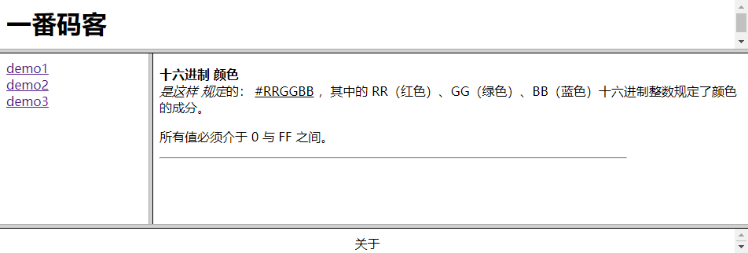
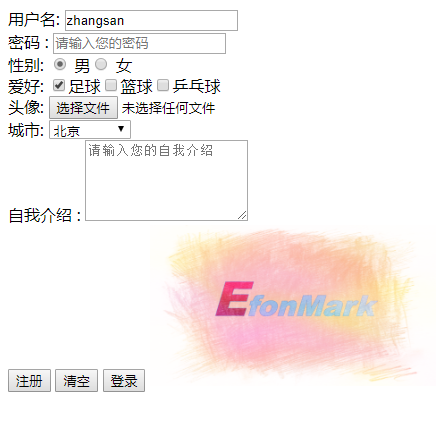

> **一番码客：挖掘你关心的亮点。**
> **http://efonfighting.imwork.net**

本文目录：

[TOC]


<!--more-->

## 框架标签



```html
<!DOCTYPE html>
<html>

	<head>
		<meta charset="UTF-8">
		<title>框架集</title>
	</head>
	<!--
		框架标签和body标签不可以同时使用
	-->
	<!--
		定义框架集
	-->
	<frameset rows="*,70%,10%">
		<!--
			src：指定引用的页面的路径
		-->

		<frame src="demo12_top.html" />
		<frameset cols="20%,*">
			<frame src="demo12_left.html" />
			<frame name="content" />
		</frameset>
		<frame src="demo12_bottom.html" />
	</frameset>

</html>
```

### frameset标签

* 用于定义框架集
* 属性
    * `cols`：垂直切割。
    * `rows`：水平切割。
* `frameset`和`body`不能同时使用。

### frame标签

* 用于具体展示页面。

* 被引用的页面不需要完整的结构，只需要页面内容即可，去除body之外的内容。
* 属性：
    * `src`：页面的路径。
    * `name`：框架的名称。

## 表单标签



```html
<!DOCTYPE html>
<html>

	<head>
		<meta charset="UTF-8">
		<title>表单标签</title>
	</head>

	<body>
		<form action="" method="post">
			用户名: <input value="zhangsan" name="username" type="text" placeholder="请输入您的用户名"/><br />
			 密码：<input name="password" type="password" placeholder="请输入您的密码"/><br /> 
			 性别: <input type="radio" name="gender" checked="checked" value="male"/> 男<input value="female" type="radio" name="gender" /> 女<br />
			  爱好: <input value="football" name="hobby" type="checkbox" checked="checked"/>足球<input type="checkbox" name="hobby"   value="basketball" />篮球<input type="checkbox"  name="hobby"  value="pingpang" />乒乓球<br />
			   头像: <input type="file" name="icon"/><br /> 
			   城市:
			<select  name="city" >
				<option>--请选择--</option>
				<optgroup label="北方城市">
					<option selected="selected" value="bj">北京</option>
					<option value="tj">天津</option>

				</optgroup>
				<optgroup label="南方城市">
					<option value="shh">上海</option>
					<option value="sz">深圳</option>
				</optgroup>

			</select><br />
			自我介绍：
			<!--
				rows :行数
				cols：列数
			-->
			<textarea  name="introduce"  cols="20" rows="5" placeholder="请输入您的自我介绍"></textarea>
				<br />
			<input type="submit" value="注册" />
			<input type="reset" value="清空" />
			<input type="button" value="登录" />
			<input type="image" src="img/logo_efonmark_caihui.png" width="15%"/>
		</form>
	</body>

</html>
```

### input标签

* 属性：`type`，指定输入框的类型。
    * `text`：普通的输入框。
    * `password`：密码输入框
    * `radio`：单选
    * `checkbox`：多选
    * `file`：文件选择框
    * `submit`：提交按钮
    * `reset`：清空按钮
    * `button`：普通按钮,事件要由自己来处理
    * `hidden`：隐藏域
    * `image`：图片

### select标签

* 下拉框

### textarea标签

* 文本域

### 通用属性
* `name`
    * 指定传递数据给后台的key的名字。
    * 对单选框和复选框进行分组。
    * 数据要传输给后台，必须指定该属性。
* `value`
    * 指定按钮上的文本。
    * 指定选择框在选中的状态，传递给后台的数据。
* `placeholder`
    * 用在输入框中的，提示文本。
* `checked="checked"`
    * 指定单选框和复选框的选中状态。
* `selected="selected"`
    * 指定下拉框的选中状态。

* `action`
    * 指定传递数据的地址。
* `method` : 请求方式。
    * `get`
        * 默认，传递数据的时候,是拼接在原地址的后面。传输的数据的大小一般是1Kb。
        * `?username=zhangsan&password=123&gender=on&hobby=on&hobby=on&city=%E5%8C%97%E4%BA%AC&introduce=ziwojieshao`
        * `get`请求，在原地址的后面以`?`拼接参数传递给后台。
        * `key = value`的形式去拼接，如果有多个参数，参数和参数之间使用`&`连接起来。
    * `post`：隐藏起来。相对来说，post请求更加安全。在传输文件的时候一定是使用post请求。


## 参考

* 黑马程序员 120天全栈区块链开发 开源教程

  > https://github.com/itheima1/BlockChain
  

----

> **一番雾语：学习一门技术，先概览建立认知，后练习孰能生巧。**

----------

> **免费知识星球： [一番码客-积累交流](http://efonfighting.imwork.net/efonmark-blog/%E7%AE%80%E4%BB%8B/zhishixingqiu1.png)**
> **微信公众号：[一番码客](http://efonfighting.imwork.net/efonmark-blog/%E7%AE%80%E4%BB%8B/guanzhu_1.jpg)**
> **微信：[Efon-fighting](http://efonfighting.imwork.net/efonmark-blog/%E7%AE%80%E4%BB%8B/weixin.jpg)**
> **网站： [http://efonfighting.imwork.net](http://efonfighting.imwork.net)**