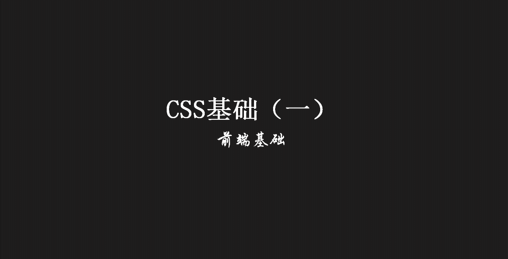

> **一番码客：挖掘你关心的亮点。**
> **http://efonfighting.imwork.net**

本文目录：

[TOC]



<!--more-->

## 简介

* 关系
    * HTML用于展示网页内容（毛坯房）。
    * CSS用于控制样式（装修工）。
    * Javascript控制行为（智能家电）。
* 定义
    * 全称：Cascading Style Sheets，层叠样式表。
    * 定义HTML内容在浏览器中的显示样式。
* 作用
    * 简化页面，减少网页体积，提高响应速度。
    * 将页面和显示分离。
    * 更好的维护网页，提高开发效率。

## 快速入门


```html
<!DOCTYPE html>
<html>
	<head>
		<meta charset="UTF-8">
		<title>一番码客</title>
		<style type="text/css">
			p{
				color: red;
				font-size: 150px;
			}
		</style>
	</head>
	<body>
		<p>一番码客</p>
	</body>
</html>
```

* 规则：在head标签中声明style标签，在style标签中书写样式。
* 格式：标签名{属性名:属性值;属性名:属性值;}。
* 注释格式：/\*我是注释*/。

## 参考

* 黑马程序员 120天全栈区块链开发 开源教程

  > https://github.com/itheima1/BlockChain
  

----

> **一番雾语：前端三把斧：HTML、CSS、Javascript。**

----------

> **免费知识星球： [一番码客-积累交流](http://efonfighting.imwork.net/efonmark-blog/%E7%AE%80%E4%BB%8B/zhishixingqiu1.png)**
> **微信公众号：[一番码客](http://efonfighting.imwork.net/efonmark-blog/%E7%AE%80%E4%BB%8B/guanzhu_1.jpg)**
> **微信：[Efon-fighting](http://efonfighting.imwork.net/efonmark-blog/%E7%AE%80%E4%BB%8B/weixin.jpg)**
> **网站： [http://efonfighting.imwork.net](http://efonfighting.imwork.net)**