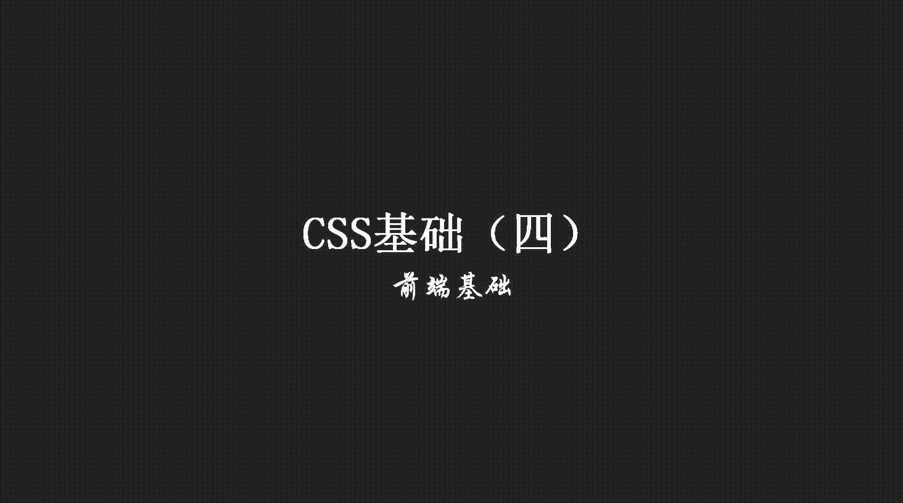
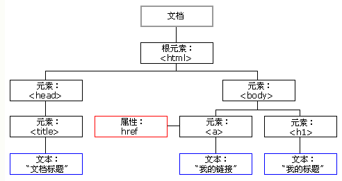
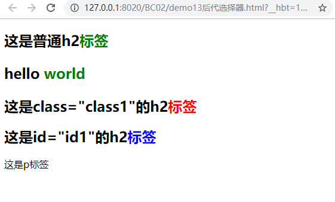
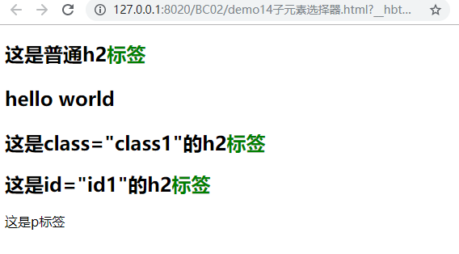
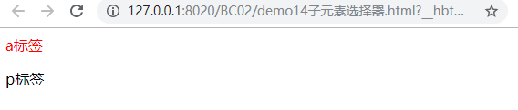
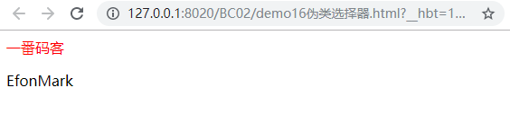

> **一番码客：挖掘你关心的亮点。**
> **http://efonfighting.imwork.net**

本文目录：

[TOC]



<!--more-->

## DOM的关系



* 元素：标签和内容
* 关系：父子关系、亲兄弟关系、后代关系。

## 后代选择器



```html
<!DOCTYPE html>
<html>
	<head>
		<meta charset="UTF-8">
		<title>一番码客</title>
		<style>
			/*h2标签下的所有span标签中的内容显示为绿色*/
			h2 span{
				color: green;
			}
			
			/*class="class1"的h2标签下所有的span标签中的内容显示为红色*/
			h2.class1 span{
				color: red;
			}
			
			/*id="id1"的h2标签下所有的span标签中的内容显示为蓝色*/
			h2#id1 span{
				color: blue;
			}
		</style>
	</head>
	
	<body>
		<h2>这是普通h2<span>标签</span> <p>hello <span>world</span></p> </h2>
		<h2 class="class1">这是class="class1"的h2<span>标签</span></h2>
		<h2 id="id1">这是id="id1"的h2<span>标签</span></h2>
		<p>这是p<span>标签</span></p>
	</body>
</html>
```

* 后代选择器是包含孙子节点的。
* 使用：`选择器[空格]选择器{定义样式}`

## 子元素选择器



```html
<!DOCTYPE html>
<html>
	<head>
		<meta charset="UTF-8">
		<title>一番码客</title>
		<style>
			/*h2标签下的所有span标签（只能是h2的子元素）中的内容显示为绿色*/
			h2>span{
				color: green;
			}
		</style>
	</head>
	
	<body>
		<h2>这是普通h2<span>标签</span> <p>hello <span>world</span></p> </h2>
		<h2 class="class1">这是class="class1"的h2<span>标签</span></h2>
		<h2 id="id1">这是id="id1"的h2<span>标签</span></h2>
		<p>这是p<span>标签</span></p>
	</body>
</html>
```

* 子元素选择器只查找子元素，不包含孙子节点。
* 使用：`选择器>选择器{定义样式}`

## 属性选择器



```html
<!DOCTYPE html>
<html>
	<head>
		<meta charset="UTF-8">
		<title>一番码客</title>
		<!--
        	更改页面上有id属性的文本的颜色为红色。
        -->
		<!--<style>
			[id] {
				color: red;
			}
		</style>-->
		
		<!--
        	更改页面上有id=id_a文本的颜色为红色
        -->
        <style>
        	[id="id_a"] {
        		color: red;
        	}
        </style>
	</head>
	
	<body>
		<a id="id_a">a标签</a>
		<p id="id_p">p标签</p>
	</body>
</html>
```

* 对包含某一属性的元素进行操作。
* 使用：`[属性名]{定义样式}`，`[属性名="属性值"]{定义样式}`

## 伪类选择器



```html
<!DOCTYPE html>
<html>
	<head>
		<meta charset="UTF-8">
		<title></title>
		<style>
			/*伪类选择器顺序不能被打乱，打乱状态会丢失，不生效*/
			a:link {
					color: #FF0000;
					text-decoration: none;
				}		/* 未访问的链接 */
			a:visited {color: #00FF00}	/* 已访问的链接 */
			a:hover {color: #FF00FF}	/* 鼠标移动到链接上 */
			a:active {color: #0000FF}	/* 选定的链接 */
			
			p:hover {color: #FF00FF}	/* 鼠标移动到链接上 */
			p:active {color: #0000FF}	/* 选定的链接 */
		</style>
	</head>
	<body>
		<a href="efonfighting.imwork.net">一番码客</a>
		<p>EfonMark</p>
	</body>
</html>
```

* 通常用于定义超链接的样式。
* 伪类选择器顺序不能被打乱，打乱状态会丢失，不生效。
* `hover`和`active`可以使用在其他标签上。

## 参考

* 黑马程序员 120天全栈区块链开发 开源教程

  > https://github.com/itheima1/BlockChain
  

----

> **一番雾语：CSS选择器。**

----------

> **免费知识星球： [一番码客-积累交流](http://efonfighting.imwork.net/efonmark-blog/%E7%AE%80%E4%BB%8B/zhishixingqiu1.png)**
> **微信公众号：[一番码客](http://efonfighting.imwork.net/efonmark-blog/%E7%AE%80%E4%BB%8B/guanzhu_1.jpg)**
> **微信：[Efon-fighting](http://efonfighting.imwork.net/efonmark-blog/%E7%AE%80%E4%BB%8B/weixin.jpg)**
> **网站： [http://efonfighting.imwork.net](http://efonfighting.imwork.net)**