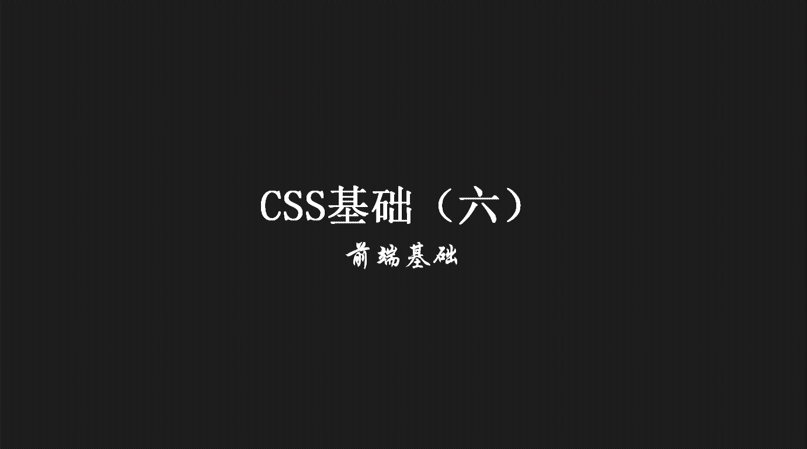
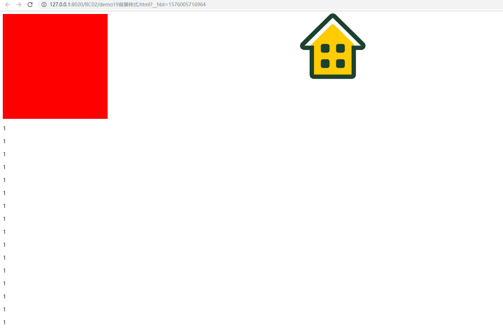
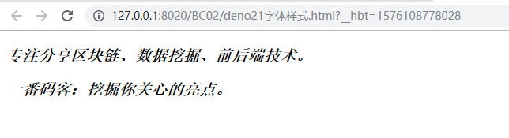
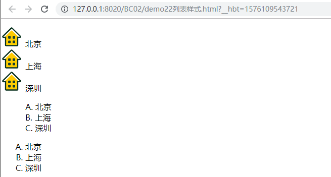
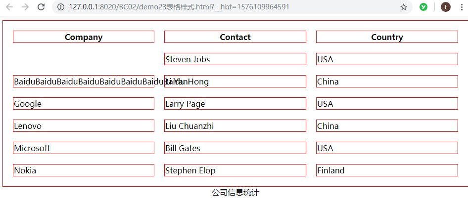
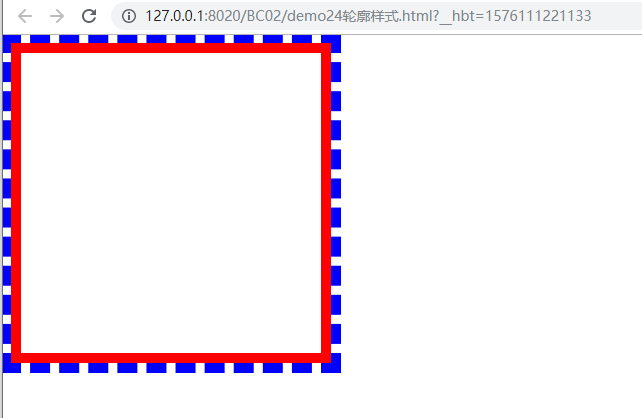

> **一番码客：挖掘你关心的亮点。**
> **http://efonfighting.imwork.net**

本文目录：

[TOC]



<!--more-->

## 背景样式



```html
<!DOCTYPE html>
<html>
	<head>
		<meta charset="UTF-8">
		<title></title>
		<style type="text/css">
			.div1{
				width: 300px;
				height: 300px;
				background: red;
			}
			body{
				background-image: url(img/小区说事.png);
				background-repeat: no-repeat;
				background-position: top center;
				background-attachment: fixed;
			}
		</style>
	</head>
	<body>
		<div class="div1"></div>
		<p>1</p>
		<p>1</p>
		<p>1</p>
		<p>1</p>
		<p>1</p>
		<p>1</p>
		<p>1</p>
		<p>1</p>
		<p>1</p>
		<p>1</p>
		<p>1</p>
		<p>1</p>
		<p>1</p>
		<p>1</p>
		<p>1</p>
		<p>1</p>
		<p>1</p>
		<p>1</p>
		<p>1</p>
		<p>1</p>
		<p>1</p>
		<p>1</p>
		<p>1</p>
		<p>1</p>
		<p>1</p>
		<p>1</p>
		<p>1</p>
		<p>1</p>
		<p>1</p>
		<p>1</p>
		<p>1</p>
		<p>1</p>
	</body>
</html>
```

## 文本样式


```html
<!DOCTYPE html>
<html>
	<head>
		<meta charset="UTF-8">
		<title></title>
		<style type="text/css">
			p{
				line-height: 20px; /*设置行高。*/
				letter-spacing: 5px; /*设置字符间距。*/
				text-align: center; /*规定文本的水平对齐方式。*/
				text-decoration: underline; /*通常用于去掉a标签的下划线*/
				text-indent: 2em; /*设置缩进*/
			}
		</style>
	</head>
	<body>
		<p>专注分享区块链、数据挖掘、前后端技术。</p>
		<p>一番码客：挖掘你关心的亮点。</p>
	</body>
</html>
```

## 字体样式



```html
<!DOCTYPE html>
<html>
	<head>
		<meta charset="UTF-8">
		<title></title>
		<style type="text/css">
			p{
				/*
				 * 字体设置的时候，一般会至少设置三种；
				 * 第一字体不生效的时候会尝试第二字体；
				 */
				font-family: "宋体";
				/*设置字体尺寸*/
				font-size: 20px;
				font-style: italic;
				font-weight: bolder;
			}
		</style>
	</head>
	<body>
		<p>专注分享区块链、数据挖掘、前后端技术。</p>
		<p>一番码客：挖掘你关心的亮点。</p>
	</body>
</html>
```

## 列表样式



```html
<!DOCTYPE html>
<html>
	<head>
		<meta charset="UTF-8">
		<title></title>
		<!--
			list-style	在一个声明中设置所有的列表属性。
			list-style-image	将图象设置为列表项标记。
			list-style-position	设置列表项标记的放置位置。
			list-style-type	设置列表项标记的类型。
		-->
		<style type="text/css">
			ul.u1{
				list-style-image: url(img/小区说事.png);
			}
			ul.u2{
				list-style-type: upper-latin;
				list-style-position: inside;
			}
			ul.u3{
				list-style-type: upper-latin;
				list-style-position: outside;
			}
		</style>
	</head>
	<body>
		<ul class="u1">
			<li>北京</li>
			<li>上海</li>
			<li>深圳</li>
		</ul>
		
		<ul class="u2">
			<li>北京</li>
			<li>上海</li>
			<li>深圳</li>
		</ul>
		
		<ul class="u3">
			<li>北京</li>
			<li>上海</li>
			<li>深圳</li>
		</ul>
	</body>
</html>
```

## 表格样式



```html
<!DOCTYPE html>
<html>
	<head>
		<meta charset="UTF-8">
		<title></title>
		<style type="text/css">
			/*
			 * border-collapse	设置是否把表格边框合并为单一的边框。
			 * border-spacing	设置分隔单元格边框的距离。
			 * caption-side	设置表格标题的位置。
			 * empty-cells	设置是否显示表格中的空单元格。
			 * table-layout	设置显示单元、行和列的算法。
			 */
			table,th,tr,td{
				border: 1px solid red;
				/*border-collapse: collapse;*/
				border-spacing: 20px;
				empty-cells: hide; /*设置空单元格*/
				table-layout: fixed; 
			}
			table{
				width: 100%;
			}
			caption{
				caption-side: bottom;
			}
		</style>
	</head>
	<body>
		<table id="customers">
		<caption>
			公司信息统计
		</caption>
		<tr>
		<th>Company</th>
		<th>Contact</th>
		<th>Country</th>
		</tr>
		
		<tr>
		<td></td>
		<td>Steven Jobs</td>
		<td>USA</td>
		</tr>
		
		<tr class="alt">
		<td>BaiduBaiduBaiduBaiduBaiduBaiduBaiduBaidu</td>
		<td>Li YanHong</td>
		<td>China</td>
		</tr>
		
		<tr>
		<td>Google</td>
		<td>Larry Page</td>
		<td>USA</td>
		</tr>
		
		<tr class="alt">
		<td>Lenovo</td>
		<td>Liu Chuanzhi</td>
		<td>China</td>
		</tr>
		
		<tr>
		<td>Microsoft</td>
		<td>Bill Gates</td>
		<td>USA</td>
		</tr>
		
		<tr class="alt">
		<td>Nokia</td>
		<td>Stephen Elop</td>
		<td>Finland</td>
		</tr>
		
		</table>
	</body>
</html>
```

## 轮廓样式



```html
<!DOCTYPE html>
<html>

	<head>
		<meta charset="{CHARSET}">
		<title></title>
	</head>
	<style type="text/css">
		.div1{
			border: 10px solid red;
			outline: 10px dashed blue;
			width: 300px;
			height: 300px;
		}
	</style>

	<body>
		<div class="div1">
			
		</div>
	</body>

</html>
```


## 参考

* 黑马程序员 120天全栈区块链开发 开源教程

  > https://github.com/itheima1/BlockChain
  

----

> **一番雾语：CSS样式。**

----------

> **免费知识星球： [一番码客-积累交流](http://efonfighting.imwork.net/efonmark-blog/%E7%AE%80%E4%BB%8B/zhishixingqiu1.png)**
> **微信公众号：[一番码客](http://efonfighting.imwork.net/efonmark-blog/%E7%AE%80%E4%BB%8B/guanzhu_1.jpg)**
> **微信：[Efon-fighting](http://efonfighting.imwork.net/efonmark-blog/%E7%AE%80%E4%BB%8B/weixin.jpg)**
> **网站： [http://efonfighting.imwork.net](http://efonfighting.imwork.net)**