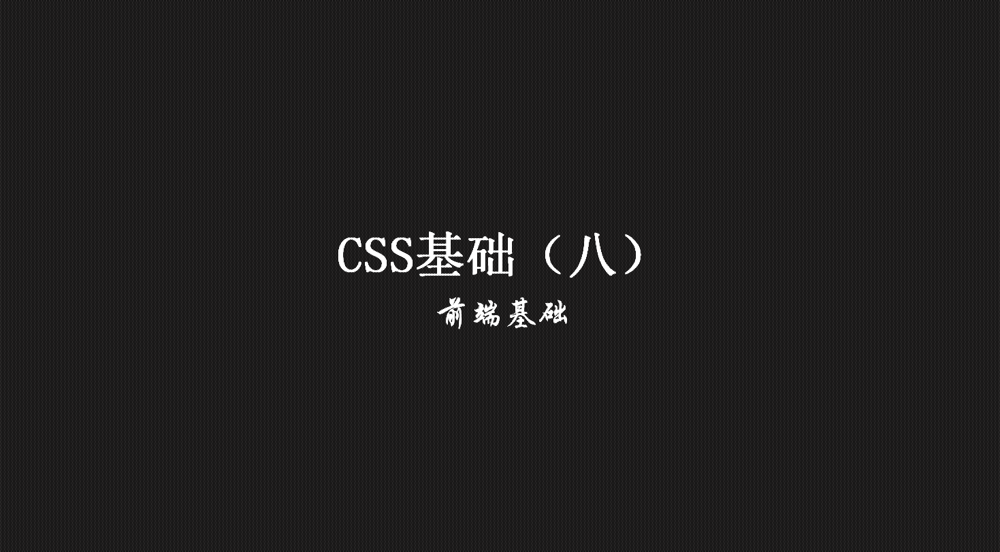
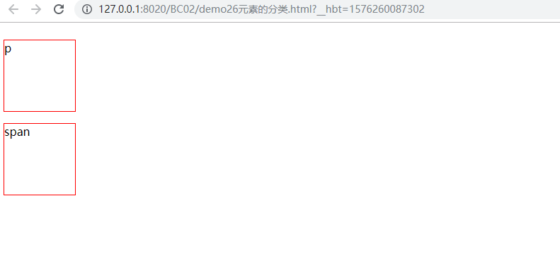
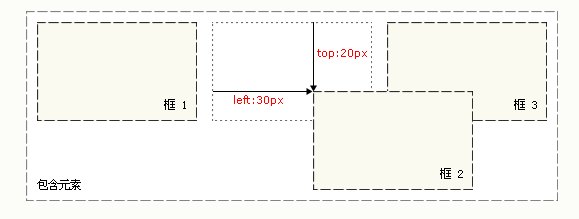
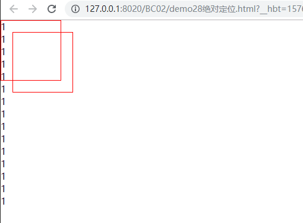
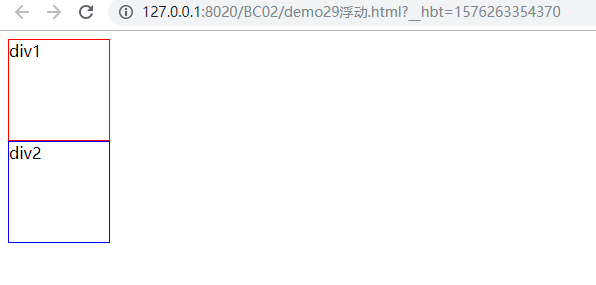
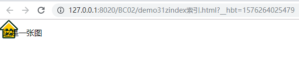

> **一番码客：挖掘你关心的亮点。**
> **http://efonfighting.imwork.net**

本文目录：

[TOC]



<!--more-->

## 元素的分类



```html
<!DOCTYPE html>
<html>
	<head>
		<meta charset="UTF-8">
		<title></title>
		<style>
			p{
				width: 100px;
				height: 100px;
				border: 1px solid red;
				display: inline-block;
			}
			span{
				width: 100px;
				height: 100px;
				border: 1px solid red;
				display: block;
			}
		</style>
	</head>
	<body>
		<p>p</p>
		<span>span</span>
	</body>
</html>
```

* 块级元素，独占一行：`p`、`div`、`h1-h6`、`ul`、`li`、`ol`、`dl`、`dt`、`dd`。
* 行内元素，行款足够在一行显示，不够时再折叠：`span`、`a`、`em`。
* 可以指定`display`属性，时块级元素和行内元素进行转换。
    * `display: inline;` 把块级元素展现为行内元素。
    * `display: block;` 把行内元素展现为块级元素。
    * `display: inline-block;` 把块级元素展现为行内元素，但保留块级元素的属性。
    * `display: none;` 隐藏元素。

## 相对定位



```html
<!DOCTYPE html>
<html>
	<head>
		<meta charset="UTF-8">
		<title></title>
		<style type="text/css">
		*{
			margin: 0;
			padding: 0;
		}
		
		div{
			position: relative;
			top: 20px;
			left: 30px;
			border: 1px solid red;
			width: 100px;
			height: 100px;
		}
		</style>
	</head>
	<body>
		<div>
			
		</div>
	</body>
</html>
```

* 注意，在使用相对定位时，无论是否进行移动，元素仍然占据原来的空间。因此，移动元素会导致它覆盖其它框。

## 绝对定位



```html
<!DOCTYPE html>
<html>
	<head>
		<meta charset="UTF-8">
		<title></title>
		<style type="text/css">
		*{
			margin: 0;
			padding: 0;
		}
		
		div{
			position: absolute;
			top: 20px;
			left: 20px;
			border: 1px solid red;
			width: 100px;
			height: 100px;
		}
		</style>
	</head>
	<body>
		<div>
			
		</div>
		<p>1</p><p>1</p><p>1</p><p>1</p><p>1</p><p>1</p><p>1</p><p>1</p><p>1</p><p>1</p><p>1</p><p>1</p><p>1</p><p>1</p><p>1</p>
	</body>
</html>
```

* fixed : 元素在页面上始终可见，参考系为浏览器；
* absolute : 在页面滚动时有可能看不到，参考系为整个页面。

## 浮动



```html
<!DOCTYPE html>
<html>
	<head>
		<meta charset="UTF-8">
		<title></title>
		<!--
			一旦有一个元素指定了浮动，后面的的元素也要指定浮动
		-->
		<style type="text/css">
			.div1{
				width: 100px;
				height: 100px;
				border: 1px solid red;
				position: relative;
				float: left;
			}
			
			.div2{
				width: 100px;
				height: 100px;
				border: 1px solid blue;
			}
			
			.cls{
				/*指定如何清除浮动*/
				clear: both;
			}
		</style>
	</head>
	<body>
		<div class="div1">
			div1
		</div>
		
		<div class="cls">
			
		</div>
		
		<div class="div2">
			div2
		</div>
	</body>
</html>
```

## 其他属性



```html
<!DOCTYPE html>
<html>
	<head>
		<meta charset="UTF-8">
		<title></title>
		<style type="text/css">
			img{
				position: absolute;
				top: 0;
				left: 0;
				z-index: -1;
			}
		</style>
	</head>
	<body>
		<p>这是一张图</p>
		
	</body>
</html>
```


## 参考

* 黑马程序员 120天全栈区块链开发 开源教程

  > https://github.com/itheima1/BlockChain
  

----

> **一番雾语：CSS盒子模型。**

----------

> **免费知识星球： [一番码客-积累交流](http://efonfighting.imwork.net/efonmark-blog/%E7%AE%80%E4%BB%8B/zhishixingqiu1.png)**
> **微信公众号：[一番码客](http://efonfighting.imwork.net/efonmark-blog/%E7%AE%80%E4%BB%8B/guanzhu_1.jpg)**
> **微信：[Efon-fighting](http://efonfighting.imwork.net/efonmark-blog/%E7%AE%80%E4%BB%8B/weixin.jpg)**
> **网站： [http://efonfighting.imwork.net](http://efonfighting.imwork.net)**