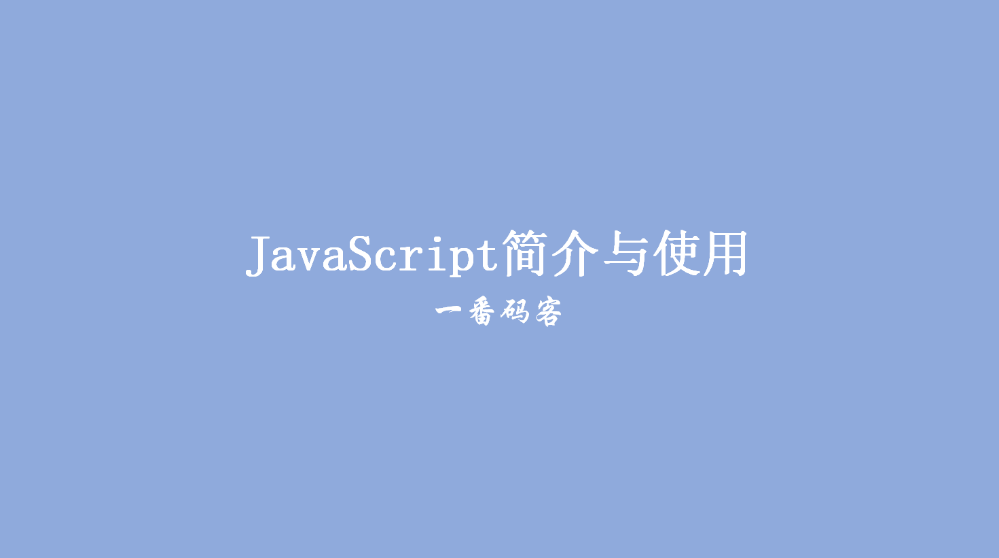
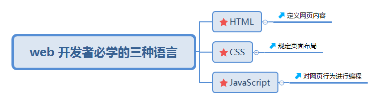
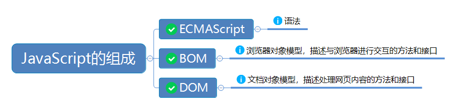
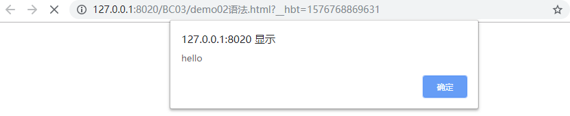

> **一番码客：挖掘你关心的亮点。**
> **http://efonfighting.imwork.net**

本文目录：

[TOC]



<!--more-->

## 前言



## 组成



## 使用方法

### 方法一

* 在页面任意位置创建script标签，在标签中写代码。

```html
<!DOCTYPE html>
<html>
	<head>
		<meta charset="UTF-8">
		<title>语法</title>
	</head>
	<body>
		<script type="text/javascript">
			alert("hello")  // 创建一个弹窗
		</script>
	</body>
</html>

```



### 方法二

* 定义一个单独的js文件,在文件中写代码；使用script标签引用文件。

* 注意：在引用的script标签中不能再写代码了。

```javascript
// demo02.js
alert("hello")
```

```html
<!DOCTYPE html>
<html>

	<head>
		<meta charset="UTF-8">
		<title>语法</title>

		<script src="js/demo02.js" type="text/javascript" charset="utf-8">		
		</script>
	</head>

	<body>

	</body>

</html>
```

以上代码效果同方法一。

### 注释方法

* 单行注释：`//内容`，快捷键`Ctrl + /`。
* 多行注释：`/*内容*/`，快捷键`Ctrl + Shift + /`。

## 参考

* 黑马程序员 120天全栈区块链开发 开源教程

  > https://github.com/itheima1/BlockChain
  

----

> **一番雾语：CSS盒子模型。**

----------

> **免费知识星球： [一番码客-积累交流](http://efonfighting.imwork.net/efonmark-blog/%E7%AE%80%E4%BB%8B/zhishixingqiu1.png)**
> **微信公众号：[一番码客](http://efonfighting.imwork.net/efonmark-blog/%E7%AE%80%E4%BB%8B/guanzhu_1.jpg)**
> **微信：[Efon-fighting](http://efonfighting.imwork.net/efonmark-blog/%E7%AE%80%E4%BB%8B/weixin.jpg)**
> **网站： [http://efonfighting.imwork.net](http://efonfighting.imwork.net)**