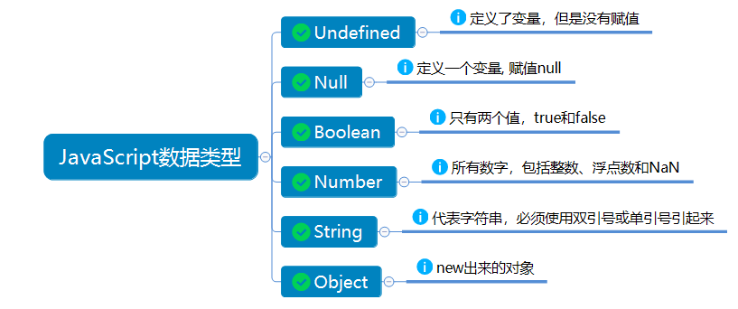

> **一番码客：挖掘你关心的亮点。**
> **http://www.efonmark.com**

本文目录：

[TOC]


<!--more-->

## 声明变量

* JavaScript中声明变量的时候，一律使用`var`。

```html
<!DOCTYPE html>
<html>
	<head>
		<meta charset="UTF-8">
		<title>变量的声明</title>
	</head>
	<body>
		<script type="text/javascript">
			var a = 1;
			var b = 1.1;
			var c = "fdasljf";
		</script>
	</body>
</html>
```

## 获取变量类型

`typeof`的两种使用方法：

* `alert(typeof a)`;
* `alert(typeof(a))`；

向控制台输出内容：

* `console.log(typeof a);`

## 基本数据类型



```html
<!DOCTYPE html>
<html>

	<head>
		<meta charset="UTF-8">
		<title>数据类型</title>
	</head>

	<body>
		<script type="text/javascript">
			
			var a; // undefined:定义了变量,但是没有赋值
			
			var b = null; // null : 定义一个变量, 赋值null
			
			var c = 1; // number : js中的数字不区分整形和浮点数
            var d = 1.1; // number
			var e= 12 * "a"; //number : NaN(not a number)
            
			var f = "fdafhsa"; // string
			var g = 'fhdasfdsaj'; // string

			var h = true; //boolean
            
			console.log(typeof h.toString());
			console.log(typeof g);
		</script>
	</body>

</html>
```

* `NaN`：
    * 任何涉及`NaN`的运算结果都是`NaN`。
    * `NaN`和任何值都不相等，包括其自身。
* `toString()`：只有`number`和`boolean`类型可以转换为字符串。
* `undefined`是从`null`派生出来的，因此`alert(null==undefined)`时返回值为`true`。

## 参考

* 黑马程序员 120天全栈区块链开发 开源教程

  > https://github.com/itheima1/BlockChain
  

----

> **一番雾语：JavaScript中的基本数据类型。**

----------

> **免费知识星球： [一番码客-积累交流](http://www.efonmark.com/efonmark-blog/readme/zhishixingqiu1.png)**
> **微信公众号：[一番码客](http://www.efonmark.com/efonmark-blog/readme/guanzhu_1.jpg)**
> **微信：[Efon-fighting](http://www.efonmark.com/efonmark-blog/readme/weixin.jpg)**
> **网站： [http://www.efonmark.com](http://www.efonmark.com)**