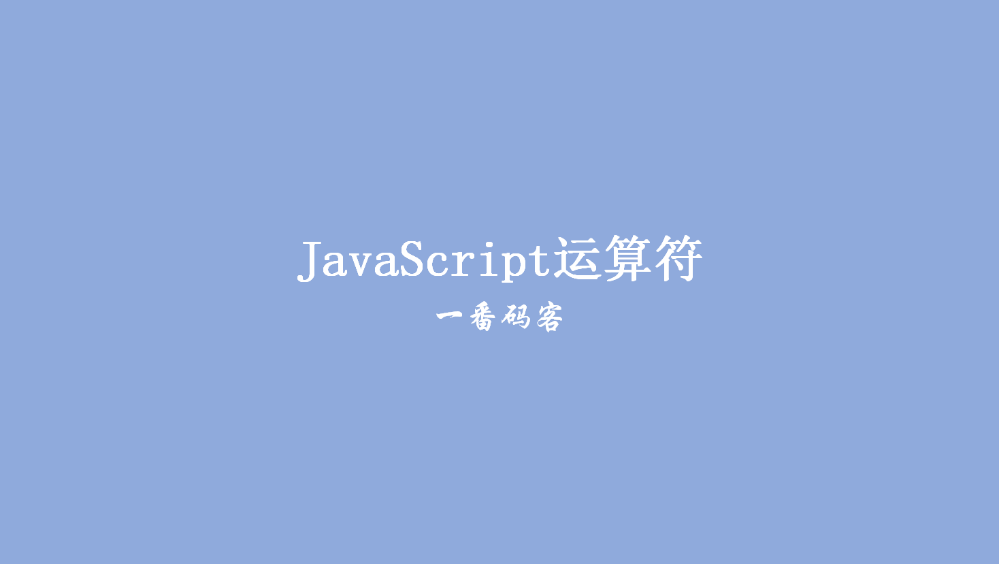
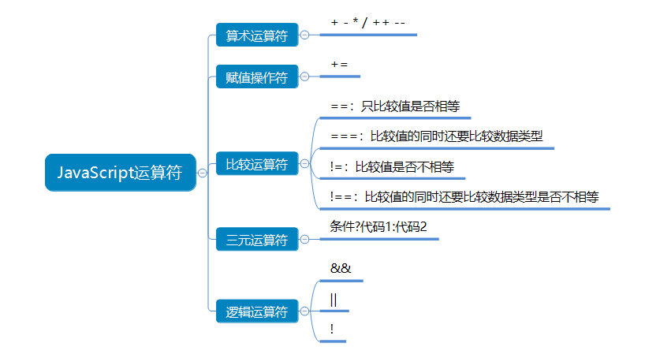

> **一番码客：挖掘你关心的亮点。**
> **http://efonfighting.imwork.net**

本文目录：

[TOC]



<!--more-->



```html
<!DOCTYPE html>
<html>

	<head>
		<meta charset="UTF-8">
		<title>运算符</title>
	</head>

	<body>

		<script type="text/javascript">
			var a = 22;
			var b = "22";

			if(a !== b) {
				document.write("两个值不相等")
			} else {
				document.write("两个值相等")
			}

			if(0) {
				document.write("两个值相等")
			} else {
				document.write("两个值不相等")
			}

			// 三元运算符      判断逻辑?true执行的代码:false执行的代码
			a === b?document.write("两个值相等"):document.write("两个值不相等");

			if(a === b) {
				document.write("两个值相等")
			} else {
				document.write("两个值不相等")
			}
		</script>
	</body>

</html>
```

如果将字符串与数字进行比较，那么在做比较时 JavaScript 会把字符串转换为数值。

空字符串将被转换为 0。非数值字符串将被转换为始终为 false 的 NaN。

## 一番今日

这几天一番其实在外面参加公司的团建，冬天的川西崇山峻岭之上都是冰天雪地。最后附上一段在海拔4800米之上的一段延时摄影。

<video src="2019-12-23-JavaScript运算符/chuanxi.mp4" controls="controls">
</video>


## 参考

* 黑马程序员 120天全栈区块链开发 开源教程

  > https://github.com/itheima1/BlockChain
  

----

> **一番雾语：JavaScript中的基本数据类型。**

----------

> **免费知识星球： [一番码客-积累交流](http://efonfighting.imwork.net/efonmark-blog/%E7%AE%80%E4%BB%8B/zhishixingqiu1.png)**
> **微信公众号：[一番码客](http://efonfighting.imwork.net/efonmark-blog/%E7%AE%80%E4%BB%8B/guanzhu_1.jpg)**
> **微信：[Efon-fighting](http://efonfighting.imwork.net/efonmark-blog/%E7%AE%80%E4%BB%8B/weixin.jpg)**
> **网站： [http://efonfighting.imwork.net](http://efonfighting.imwork.net)**