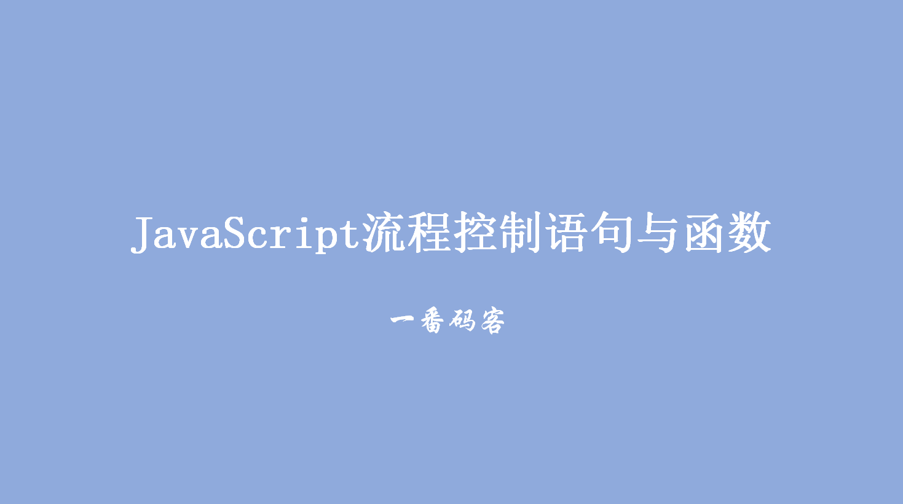
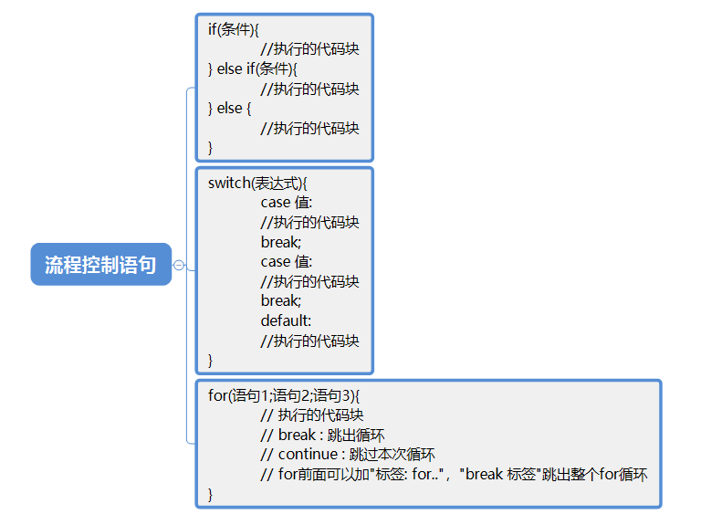
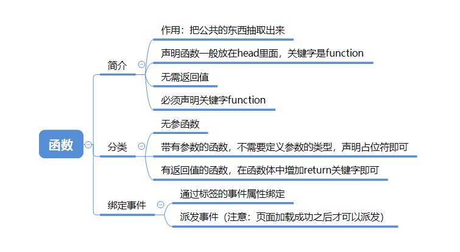

> **一番码客：挖掘你关心的亮点。**
> **http://efonfighting.imwork.net**

本文目录：

[TOC]



<!--more-->

## 流程控制语句




```html
<!DOCTYPE html>
<html>
	<head>
		<meta charset="UTF-8">
		<title>流程控制语句</title>
	</head>

	<body>
		<script type="text/javascript">
			//	break : 跳出循环
			// continue : 跳过本次循环
			outer: for(var i = 0; i < 10; i++) {
				for(var j = 0; j < 10; j++) {
					if(i == 5 && j == 5) {
						break outer;
					}
					document.write("i:" + i + ",j:" + j )
				}
				document.write("<br/>")
			}

			var a = 3;
			switch(a) {
				case 1:
					document.write("周1");
					break;
				case 2:
					document.write("周2");
					break;
				case 3:
					document.write("周3");
					break;
				case 4:
					document.write("周4");
					break;
				case 5:
					document.write("周5");
					break;
				case 6:
					document.write("周6");
					break;
				case 7:
					document.write("周7");
					break;
				default:
					document.write("出错了");
					break;
			}

			if(a == 1) {
				document.write("周1");
			} else
			if(a == 2) {
				document.write("周2");
			} else
			if(a == 3) {
				document.write("周3");
			} else
			if(a == 4) {
				document.write("周4");
			} else
			if(a == 5) {
				document.write("周5");
			} else
			if(a == 6) {
				document.write("周6");
			} else
			if(a == 7) {
				document.write("周7");
			} else {
				document.write("出错了");
			}
		</script>
	</body>

</html>
```


## 函数



```html
<!DOCTYPE html>
<html>

	<head>
		<meta charset="UTF-8">
		<title></title>
	</head>

	<body>
		<script type="text/javascript">
			// 无参无返回值的函数
			function fn1() {
				document.write("无参无返回值的函数")
			}

			// 有参无返回值的函数
			function fn2(a, b) {
				document.write("有参无返回值的函数:a:" + a + ",b:" + b)
			}

			// 无参有返回值的函数
			function fn3() {
				return 2;
			}

			// 有参有返回值的函数
			function fn4(a, b) {
				return a + b;
			}

			// 调用函数
			// fn1();
			// fn2(1, "3");
			var result = fn4(2,3)
			console.log(result)
		</script>
	</body>

</html>
```


### 绑定事件：方法一

```html
<!DOCTYPE html>
<html>
	<head>
		<meta charset="UTF-8">
		<title></title>
	</head>

	<body>
		<script type="text/javascript">
			function login() {
				document.write("登录成功")
			}
		</script>
		<!--
			函数绑定的第一种方式 : 使用属性
			在标签中声明 对应的事件属性   onclick = "方法名()"
		-->
		<input type="button" value="登录" onclick="login()" />
	</body>
</html>
```


### 绑定事件：方法二

```html
<!DOCTYPE html>
<html>
	<head>
		<meta charset="UTF-8">
		<title></title>
		<script type="text/javascript">
			// 监听页面加载完成的事件
			window.onload = function() {
				// 1. 查找元素
				var id_input = document.getElementById("id_input");
				// 2. 派发事件
				id_input.onclick = function() {
					document.write("登录成功")
				}
			}
		</script>
	</head>

	<body>
		<input type="button" value="登录" id="id_input" />
		<!--
			函数绑定的第二种方式 : 事件的派发
			HTML代码执行的顺序 : 从上往下,从左往右
		-->
	</body>
</html>
```


## 参考

* 黑马程序员 120天全栈区块链开发 开源教程

  > https://github.com/itheima1/BlockChain
  

----

> **一番雾语：JavaScript中的基本数据类型。**

----------

> **免费知识星球： [一番码客-积累交流](http://efonfighting.imwork.net/efonmark-blog/%E7%AE%80%E4%BB%8B/zhishixingqiu1.png)**
> **微信公众号：[一番码客](http://efonfighting.imwork.net/efonmark-blog/%E7%AE%80%E4%BB%8B/guanzhu_1.jpg)**
> **微信：[Efon-fighting](http://efonfighting.imwork.net/efonmark-blog/%E7%AE%80%E4%BB%8B/weixin.jpg)**
> **网站： [http://efonfighting.imwork.net](http://efonfighting.imwork.net)**