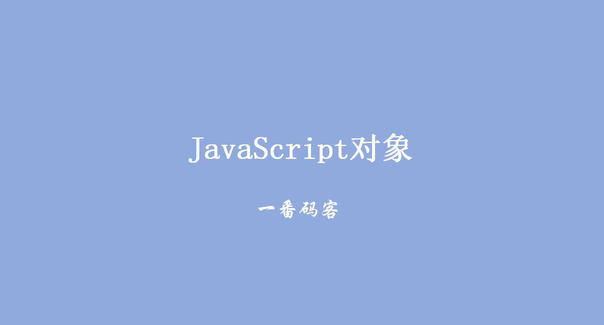
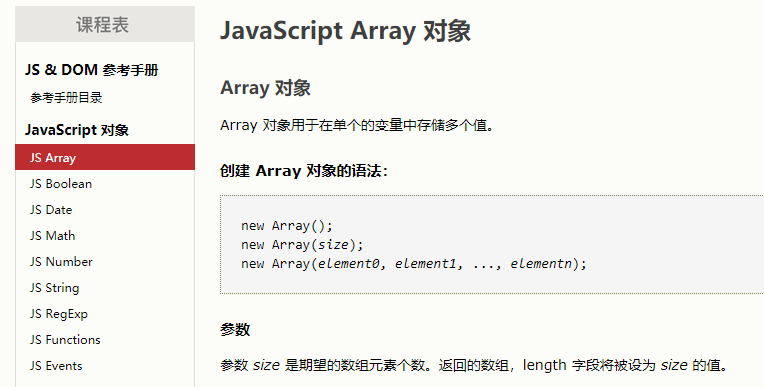
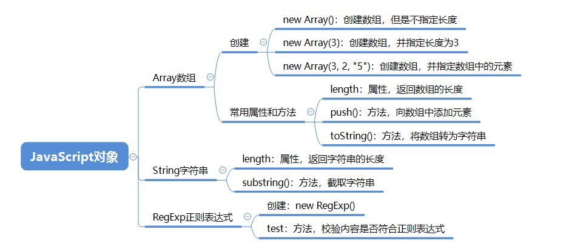

> **一番码客：挖掘你关心的亮点。**
> **http://www.efonmark.com**

本文目录：

[TOC]



<!--more-->

## 概述

首先看看W3school上JavaScript对象有哪些。



这里重点看看以下几种对象。



## 数组

```html
<!DOCTYPE html>
<html>

	<head>
		<meta charset="UTF-8">
		<title></title>
	</head>

	<body>

		<script type="text/javascript">
			var arr = null;
			// 创建数组,没有指定长度
			// arr = new Array();
			
			// 创建数组,指定长度为3
			// arr = new Array(3);
			
			// 创建数组,指定元素
			arr = new Array("1", 2, "fdsa");
			// 数组的下标是从0开始的
			// 获取数组中的元素的内容,数组[下标]
			
			// 向数组中添加元素
			// arr.push(9)
			arr[999] = "jfdlksafjsla";

//			for(var i = 0; i < arr.length; i++) {
//				console.log(arr[i])
//			}

			console.log(arr.toString())
		</script>
	</body>

</html>
```

## 正则表达式

```html
<!DOCTYPE html>
<html>

	<head>
		<meta charset="UTF-8">
		<title></title>
	</head>

	<body>

		<script type="text/javascript">
			// 创建一个正则表达式的对象
			// 指定规则
			// 全部是数字 ,11位
			// 第一位只能是1
			// 第二位 3456789

			// '^'代表开始
			// '$'代表结束
			var reg = new RegExp("^1[^012]\\d{9}$");

			var tel = "13123462789";
			// 检验数据
			var result = reg.test(tel);
			console.log(result);
		</script>
	</body>

</html>
```

## 日期

```html
<!DOCTYPE html>
<html>
	<head>
		<meta charset="UTF-8">
		<title></title>
	</head>
	<body>
		<script type="text/javascript">
			var date= new Date();
			console.log(date.getFullYear())
			console.log(date.getMonth())
			console.log(date.getDate())
			console.log(date.getDay())
			console.log(date.getHours())
			console.log(date.getMinutes())
			console.log(date.getSeconds())
		</script>
	</body>
</html>
```

## 参考

* w3school在线教程

  > https://www.w3school.com.cn/
  
* 黑马程序员 120天全栈区块链开发 开源教程

  > https://github.com/itheima1/BlockChain
  

----

> **一番雾语：JavaScript中的基本数据类型。**

----------

> **免费知识星球： [一番码客-积累交流](http://www.efonmark.com/efonmark-blog/readme/zhishixingqiu1.png)**
> **微信公众号：[一番码客](http://www.efonmark.com/efonmark-blog/readme/guanzhu_1.jpg)**
> **微信：[Efon-fighting](http://www.efonmark.com/efonmark-blog/readme/weixin.jpg)**
> **网站： [http://www.efonmark.com](http://www.efonmark.com)**