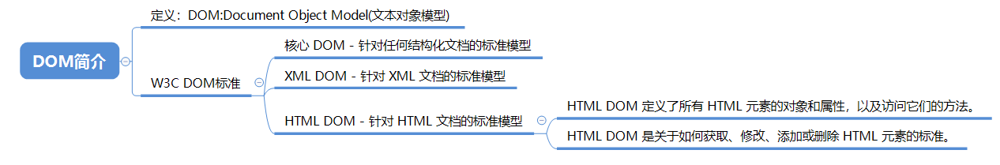

> **一番码客：挖掘你关心的亮点。**
> **http://efonfighting.imwork.net**

本文目录：

[TOC]


<!--more-->

## DOM简介



## 元素查找

```html
<!DOCTYPE html>
<html>
	<head>
		<meta charset="UTF-8">
		<title></title>

		<script type="text/javascript">
			// 页面加载完成之后,调用的函数
			window.onload = function(){
				// 根据ID查找元素，快捷键：dg
				var pId = document.getElementById("pId");
				console.log(pId);
	
				// 获取当前页面所有的p标签
				// 根据标签名查找元素
				var pTags = document.getElementsByTagName("p")
				for (var i = 0; i < pTags.length; i++) {
					console.log(pTags[i])
				}

				// 根据类名查找元素
				var pTags = document.getElementsByClassName("pClass")
				console.log(pTags.length)
			}
		</script>
	</head>

	<body>
		<p class="pClass">这是一个段落</p>
		<p class="pClass">这是第二个段落</p>
		<p>这是第3个段落</p>
	</body>
</html>
```

| 方法                     | 描述                                                         |
| :----------------------- | :----------------------------------------------------------- |
| getElementById()         | 返回带有指定 ID 的元素。                                     |
| getElementsByTagName()   | 返回包含带有指定标签名称的所有元素的节点列表（集合/节点数组）。 |
| getElementsByClassName() | 返回包含带有指定类名的所有元素的节点列表。                   |

## CSS样式设置

```html
<!DOCTYPE html>
<html>
	<head>
		<meta charset="UTF-8">
		<title></title>
		<style type="text/css">
			.div1 {
				width: 100px;
				height: 100px;
				background-color: red;
				border: #FF0000 solid 1px;
			}
		</style>
	</head>

	<body>

		<div class="div1">
			div1
		</div>

		<div id="div2">
			div2
		</div>

		<script type="text/javascript">
			// 查找元素
			var div2 = document.getElementById("div2")
			/*属性的值要使用引号引起来*/
			div2.style.height = "100px";
			div2.style.width = "100px";
			/*在通过DOM设置CSS属性的时候,如果原来的属性是由多个单词组成的,此时要使用驼峰命名对应的样式来设置*/
			div2.style.back groundColor = "blue"
			div2.style.border = "#FF0000 solid 1px"
		</script>
	</body>

</html>
```


## 参考

* w3school在线教程

  > https://www.w3school.com.cn/
  
* 黑马程序员 120天全栈区块链开发 开源教程

  > https://github.com/itheima1/BlockChain
  

----

> **一番雾语：JavaScript操作DOM。**

----------

> **免费知识星球： [一番码客-积累交流](http://efonfighting.imwork.net/efonmark-blog/%E7%AE%80%E4%BB%8B/zhishixingqiu1.png)**
> **微信公众号：[一番码客](http://efonfighting.imwork.net/efonmark-blog/%E7%AE%80%E4%BB%8B/guanzhu_1.jpg)**
> **微信：[Efon-fighting](http://efonfighting.imwork.net/efonmark-blog/%E7%AE%80%E4%BB%8B/weixin.jpg)**
> **网站： [http://efonfighting.imwork.net](http://efonfighting.imwork.net)**