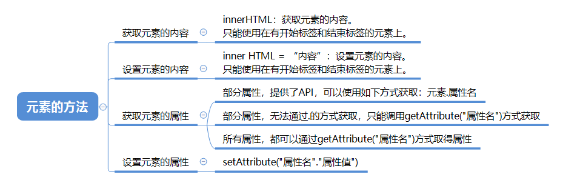

> **一番码客：挖掘你关心的亮点。**
> **http://www.efonmark.com**

本文目录：

[TOC]


<!--more-->

## 概述



## 元素的内容的获取和设置

```html
<!DOCTYPE html>
<html>

	<head>
		<meta charset="UTF-8">
		<title></title>
	</head>

	<body>

		<div id="div1">
			this is a div
			<p>this is a p</p>
			
		</div>

		<script type="text/javascript">
			var div1 = document.getElementById("div1")
			// 获取标签中的文本内容
			console.log(div1.innerText)
			// 获取标签中的所有内容,包括标签
			console.log(div1.innerHTML)

			// 两边使用的是",里面要使用引号的时候就使用'
			//两边使用的是',里面要使用引号的时候就使用"
			//div1.innerHTML="<a href='#'>hello</a>"
			div1.innerHTML='<a href="#">hello</a>'

		</script>
	</body>

</html>
```


## 元素的属性的获取和设置

```html
<!DOCTYPE html>
<html>

	<head>
		<meta charset="UTF-8">
		<title></title>
	</head>

	<body>

		<input city="shenzhen" type="button" name="regist" id="btn" value="注册" />

		<script type="text/javascript">
			var inputTag = document.getElementById("btn");
			// 获取属性的时候,如果是本身就有的属性,可以采用.的方式获取里面的值
			// 自定义属性就不能使用这种方式
			// getAttribute("属性名")一定可以获取到属性值,不管是自定义的还是本身就有的
			console.log(inputTag.getAttribute("type"))

			// 设置属性的时候,如果是本身就有的属性,可以采用赋值的方式设置里面的值
			// 自定义属性就不能使用这种方式
			// setAttribute(key,value)一定可以设置属性值的,不管是自定义的还是本身就有的
			inputTag.type="text"
			inputTag.setAttribute("city", "guangzhou")
		</script>
	</body>

</html>
```


## 参考

* 黑马程序员 120天全栈区块链开发 开源教程

  > https://github.com/itheima1/BlockChain
  

----

> **一番雾语：JavaScript操作元素的方法。**

----------

> **免费知识星球： [一番码客-积累交流](http://www.efonmark.com/efonmark-blog/readme/zhishixingqiu1.png)**
> **微信公众号：[一番码客](http://www.efonmark.com/efonmark-blog/readme/guanzhu_1.jpg)**
> **微信：[Efon-fighting](http://www.efonmark.com/efonmark-blog/readme/weixin.jpg)**
> **网站： [http://www.efonmark.com](http://www.efonmark.com)**