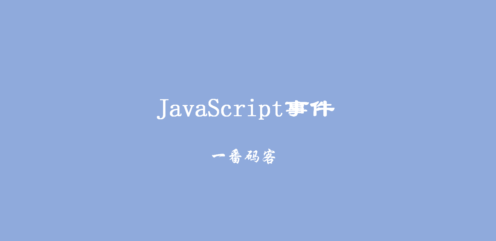
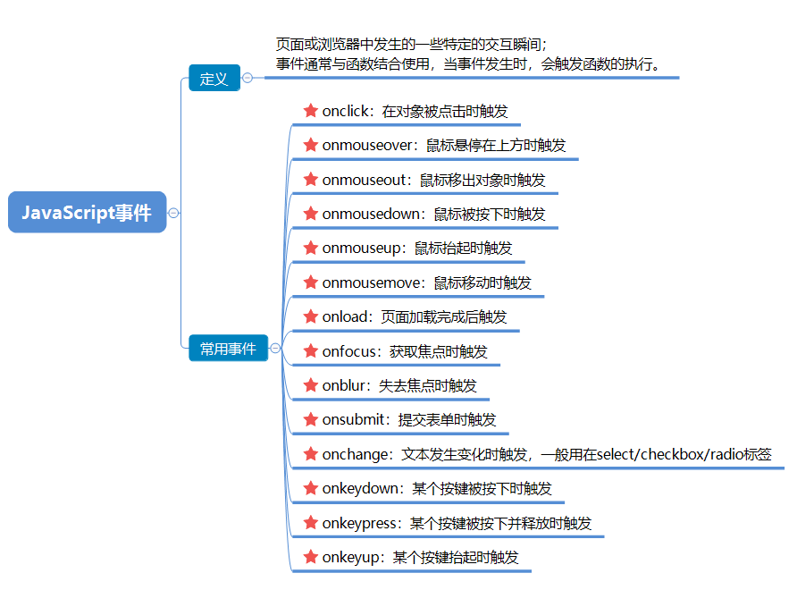

> **一番码客 : 挖掘你关心的亮点。**
> **http://www.efonmark.com**

本文目录：

[TOC]



<!--more-->

## 概述



## 鼠标事件

```html
<!DOCTYPE html>
<html>
	<head>
		<meta charset="UTF-8">
		<title></title>

		<style type="text/css">
			div {
				width: 100px;
				height: 100px;
				border: #FF0000 solid 1px;
			}
		</style>
	</head>

	<body>
		<div id="div1" onmousedown="onmousedownFn()" onmouseenter="onmouseenterFn()" onmouseleave="onmouseleaveFn()" onmousemove="onmousemoveFn()" onmouseout="onmouseoutFn()" onmouseover="onmouseoverFn()" onmouseup="onmouseupFn()" onmousewheel="onmousewheelFn()">

		</div>

		<script type="text/javascript">
			function onmousedownFn() {
				console.log("鼠标按下")
			}

			function onmouseenterFn() {
					console.log("鼠标")
			}

			function onmouseleaveFn() {
				console.log("鼠标离开")
			}

			function onmousemoveFn() {
				console.log("鼠标移动")
			}

			function onmouseoutFn() {
				console.log("鼠标离开")
			}

			function onmouseoverFn() {
				console.log("鼠标悬停在上方")
			}

			function onmouseupFn() {
				console.log("鼠标抬起")
			}

			function onmousewheelFn() {
				console.log("鼠标滚轮事件")
			}
		</script>
	</body>

</html>
```


## 输入框相关的事件

```html
<!DOCTYPE html>
<html>

	<head>
		<meta charset="UTF-8">
		<title></title>
	</head>

	<body>
		用户名:<input type="text" id="username" onfocus="onfocusFn()" onblur="onblurFn()" />
		<script type="text/javascript">
			function onfocusFn() {
				console.log("获取到焦点了")
			}

			function onblurFn() {
				console.log("失去焦点了")
			}
		</script>
	</body>

</html>
```


## 表单提交事件

```html
<!DOCTYPE html>
<html>

	<head>
		<meta charset="UTF-8">
		<title></title>
	</head>

	<body>
		<form onsubmit="return checkForm()">
			用户名:<input type="text" id="username" name="usr" value="" /><br />
			<input type="submit" value="注册" />
		</form>

		<script type="text/javascript">
			function checkForm() {
				var inputTag = document.getElementById("username");
				var usernameInput = inputTag.value;
				if(usernameInput == "zhangsan") {
					return false;
				}
				return true;
			}
		</script>
	</body>

</html>
```


## onChange事件

```html
<!DOCTYPE html>
<html>

	<head>
		<meta charset="UTF-8">
		<title></title>
	</head>

	<body>
		<!--
			this 代表自己,就是当前元素
		-->
		<select id="city" onchange="onchangeFn(this)">
			<option value="bj">北京</option>
			<option value="sh">上海</option>
			<option value="sz">深圳</option>
		</select>

		<script type="text/javascript">
			function onchangeFn(obj) {
				console.log(obj.value)
			}
		</script>

		<!--<script type="text/javascript">
			function onchangeFn() {
				var selectTag = document.getElementById("city")
				console.log(selectTag.value)
			}
		</script>-->
	</body>

</html>
```


## 键盘事件

```html
<!DOCTYPE html>
<html>
	<head>
		<meta charset="UTF-8">
		<title></title>
	</head>
	<body>
		<input type="text"  />
		
		<script type="text/javascript">
				
			window.onkeydown=function(){
				console.log("键盘按下")
			}
			
			window.onkeypress=function(){
				console.log("键盘释放")
			}
			
			window.onkeyup=function(e){
				console.log(e)
			}
		</script>
	</body>
</html>
```

## 参考

* 黑马程序员 120天全栈区块链开发 开源教程

  > https://github.com/itheima1/BlockChain


> 一番雾语：JavaScript事件的用法。。

-------
<table>
<tr>
<td ><center></center></td>
<td width="50%" align=left><b>
    免费知识星球：<a href="http://efonfighting.imwork.net/efonmark-blog/%E7%AE%80%E4%BB%8B/zhishixingqiu1.png">一番码客-积累交流</a><br>
    微信公众号：<a href="http://efonfighting.imwork.net/efonmark-blog/%E7%AE%80%E4%BB%8B/guanzhu_1.jpg">一番码客</a><br>
    微信：<a href="http://efonfighting.imwork.net/efonmark-blog/%E7%AE%80%E4%BB%8B/weixin.jpg">Efon-fighting</a><br>
    网站：<a href="http://efonfighting.imwork.net">http://efonfighting.imwork.net</a><br></b></td>
</tr>
</table>