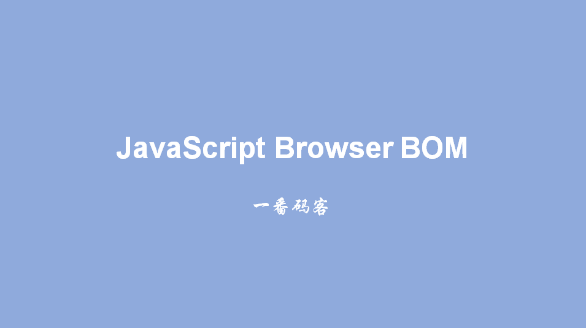
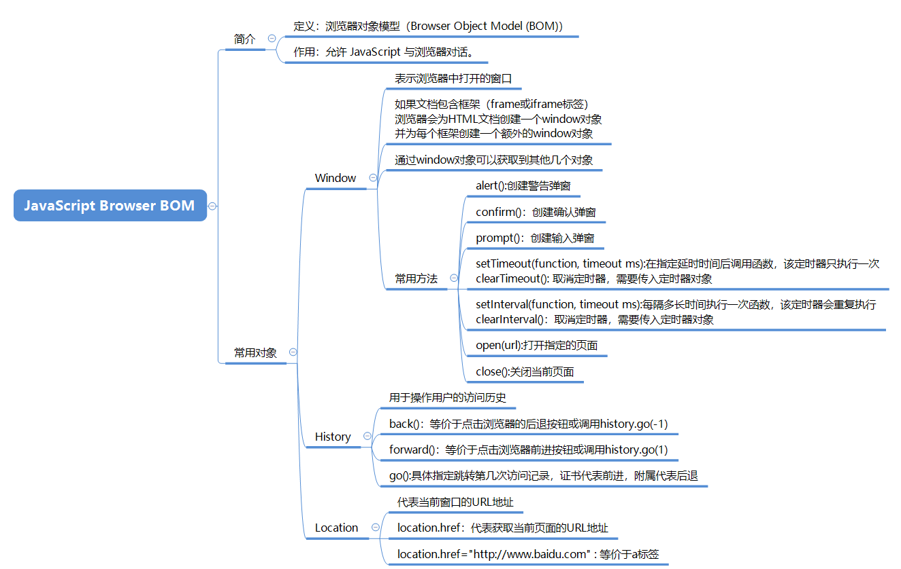

> **一番码客 : 挖掘你关心的亮点。**
> **http://www.efonmark.com**

本文目录：

[TOC]



<!--more-->

## 概述



## confirm

```html
<!DOCTYPE html>
<html>
	<head>
		<meta charset="UTF-8">
		<title>确认框</title>
	</head>
	<body>
		<script type="text/javascript">
			var result = window.confirm("您确定要进行删除吗");
			if(result){
				console.log("执行删除")
			}else{
				console.log("取消删除")
			}
		</script>
	</body>
</html>
```

## prompt

```html
<!DOCTYPE html>
<html>
	<head>
		<meta charset="UTF-8">
		<title>输入框</title>
	</head>
	<body>
		<script type="text/javascript">
			// 弹出一个让用户输入内容的弹窗
			var result = window.prompt("请输入您的用户名");
			console.log(result);
		</script>
	</body>
</html>
```


## open/close

```html
<!DOCTYPE html>
<html>
	<head>
		<meta charset="UTF-8">
		<title>打开关闭窗口</title>
	</head>
	<body>
		<script type="text/javascript">
			window.open("http://www.baidu.com")
			// 在编写js代码时, 如果发现代码执行不正常,F12观察控制台
			window.close()
		</script>
	</body>
</html>
```

## 定时器

```html
<!DOCTYPE html>
<html>
	<head>
		<meta charset="UTF-8">
		<title>定时器</title>
	</head>
	<body>
		<a href="demo05history.html">打开第五个页面</a>
		<br />
		<input type="button" value="五秒钟时候显示当前时间" onclick="showTime5()" />
		<input type="button" value="关闭五秒钟的闹钟" onclick="closeTime5()" />
		<br /> <input type="button" value="打开时钟" onclick="openClock()" />
		<input type="button" value="关闭时钟" onclick="closeClock()" />
		<br />
		<script type="text/javascript">
			function showTime() {
				var date = new Date()
				var spanTag = document.getElementById("id_span")
				spanTag.innerHTML = date
			}
            
			var timer1 = null;
            
			function showTime5() {
				// 参数1:要执行的逻辑
				// 参数2: 延时时间,单位是毫秒值
				// 定时任务只执行一次
				timer1 = setTimeout("showTime()", 5000)
			}

			function closeTime5() {
				// 清除定时任务
				clearTimeout(timer1)
			}

			var timer2 = null;

			function openClock() {
				// 参数1:要执行的逻辑
				// 参数2: 延时时间,单位是毫秒值
				// 定时任务会一直执行下去
				timer2 = setInterval("showTime()", 1000)
			}

			function closeClock() {
				// 清除定时任务
				clearInterval(timer2)
			}
		</script>
		<span id="id_span">
		</span>
	</body>
</html>
```

## history

```html
<!DOCTYPE html>
<html>
	<head>
		<meta charset="UTF-8">
		<title>历史记录</title>
	</head>
	<body>
		<a href="demo06location.html">打开第六个页面</a>
		<br />
		<input type="button" onclick="goforward()" value="前进" />
		<input type="button" onclick="goback()" value="后退" />
		<script type="text/javascript">
			function goforward(){
				history.forward()
			}
			function goback(){
				history.back()
			}
		</script>
	</body>
</html>
```

## location

```html
<!DOCTYPE html>
<html>
	<head>
		<meta charset="UTF-8">
		<title>location</title>
	</head>
	<body>	
		第六个页面
		<script type="text/javascript">	
			location.href="http://www.baidu.com"
			console.log(location.href)
		</script>
	</body>
</html>
```


## 参考

* 黑马程序员 120天全栈区块链开发 开源教程

  > https://github.com/itheima1/BlockChain


> 一番雾语：JavaScript与浏览器的互动。

-------
<table>
<tr>
<td ><center></center></td>
<td width="50%" align=left><b>
    免费知识星球：<a href="http://efonfighting.imwork.net/efonmark-blog/%E7%AE%80%E4%BB%8B/zhishixingqiu1.png">一番码客-积累交流</a><br>
    微信公众号：<a href="http://efonfighting.imwork.net/efonmark-blog/%E7%AE%80%E4%BB%8B/guanzhu_1.jpg">一番码客</a><br>
    微信：<a href="http://efonfighting.imwork.net/efonmark-blog/%E7%AE%80%E4%BB%8B/weixin.jpg">Efon-fighting</a><br>
    网站：<a href="http://efonfighting.imwork.net">http://efonfighting.imwork.net</a><br></b></td>
</tr>
</table>