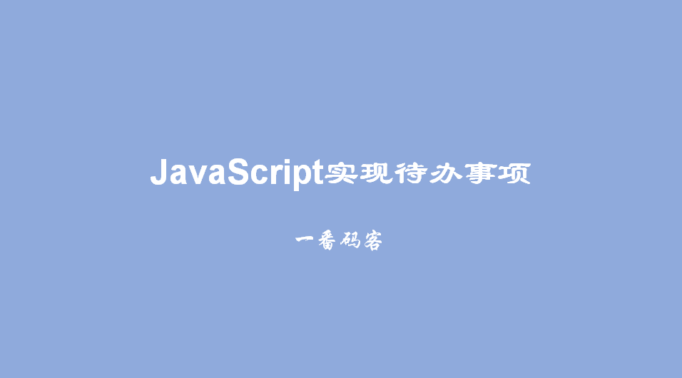
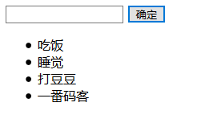

> **一番码客 : 挖掘你关心的亮点。**
> **http://www.efonmark.com**

本文目录：

[TOC]



<!--more-->

## 思路分析

1. 按钮绑定一个点击事件
2. 获取用户输入的内容
3. 创建li元素,把用户输入的内容添加到li标签中
4. 把创建的li元素添加到无序列表
5. 清空输入框

## 代码实现

```html
<!DOCTYPE html>
<html>
	<head>
		<meta charset="UTF-8">
		<title>待办事项</title>
	</head>
	<body>
		<input type="text" id="id_input" /> <input type="button" value="确定" onclick="addItem()" />
		<ul id="id_ul">
			<li>吃饭</li>
			<li>睡觉</li>
			<li>打豆豆</li>
		</ul>
		<script type="text/javascript">
			//1. 按钮绑定一个点击事件
			function addItem() {
				//2. 获取用户输入的内容
				var inputTag = document.getElementById("id_input");
				var content = inputTag.value;
				//3. 创建li元素,把用户输入的内容添加到li标签中
				// 新建一个li元素
				var liTag = document.createElement("li")
				// 指定li标签中的内容
				liTag.innerHTML = content;
				//4. 把创建的li元素添加到无序列表
				//获取到ul标签
				var ulTag = document.getElementById("id_ul")
				// 把新建的li元素追加到ul之后
				ulTag.appendChild(liTag)
				// 清空输入框
				inputTag.value = ""
			}
		</script>
	</body>
</html>
```

## 效果展示



## 参考

* 黑马程序员 120天全栈区块链开发 开源教程

  > https://github.com/itheima1/BlockChain


> 一番雾语：JavaScript事件的用法。。

-------
<table>
<tr>
<td ><center></center></td>
<td width="50%" align=left><b>
    免费知识星球：<a href="http://www.efonmark.com/efonmark-blog/readme/zhishixingqiu1.png">一番码客-积累交流</a><br>
    微信公众号：<a href="http://www.efonmark.com/efonmark-blog/readme/guanzhu_1.jpg">一番码客</a><br>
    微信：<a href="http://www.efonmark.com/efonmark-blog/readme/weixin.jpg">Efon-fighting</a><br>
    网站：<a href="http://www.efonmark.com">http://www.efonmark.com</a><br></b></td>
</tr>
</table>