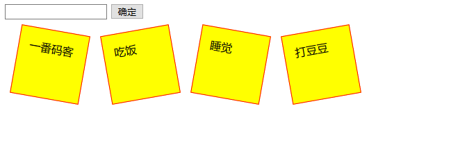

> **一番码客 : 挖掘你关心的亮点。**
> **http://www.efonmark.com**

本文目录：

[TOC]


<!--more-->

## 思路分析

1. 点击事件：
    * 添加元素到页面
    * 存储数据
    * 存储总数据条数
2. 页面加载成功的时候：
    * 读取数据
    * 遍历数据
    * 添加元素到页面
3. CSS样式：
    * 2D/3D 转换属性（Transform）

## 代码实现

```html
<!DOCTYPE html>
<html>

	<head>
		<meta charset="UTF-8">
		<title>任务清单</title>
		<style type="text/css">
			.right {
				border: 1px solid red;
				width: 100px;
				height: 100px;
				background-color: yellow;
				padding: 15px;
				box-sizing: border-box;
				position: relative;
				float: left;
				margin: 15px;
				transform: rotate(-10deg);
				-ms-transform: rotate(-10deg);
				-moz-transform: rotate(-10deg);
				-webkit-transform: rotate(-10deg);
				-o-transform: rotate(-10deg);
			}
			.left {
				border: 1px solid red;
				width: 100px;
				height: 100px;
				background-color: yellow;
				padding: 15px;
				box-sizing: border-box;
				position: relative;
				float: left;
				margin: 15px;
				transform: rotate(10deg);
				-ms-transform: rotate(10deg);
				-moz-transform: rotate(10deg);
				-webkit-transform: rotate(10deg);
				-o-transform: rotate(10deg);
			}
		</style>
	</head>

	<body>
		<input type="text" id="id_input" /> <input type="button" value="确定" onclick="addItem()" />
        
		<div id="container">
		</div>
        
		<script type="text/javascript">
			// 下标
			var index = 0;
			// 获取总数据条数
			var total = localStorage.getItem("total");
			// 如果总数据条数有值,赋值给下标index
			// 如果总数据条数没有值, 下标index就为0
			if(total != null) {
				index = total;
			}

			function addItem() {
				// 1. 获取用户输入的内容
				var content = document.getElementById("id_input").value;
				// 2.新建div元素
				var divTag = document.createElement("div");
				divTag.innerHTML = content;
				if(index % 2 == 0) {
					divTag.setAttribute("class", "left")
				} else {
					divTag.setAttribute("class", "right")
				}
				// 3.把新建的div放到父容器中
				var container = document.getElementById("container");
				container.appendChild(divTag);
				// 4.清空输入框中的内容
				document.getElementById("id_input").value = "";
				// 5.保存数据
				localStorage.setItem("diary" + index, content);
				index++;
				// 6.保存总数据条数
				localStorage.setItem("total", index)
			}

			// 页面加载成功之后,读取数据,并显示到页面上 
			window.onload = function() {
				//	0.获取总数据条数
				var total = localStorage.getItem("total");

				for(var i = 0; i < total; i++) {
					// 1.读取数据
					var content = localStorage.getItem("diary" + i);
					// 2.新建div元素
					var divTag = document.createElement("div");
					divTag.innerHTML = content;
					if(i % 2 == 0) {
						divTag.setAttribute("class", "left")
					} else {
						divTag.setAttribute("class", "right")
					}
					// 3.把新建的div放到父容器中
					var container = document.getElementById("container");
					container.appendChild(divTag);
				}
			}
		</script>
	</body>
</html>
```

## 效果展示



## 参考

* 黑马程序员 120天全栈区块链开发 开源教程

  > https://github.com/itheima1/BlockChain


> 一番雾语：一个Html页面做个小工具。

-------
<table>
<tr>
<td ><center></center></td>
<td width="50%" align=left><b>
    免费知识星球：<a href="http://www.efonmark.com/efonmark-blog/readme/zhishixingqiu1.png">一番码客-积累交流</a><br>
    微信公众号：<a href="http://www.efonmark.com/efonmark-blog/readme/guanzhu_1.jpg">一番码客</a><br>
    微信：<a href="http://www.efonmark.com/efonmark-blog/readme/weixin.jpg">Efon-fighting</a><br>
    网站：<a href="http://www.efonmark.com">http://www.efonmark.com</a><br></b></td>
</tr>
</table>