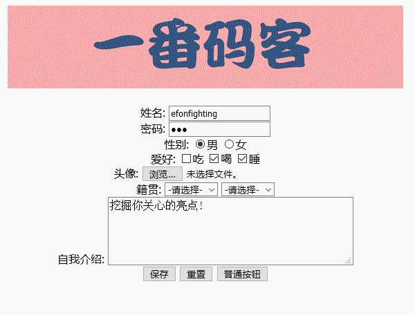

> **一番码客 : 挖掘你关心的亮点。**
> **http://www.efonmark.com**

本文目录：

[TOC]


<!--more-->

## 思路分析

1. 获取city的下拉列表。
2. 清空下拉列表。
3. 创建option节点。
4. 把新建的option节点追加到城市下拉框中。

## 代码实现

```html
<!DOCTYPE html>
<html>
	<head>
		<meta charset="UTF-8">
		<title></title>
		<style type="text/css">
			form {
				text-align: center;
			}
			img {
				margin-bottom: 20px;
			}
		</style>
		<script>
			// 定义二维数组:
			var arr = new Array(4);
			arr[0] = new Array("哈尔滨", "齐齐哈尔", "大庆", "佳木斯");
			arr[1] = new Array("长春市", "吉林市", "四平市", "通化市");
			arr[2] = new Array("沈阳市", "锦州市", "大连市", "铁岭市");
			arr[3] = new Array("郑州市", "洛阳市", "安阳市", "南阳市");

			function proChanged(obj) {
				// 获取city的下拉列表
				var cityTag = document.getElementById("city");
				// 清空下拉列表
				cityTag.innerHTML = "<option>-请选择-</option>";

				var cityArr = arr[obj.value];
				for(var i = 0; i < cityArr.length; i++) {
					// 创建option节点
					var opt = document.createElement("option");
					opt.innerHTML = cityArr[i];
					// 把新建的option节点追加到城市下拉框中
					cityTag.appendChild(opt);
				}
			}
		</script>
	</head>

	<body>
		<form action="#" method="get">
			<br />
			<input type="hidden" name="id" value="007" /> 姓名:
			<input name="username" value="efonfighting" /><br> 密码:
			<input type="password" name="password" value="123"><br> 性别:
			<input type="radio" name="sex" value="1" checked="checked">男
			<input type="radio" name="sex" value="0">女
			<br> 爱好:
			<input type="checkbox" name="hobby" value="eat">吃
			<input type="checkbox" name="hobby" value="drink" checked="checked">喝
			<input type="checkbox" name="hobby" value="sleep" checked="checked">睡
			<br> 头像:
			<input type="file" name="photo"><br> 籍贯:
			<select name="pro" id="pro" onchange="proChanged(this)">
				<option>-请选择-</option>
				<option value="0">黑龙江</option>
				<option value="1">吉林</option>
				<option value="2">辽宁</option>
				<option value="3">河南</option>
			</select>
			<select name="city" id="city">
				<option>-请选择-</option>
			</select>
			<br> 自我介绍:
			<textarea name="intr" cols="40" rows="4">挖掘你关心的亮点!</textarea>
			<br>
			<input type="submit" value="保存" />
			<input type="reset" />
			<input type="button" value="普通按钮" />
		</form>
	</body>

</html>
```

## 效果展示



> 一番雾语：大技能就是各类小技能的排列组合，熟练掌握各种小技能才能成就大技能。

-------
<table>
<tr>
<td ><center></center></td>
<td width="50%" align=left><b>
    免费知识星球：<a href="http://www.efonmark.com/efonmark-blog/readme/zhishixingqiu1.png">一番码客-积累交流</a><br>
    微信公众号：<a href="http://www.efonmark.com/efonmark-blog/readme/guanzhu_1.jpg">一番码客</a><br>
    微信：<a href="http://www.efonmark.com/efonmark-blog/readme/weixin.jpg">Efon-fighting</a><br>
    网站：<a href="http://www.efonmark.com">http://www.efonmark.com</a><br></b></td>
</tr>
</table>