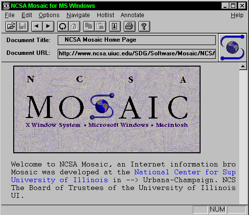
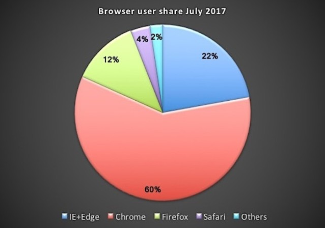
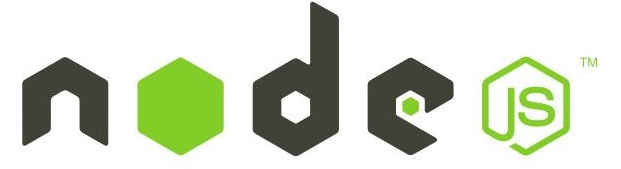
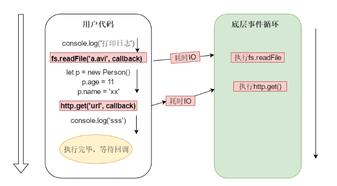
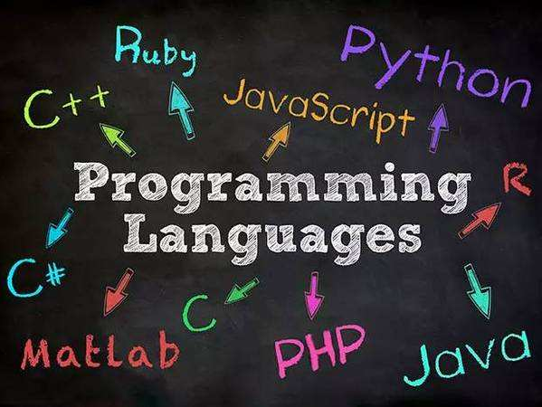
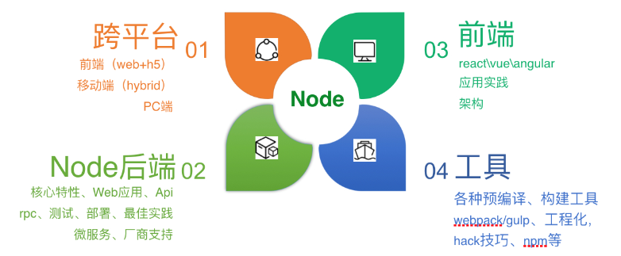

> **一番码客 : 挖掘你关心的亮点。**
> **http://www.efonmark.com**

本文目录：

[TOC]

<!--more-->

## 故事的开端

很久很久以前，浏览器只能展示文本和图片，并不能像现在这样有动画，弹窗等绚丽的特效。

为了提升浏览器的交互性，Javascript就被设计出来；而且很快统一了所有浏览器，成为了前端脚本开发的唯一标准。

## 浏览器之战

随着互联网的不断普及和Web的迅速发展，几家巨头公司开始了浏览器之战。微软推出了IE系列浏览器，Mozilla推出了Firefox浏览器，苹果推出了Safari浏览器，谷歌推出了Chrome浏览器。

其中，微软的IE6由于推出的早，并和Windows系统绑定，在早期成为了浏览器市场的霸主。没有竞争就没有发展。微软认为IE6已经非常完善，几乎没有可改进之处，就解散了IE6的开发团队。

而Google却认为支持现代Web应用的新一代浏览器才刚刚起步，尤其是浏览器负责运行JavaScript的引擎性能还可提升10倍，于是自己偷偷开发了一个高性能的Javascript解析引擎，取名V8，并且开源。

在浏览器大战中，微软由于解散了最有经验、战斗力最强的浏览器团队，被Chrome远远的抛在身后。。。

## Node的诞生

浏览器大战和Node有何关系？

话说有个叫**Ryan Dahl**的歪果仁，他的工作是用C/C++写高性能Web服务。对于高性能，异步IO、事件驱动是基本原则，但是用C/C++写就太痛苦了。于是这位仁兄开始设想用高级语言开发Web服务。他评估了很多种高级语言，发现很多语言虽然同时提供了同步IO和异步IO，但是开发人员一旦用了同步IO，他们就再也懒得写异步IO了，所以，最终，**Ryan**瞄向了JS。因为JavaScript是单线程执行，根本不能进行同步IO操作，只能使用异步IO。

另一方面，因为V8是开源的高性能JavaScript引擎。Google投资去优化V8，而他只需拿来改造一下。

于是在2009年，Ryan正式推出了基于JavaScript语言和V8引擎的开源Web服务器项目，命名为Node.js。虽然名字很土，但是，Node第一次把JavaScript带入到后端服务器开发，加上世界上已经有无数的JavaScript开发人员，所以Node一下子就火了起来。

## 浏览器端JS和Node端JS的区别

相同点就是都使用了Javascript这门语言来开发。

浏览器端的JS，受制于浏览器提供的接口。比如浏览器提供一个弹对话框的Api，那么JS就能弹出对话框。浏览器为了安全考虑，对文件操作，网络操作，操作系统交互等功能有严格的限制，所以在浏览器端的JS功能无法强大，就像是压在五行山下的孙猴子。

NodeJs完全没有了浏览器端的限制，让Js拥有了文件操作，网络操作，进程操作等功能，和Java，Python，Php等语言已经没有什么区别了。而且由于底层使用性能超高的V8引擎来解析执行，和天然的异步IO机制，让我们编写高性能的Web服务器变得轻而易举。Node端的JS就像是被唐僧解救出来的齐天大圣一样，法力无边。

## 理解NodeJS的事件驱动和异步IO

NodeJS在用户代码层，只启动一个线程来运行用户的代码。每当遇到耗时的IO操作，比如文件读写，网络请求，则将耗时操作丢给底层的事件循环去执行，而自己则不会等待，继续执行下面的代码。当底层的事件循环执行完耗时IO时，会执行我们的回调函数来作为通知。

**同步就是你去银行排队办业务，排队的时候啥也不能干(阻塞)；异步就是你去银行用取号机取了一个号，此时你可以自由的做其他事情，到你的时候会用大喇叭对你进行事件通知。而银行系统相当于底层的事件循环，不断的处理耗时的业务(IO)。**

但是NodeJs只有一个线程用来执行用户代码，如果耗时的是CPU计算操作，比如for循环100000000次，那么在循环的过程中，下面的代码将会无法执行，阻塞了唯一的一个线程。

所以，Node适合大并发的IO处理，不适合CPU密集型的计算操作。

Web开发大部分都是耗时IO操作，所以Node非常适合进行Web开发。

如果真的遇到了CPU密集的计算，比如从1亿个用户中计算出哪些人和你兴趣相投的这个功能，就非常耗CPU，那这个功能就交由C++，C，Go，Java这些语言实现。像淘宝，京东这种大型网站绝对不是一种语言就可以实现的。

语言只是工具，让每一种语言做它最擅长的事，才能构建出稳定，强大的系统。

## NodeJs能做什么？

> 一番雾语：前因后果。

-------
<table>
<tr>
<td >

</td>
<td width="50%" align=left><b>
    免费知识星球：<a href="http://efonfighting.imwork.net/efonmark-blog/%E7%AE%80%E4%BB%8B/zhishixingqiu1.png">一番码客-积累交流</a> 
    微信公众号：<a href="http://efonfighting.imwork.net/efonmark-blog/%E7%AE%80%E4%BB%8B/guanzhu_1.jpg">一番码客</a> 
    微信：<a href="http://efonfighting.imwork.net/efonmark-blog/%E7%AE%80%E4%BB%8B/weixin.jpg">Efon-fighting</a> 
    网站：<a href="http://efonfighting.imwork.net">http://efonfighting.imwork.net</a> </b></td>
</tr>
</table>