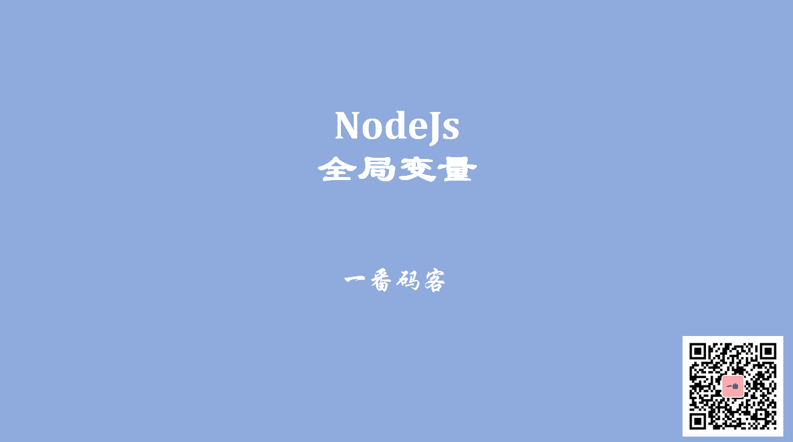

> **一番码客 : 挖掘你关心的亮点。**
> **http://www.efonmark.com**

本文目录：

[TOC]



<!--more-->

## 打印全局变量

我们用`console.log(global)`来打印出全局变量看看：

```
Object [global] {
  global: [Circular],
  clearInterval: [Function: clearInterval],
  clearTimeout: [Function: clearTimeout],
  setInterval: [Function: setInterval],
  setTimeout: [Function: setTimeout] { [Symbol(util.promisify.custom)]: [Function] },
  queueMicrotask: [Function: queueMicrotask],
  clearImmediate: [Function: clearImmediate],
  setImmediate: [Function: setImmediate] {
    [Symbol(util.promisify.custom)]: [Function]
  }
}
```


## 常用全局变量

> 全局变量是指我们在任何js文件的任何地方都可以使用的变量。

- `__dirname`：当前文件的目录
- `__filename`：当前文件的绝对路径
- `console`：控制台对象，可以输出信息
    - `console.log()/console.error()`，等同于`global.console.log()`。
    - 打印出执行时间：`console.time("ldh")/console.timeEnd("ldh")`
- `process`：进程对象，可以获取进程的相关信息，环境变量等
    - 增加环境变量：`process.env.NODE_ENV = 'development'`和`process.env.NODE_ENV = 'production'`。
- `setTimeout(function,timeout)/clearTimeout(function)`：延时执行。
- `setInterval(function,timeout)/clearInterval(function)`：定时器


## 代码示例

```js
'use strict'
console.log(global)
console.log(process);

console.time("ldh");

process.env.NODE_ENV = 'development';
process.env.NODE_ENV = 'production';

// console.log(process.env);

console.error("我是一个error级别的log");

console.log(__dirname);
console.log(__filename);

setTimeout( ()=>{
    console.log("我执行了");
}, 1000);

setInterval(()=>{
    console.log("我每秒钟执行一次");
}, 1000);

console.timeEnd("ldh");
```


## 参考

* 黑马程序员 120天全栈区块链开发 开源教程

    > https://github.com/itheima1/BlockChain


> 一番雾语：每天进步一点一点。

-------
<table>
<tr>
<td ><center></center></td>
<td width="50%" align=left><b>
    免费知识星球：<a href="http://efonfighting.imwork.net/efonmark-blog/%E7%AE%80%E4%BB%8B/zhishixingqiu1.png">一番码客-积累交流</a><br>
    微信公众号：<a href="http://efonfighting.imwork.net/efonmark-blog/%E7%AE%80%E4%BB%8B/guanzhu_1.jpg">一番码客</a><br>
    微信：<a href="http://efonfighting.imwork.net/efonmark-blog/%E7%AE%80%E4%BB%8B/weixin.jpg">Efon-fighting</a><br>
    网站：<a href="http://efonfighting.imwork.net">http://efonfighting.imwork.net</a><br></b></td>
</tr>
</table>