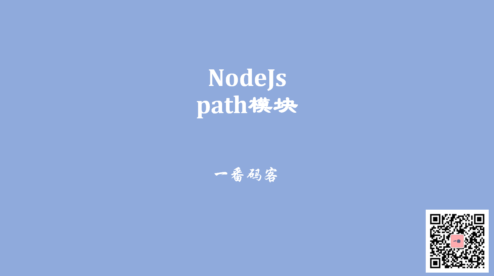

> **一番码客 : 挖掘你关心的亮点。**
> **http://www.efonmark.com**

本文目录：

[TOC]



<!--more-->

## 常用函数

> path模块供了一些工具函数，用于处理文件与目录的路径

- `path.basename`：返回一个路径的最后一部分
- `path.dirname`：返回一个路径的目录名
- `path.extname`：返回一个路径的扩展名
- `path.join`：用于拼接给定的路径片段
- `path.normalize`：将一个路径正常化

## 代码示例

```js
'use strict'
let path = require("path");

console.log("__filename: "+__filename);
console.log(path.basename(__filename));
console.log(path.dirname(__filename));
console.log(path.extname("F:/imgs/a.jpg"));

console.log(path.join("F:/aaa", "bbb", "test.jpg")); //f:/aaa/bbb/test.jpg
console.log(path.normalize("F:/a\\b\\c/d")); //f:\a\b\c\d
```

输出：

```
C:\Program Files\nodejs\node.exe path-demo.js 
__filename: d:\03-BlockChain\06_nodejs课程\day43_nodejs_day01\code\Node01\path-demo.js
path-demo.js
d:\03-BlockChain\06_nodejs课程\day43_nodejs_day01\code\Node01
.jpg
F:\aaa\bbb\test.jpg
F:\a\b\c\d
```


## 参考

* 黑马程序员 120天全栈区块链开发 开源教程

    > https://github.com/itheima1/BlockChain

## 其他
今天是除夕节日，明天就是春节了。这个春节大家都不要出去乱跑了，在家呆着是最安全的。为奋战在一线的医护工作者加油，他们同样是父母，同样是子女，真的非常不容易。大家平时多锻炼身体，注意卫生，希望大家过个祥和年。

> 一番雾语：每天进步一点一点。

-------
<table>
<tr>
<td ><center></center></td>
<td width="50%" align=left><b>
    免费知识星球：<a href="http://efonfighting.imwork.net/efonmark-blog/%E7%AE%80%E4%BB%8B/zhishixingqiu1.png">一番码客-积累交流</a><br>
    微信公众号：<a href="http://efonfighting.imwork.net/efonmark-blog/%E7%AE%80%E4%BB%8B/guanzhu_1.jpg">一番码客</a><br>
    微信：<a href="http://efonfighting.imwork.net/efonmark-blog/%E7%AE%80%E4%BB%8B/weixin.jpg">Efon-fighting</a><br>
    网站：<a href="http://efonfighting.imwork.net">http://efonfighting.imwork.net</a><br></b></td>
</tr>
</table>