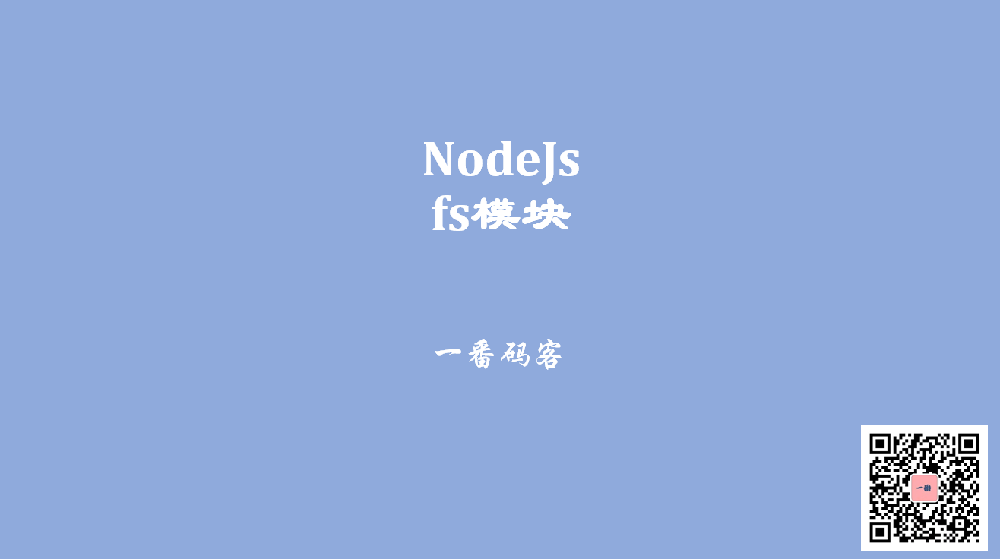

> **一番码客 : 挖掘你关心的亮点。**
> **http://www.efonmark.com**

本文目录：

[TOC]



<!--more-->

## 常用函数

> 文件操作相关的模块。
>
> 具体用法，可以参考Node.js文档：`http://nodejs.cn/api/fs.html`

- `fs.stat/fs.statSync`：访问文件的元数据，比如文件大小，文件的修改时间


- `fs.readFile/fs.readFileSync`：异步/同步读取文件

- `fs.writeFile/fs.writeFileSync`：异步/同步写入文件

- `fs.readdir/fs.readdirSync`：读取文件夹内容

- `fs.unlink/fs.unlinkSync`：删除文件

- `fs.rmdir/fs.rmdirSync`：只能删除空文件夹。

    > 删除非空文件夹：使用`fs-extra` 第三方模块来删除。

- `fs.watchFile`：监视文件的变化


## 代码示例

```js
'use strict'
let fs = require("fs");
let path = require("path");
let fs2 = require('fs-extra');

//读文件
fs.readFile("a.txt", (err, data) =>{
    if(err){
        throw err;
    }

    console.log(data.toString());
});

//写文件
let data = "举头望明月，低头思故乡";
fs.writeFile("b.txt", data, (err)=>{
    if(err){
        throw err;
    }

});

//读文件夹
let target = "./test";
fs.readdir(target, (err, files)=>{
    //遍历数组
    files.forEach( f =>{
        // 判断当前的f到底是文件夹还是文件
        fs.stat(path.join(target, f), (err, stat)=>{
            if(err){
                throw err;
            }
            console.log(f + " : "+ stat.isDirectory());
        })
    });
});

// 删除文件
fs.unlink("test/a.txt", (err)=>{
    if(err){
        console.log("删除失败："+err);
    }else {
        console.log("删除成功");
    }
});

// 删除文件夹
fs.rmdir("test", (err) =>{
   console.log(err);
});

// 同步阻塞的方式来读取文件
let data = fs.readFileSync("async-demo.js");
console.log(data.toString());

// 删除非空文件夹
fs2.remove("test");

// 监视文件变化
fs.watchFile("a.txt", {interval: 500} , (current, previous)=>{
   console.log(" current mtime:" + current.mtime);
   console.log(" previous mtime:" + previous.mtime);
});
```


## 参考

* 黑马程序员 120天全栈区块链开发 开源教程

    > https://github.com/itheima1/BlockChain

## 今日一番
今天一番在家做了一些家务，还出门逛了一圈，街上也不是完全没有人，超市、药店、菜市场人是最多的。现在才有时间来学习和写文章。

一番准备同步一些学习视频到B站，欢迎关注一番码客的B站主页。


> 一番雾语：一番新建了B站主页，欢迎关注。

-------
<table>
<tr>
<td ><center></center></td>
<td width="50%" align=left><b>
    免费知识星球：<a href="http://www.efonmark.com/efonmark-blog/readme/zhishixingqiu1.png">一番码客-积累交流</a><br>
    微信公众号：<a href="http://www.efonmark.com/efonmark-blog/readme/guanzhu_1.jpg">一番码客</a><br>
    微信：<a href="http://www.efonmark.com/efonmark-blog/readme/weixin.jpg">Efon-fighting</a><br>
    网站：<a href="http://www.efonmark.com">http://www.efonmark.com</a><br></b></td>
</tr>
</table>