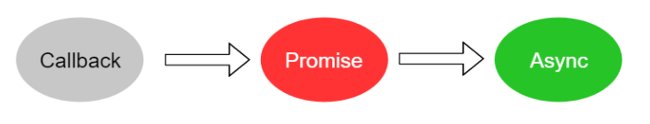

> **一番码客 : 挖掘你关心的亮点。**
> **http://www.efonmark.com**

本文目录：

[TOC]


<!--more-->

## Callback hell回调地域

当我们以同步的方式编写耗时的代码，那么就会阻塞JS的单线程，造成CPU一直等待IO完成才去执行后面的代码。

而CPU的执行速度是远远大于硬盘IO速度的，这样等待只会造成资源的浪费。

异步IO就是为了解决这个问题的，异步能尽可能不让CPU闲着，它不会在那等着IO完成；而是传递给底层的事件循环一个函数，自己去执行下面的代码。等磁盘IO完成后，函数就会被执行来作为通知。

虽然**异步**和**回调**的编程方式能充分利用CPU，但是当代码逻辑变的越来越复杂后，新的问题出现了——**Callback hell回调地域!**


## 功能代码

实现如下功能：

> 1. 判断一个文件是文件还是目录；
> 2. 如果是目录，读取这个目录下的文件，找出结尾是txt的文件；
> 3. 获取这些txt文件大小。

### 异步方式

```js
function withoutPromise() {
    let target = "test";
    fs.stat(target, (err, stat)=>{
        if(err){
            throw err;
        }
        // 如果是文件夹
        if(stat.isDirectory()){
            fs.readdir(target, (err, files)=>{
                // 遍历files
                files.forEach( f =>{
                    if(path.extname(f) === '.txt'){
                        fs.stat(path.join(target, f), (err, stat)=>{
                            console.log(f+ " : "+stat.size);
                        });
                    }
                } );
            });
        }
    });
}
```

### Promise方式

```js
async function withPromise() {
    let target = "test";
    //将fs.stat转为一个可以返回Promise对象的方法
    let pstat = util.promisify(fs.stat);
    let stat = await pstat(target);
    // 如果是文件夹
    if(stat.isDirectory()){
        //将fs.readdir转为一个可以返回Promise对象的方法
        let preaddir = util.promisify(fs.readdir)
        let files = await preaddir(target)
        files.forEach( async (f) => {
            if(path.extname(f) === '.txt'){
                let stat = await pstat(path.join(target, f));
                console.log(stat.size);
            }
        });
    }
}
```


## Promise和async/await

`Promise`和`async/await`便是为了解决**Callback hell**的问题。

### promise

`promise`的作用是对异步回调代码包装一下，把原来的一个回调函数拆成2个回调函数，这样的好处是可读性更好。语法如下：

```js
// 创建promise对象
let promise = new Promise((resolve, reject)=>{
    // 在异步操作成功的情况选调用resolve，失败的时候调用reject
    fs.readFile('xxx.txt',(err, data)=>{
        if(err){
            reject(err)
        }else {
            resolve(data.toString())
        }
    })
});
// 使用promise
promise.then((text)=>{
    //then方法是当Promise内部调用了resolve的时候执行
}).catch((err)=>{
    //catch方法是当Promise内部调用了reject的时候执行
    console.log(err);
})
```

* 语法注意：**Promise内部的resolve和reject方法只能调用一次，调用了这个就不能再调用了那个；如果调用，则无效。**

### async/await

`async/await`的作用是直接**将Promise异步代码变为同步的写法，注意，代码仍然是异步的**。

语法要求：

- `await`只能用在`async`修饰的方法中，但是有`async`不要求一定有`await`。
- `await`后面只能跟`async`方法和`promise`。

假设拥有了一个promise对象，现在使用async/await可以这样写：

```js
async function asyncDemo() {
    try {
        // 当promise的then方法执行的时候
        let text = await promise
        // 当你用promise包装了所有的异步回调代码后，就可以一直await，真正意义实现了以同步的方式写异步代码
        console.log('异步道明执行');
    }catch (e){
        // 捕获到promise的catch方法的异常
        console.log(e);
    }
}
asyncDemo()
console.log('我是同步代码');
```

### 异步代码的终极写法

1. 先使用`promise`包装异步回调代码，可使用node提供的`util.promisify`方法；
2. 使用`async/await`编写异步代码。



## 参考

* 黑马程序员 120天全栈区块链开发 开源教程

    > https://github.com/itheima1/BlockChain

## 学习视频
一番同步了对应的学习视频到B站，长按识别可访问一番B站主页观看。


> 一番雾语：让异步，更简洁~

-------
<table>
<tr>
<td ><center></center></td>
<td width="50%" align=left><b>
    免费知识星球：<a href="http://www.efonmark.com/efonmark-blog/readme/zhishixingqiu1.png">一番码客-积累交流</a><br>
    微信公众号：<a href="http://www.efonmark.com/efonmark-blog/readme/guanzhu_1.jpg">一番码客</a><br>
    微信：<a href="http://www.efonmark.com/efonmark-blog/readme/weixin.jpg">Efon-fighting</a><br>
    网站：<a href="http://www.efonmark.com">http://www.efonmark.com</a><br></b></td>
</tr>
</table>