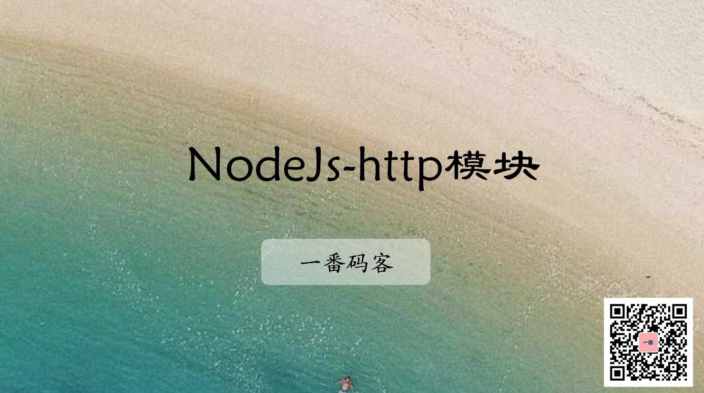
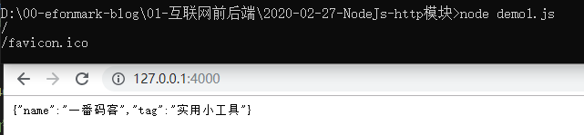
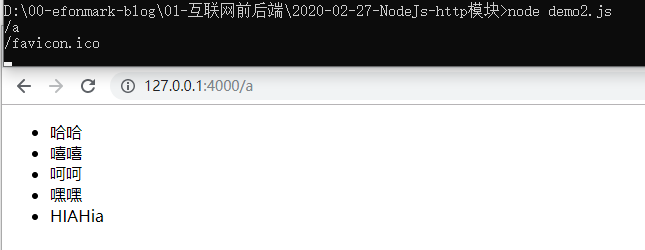
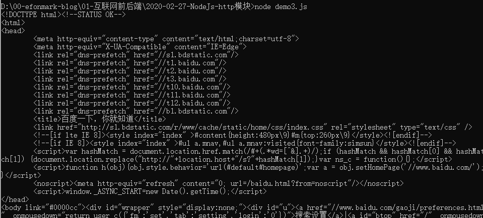

> **一番码客 : 挖掘你关心的亮点。**
> **http://www.efonmark.com**

本文目录：

[TOC]



<!--more-->

## 概述

`Nodejs`里的`http`模块，封装了`http server `和 `client`的功能，就是说可以充当`server`处理请求，也可以充当`client`发出请求。

## 创建server对象

- `http.createServer`

### 例子（一）

* 创建服务，设置端口，向请求者返回一个对象。

```js
'use strict'
let http = require('http');
let fs = require('fs');

//创建Server
let server = http.createServer( (req, res)=>{
   console.log(req.url);
   res.writeHead(200, {"content-type": "application/json;charset=utf-8"});
   let person = {
       name: "一番码客",
       tag: "实用小工具"
   };
   res.end(JSON.stringify(person))
});
server.listen(4000);
```

* 效果：



* `favicon.ico`，便是网站的图标。
* 返回的对象是`json`格式，需要用`application/json`去声明。

### 例子（二）

* 返回子路径页面

```js
'use strict'
let http = require('http');
let fs = require('fs');

//创建Server
let server = http.createServer( (req, res)=>{
   console.log(req.url);
   res.writeHead(200, {"content-type": "text/html;charset=utf-8"});
   if(req.url === '/a'){
       let html = fs.readFileSync('a.html');
       res.end(html);
   }else if(req.url ==='/b'){
       let html = fs.readFileSync('b.html');
       res.end(html);
   }else if(req.url ==='/'){
       let html = fs.readFileSync('index.html');
       res.end(html);
   }
});
server.listen(4000);
```

* 效果：



* 返回的对象是`html`格式，需要用`text/html`去声明。

## client的功能

* `http.get`

### 例子

```js
http.get("http://www.baidu.com/", res=>{
    let data = ''
    res.on('data', (chunk)=>{
        data += chunk.toString();
    });
    res.on('end', ()=>{
        console.log(data);
    })
});
```

* 效果：



* `res`本质上是一个`reader`对象（参考`stream操作大文件`），可以监听`data`事件来拿数据。

## 参考

* 黑马程序员 120天全栈区块链开发 开源教程

    > https://github.com/itheima1/BlockChain

## 学习视频
一番同步了对应的学习视频到B站，长按识别可访问一番B站主页观看。


> 一番雾语：简单理解http，没有那么深不可测。

-------
<table>
<tr>
<td ><center></center></td>
<td width="50%" align=left><b>
    免费知识星球：<a href="http://www.efonmark.com/efonmark-blog/readme/zhishixingqiu1.png">一番码客-积累交流</a><br>
    微信公众号：<a href="http://www.efonmark.com/efonmark-blog/readme/guanzhu_1.jpg">一番码客</a><br>
    微信：<a href="http://www.efonmark.com/efonmark-blog/readme/weixin.jpg">Efon-fighting</a><br>
    网站：<a href="http://www.efonmark.com">http://www.efonmark.com</a><br></b></td>
</tr>
</table>