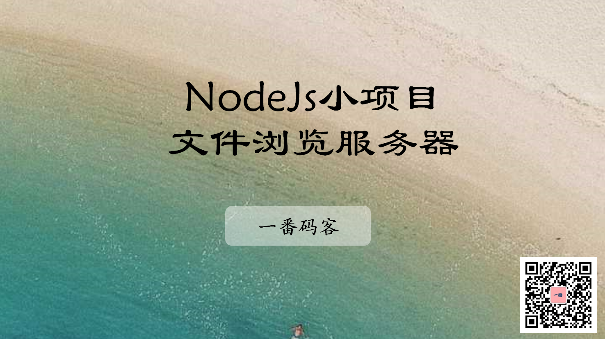
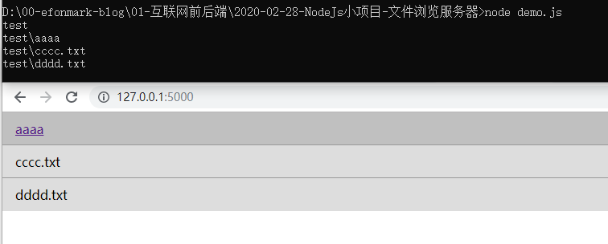
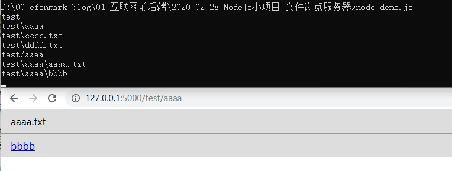

> **一番码客 : 挖掘你关心的亮点。**
> **http://www.efonmark.com**

本文目录：

[TOC]



<!--more-->

## 功能需求

启动一个服务，当用户访问服务时，给用户展示指定目录下的所有文件；

如果子文件是目录，则能继续点进去浏览。

## 方案设计

通过读取需要获取的文件夹里的内容，动态生成一个包含该文件夹内容元素的html页面。

如果这个元素是文件夹，需要有链接功能。

## 代码实现

```js
'use strict'
let http = require("http");
let fs = require('fs');
let path = require('path');


// 1.启动一个服务器
let server = http.createServer( (req, res)=>{
    if(req.url === '/favicon.ico'){
        res.end("")
        return
    }
    // console.log(req.url);
    res.writeHead(200, {'content-type': 'text/html;charset=utf-8'})
    showDir(req, res)

});

server.listen(5000);

function showDir(req, res) {
    // 默认是/，读取test目录下面的
    // 如果不是/根路径，说明是请求了其他路径

    let target = 'test';
    if(req.url !== '/'){
        //说明是其他的路径，不是根路径的请求
        target = req.url;
    }

    //1. 读取目标目录下的文件列表
    let s = target.substring(target.indexOf("/")+1);
    console.log(s);
    fs.readdir(s, (err, files)=>{
        // res.end(JSON.stringify(files))
        let listr = '';
        files.forEach( f=>{
            let fpath = path.join("./", target, f);
            console.log(fpath);
            let stat = fs.statSync(fpath);
            if(stat.isDirectory()){
                //应该拼上a标签
                // console.log(fpath);
                listr += `<li><a href="${fpath}">${f}</a></li>`
            }else {
                //不拼a标签
                listr += `<li>${f}</li>`
            }

        });

        res.end(makeHtml(listr))
    })
}

function makeHtml(lis) {
    return `<!DOCTYPE html>
<html lang="en">
<head>
    <meta charset="UTF-8">
    <title>标题</title>
    <style type="text/css">
        *{padding: 0; margin: 0}
        ul>li{
            list-style: none;
        }
        
        li{
            padding: .6rem 1rem;
            background-color:#ddd;
            transition: all 1s;
        }
        li:not(:first-child){
             border-top: solid 1px #999;
        }
        li:hover{
            background-color:#aaa;
        }
    </style>
</head>
<body>
<div>
    <ul>
        ${lis}
    </ul>
</div>
</body>
</html>`
}
```

## 效果







## 参考

* 黑马程序员 120天全栈区块链开发 开源教程

    > https://github.com/itheima1/BlockChain

## 学习视频
一番同步了对应的学习视频到B站，长按识别可访问一番B站主页观看。


> 一番雾语：nodejs操作本地大文件的方法。

-------
<table>
<tr>
<td ><center></center></td>
<td width="50%" align=left><b>
    免费知识星球：<a href="http://www.efonmark.com/efonmark-blog/readme/zhishixingqiu1.png">一番码客-积累交流</a><br>
    微信公众号：<a href="http://www.efonmark.com/efonmark-blog/readme/guanzhu_1.jpg">一番码客</a><br>
    微信：<a href="http://www.efonmark.com/efonmark-blog/readme/weixin.jpg">Efon-fighting</a><br>
    网站：<a href="http://www.efonmark.com">http://www.efonmark.com</a><br></b></td>
</tr>
</table>