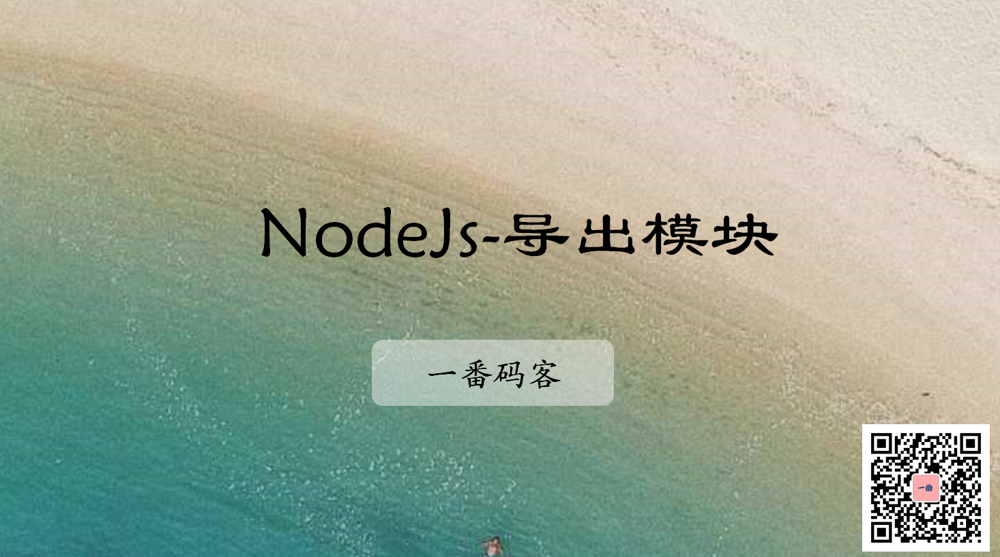

> **一番码客 : 挖掘你关心的亮点。**
> **http://www.efonmark.com**

本文目录：

[TOC]



<!--more-->

## 概述

为了方便代码编写的模块化、解耦性，因此需要代码模块封装。

一个js文件就是一个模块，模块内部的所有变量，对象，方法对外界都不可见。

如果想暴漏出去让别人用，就需要导出模块。

## 导出

* 语法如下：

```javascript
module.exports = {
    a :a,
    foo
}
```

* 通常一个文件导出一个**对象**，如果多次exports，会以最后一次的为准。
* 当key和value一模一样的时候，es6允许我们只写一个。
* 示例代码：

```js
'use strict'
function add(x, y) {
    return x + y;
}

function multi(x, y) {
    return x*y
}

const APP_NAME = "nodejs-demo"

module.exports = {
    name: APP_NAME,
    add, // 当key和value一模一样的时候，es6允许我们只写一个
    multi
};
```

## 引用

* 路径需要相对路径，否则会去找系统模块。
* 示例代码：

```js
'use strict'
let mathutil = require('./libs/mathutil');
let value = mathutil.add(2 ,3);

console.log(value);
console.log(mathutil.name);
console.log(mathutil.multi(10, 10));
```

## 参考

* 黑马程序员 120天全栈区块链开发 开源教程

    > https://github.com/itheima1/BlockChain

## 学习视频
一番同步了对应的学习视频到B站，长按识别可访问一番B站主页观看。


> 一番雾语：模块化编码。

-------
<table>
<tr>
<td ><center></center></td>
<td width="50%" align=left><b>
    免费知识星球：<a href="http://www.efonmark.com/efonmark-blog/readme/zhishixingqiu1.png">一番码客-积累交流</a><br>
    微信公众号：<a href="http://www.efonmark.com/efonmark-blog/readme/guanzhu_1.jpg">一番码客</a><br>
    微信：<a href="http://www.efonmark.com/efonmark-blog/readme/weixin.jpg">Efon-fighting</a><br>
    网站：<a href="http://www.efonmark.com">http://www.efonmark.com</a><br></b></td>
</tr>
</table>