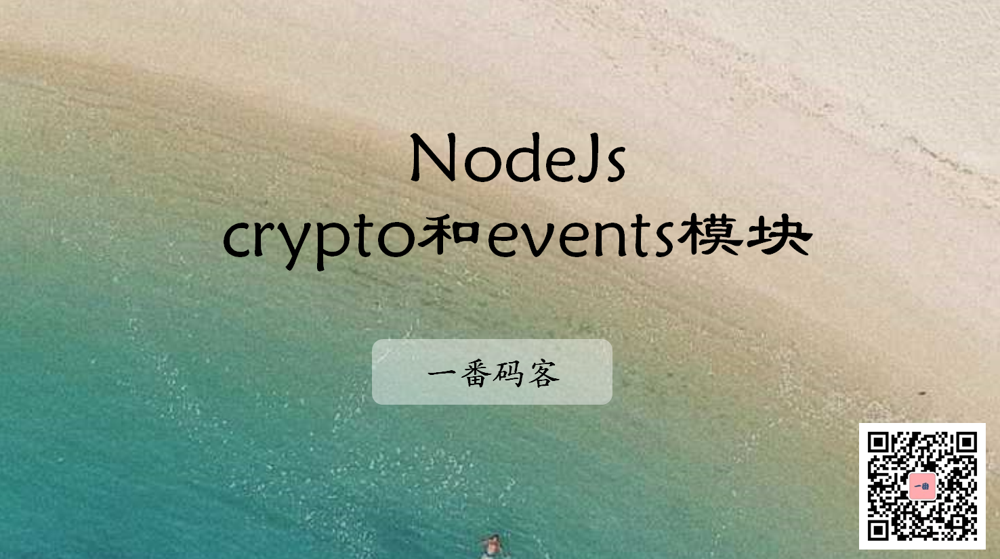
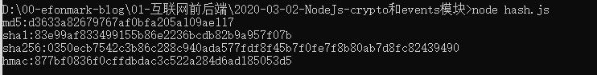
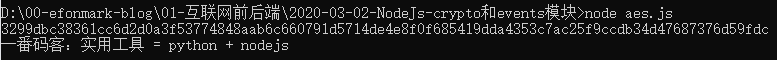
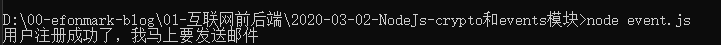

> **一番码客 : 挖掘你关心的亮点。**
> **http://www.efonmark.com**

本文目录：

[TOC]



<!--more-->

## crypto模块

NodeJs的crypto模块提供了哈希、加密相关的功能支持。

### 哈希算法：MD5，SHA1，SHA256，Hmac

* 哈希算法用来对数据进行签名，确定数据的唯一性，以及是否被篡改。
* 由于其过程不可逆，也常常用来对用户密码进行加密。
* Hmac(hash增强)，是基于key和hash的认证算法。它在上面哈希算法的基础上，再传入一个key。只要key变化，即使输入同样的数据也会得到不同的结果。可以将Hmac理解为随机数增强的哈希算法。
* 代码示例：

```js
'use strict'

let crypto = require('crypto')

let data = "一番码客：实用工具 = python + nodejs";

// md5 哈希算法
let md5 = crypto.createHash("md5");
let sha1 = crypto.createHash("sha1");
let sha256 = crypto.createHash("sha256");
let salt = "nodejs";
let hmac = crypto.createHmac("sha1", salt);

md5.update(data);
let result = md5.digest("hex");
console.log('md5:' + result);

sha1.update(data);
result = sha1.digest("hex");
console.log('sha1:' + result);

sha256.update(data);
result = sha256.digest("hex");
console.log('sha256:' + result);

// 随机数增强的hash算法
hmac.update(data);
result = hmac.digest("hex");
console.log('hmac:'+result);
```

运行结果：



### 对称加密算法：AES

* AES是一种常用的对称加密算法，加解密都用同一个密钥。
* 示例代码：

```js
const crypto = require('crypto');

// 加密
function genSign(src, key, iv) {
    let sign = '';
    const cipher = crypto.createCipheriv('aes-128-cbc', key, iv);
    sign += cipher.update(src, 'utf8', 'hex');
    sign += cipher.final('hex');
    return sign;
}

// 解密
function deSign(sign, key, iv) {
    let src = '';
    const cipher = crypto.createDecipheriv('aes-128-cbc', key, iv);
    src += cipher.update(sign, 'hex', 'utf8');
    src += cipher.final('utf8');
    return src;
}

// ase-128-cbc 加密算法要求key和iv长度都为16
const data = '一番码客：实用工具 = python + nodejs'

const key = Buffer.from('9vApxLk5G3PAsJrM', 'utf8');
const iv = Buffer.from('FnJL7EDzjqWjcaY9', 'utf8');

const sign = genSign(data, key, iv);
console.log(sign);


const src=deSign('3299dbc38361cc6d2d0a3f53774848aab6c660791d5714de4e8f0f685419dda4353c7ac25f9ccdb34d47687376d59fdc', key, iv);
console.log(src);
```

运行结果：



## event模块

大多数 Node.js 核心 API 都采用惯用的异步事件驱动架构，其中某些类型的对象（触发器）会周期性地触发命名事件来调用函数对象（监听器）。

例如，`fs.ReadStream`会在文件被打开时触发事件；`stream` 会在数据可读时触发事件。

当你想设计一个模块，它具有在某个条件下执行某个操作的功能，那么event模块就派上用场了。

例如：你想设计一个用户注册模块，当用户注册成功之后给用户发送一个email。

* 示例代码：

```javascript
'use strict'
let EventEmitter = require('events');

class MyEmitter extends EventEmitter{

}

let myEmitter = new MyEmitter();
// 监听事件
myEmitter.on('registerSuccess', (p)=>{
    // console.log("我笑了, 参数是："+ JSON.stringify(p));
    console.log("用户注册成功了，我马上要发送邮件");
});

//触发事件
setTimeout(()=>{
    let person = {
        name: "赵四"
    };
    myEmitter.emit("registerSuccess", person);
}, 2000);
```

结果：



## 参考

* 黑马程序员 120天全栈区块链开发 开源教程

    > https://github.com/itheima1/BlockChain

## 学习视频
一番同步了对应的学习视频到B站，长按识别可访问一番B站主页观看。


> 一番雾语：NodeJs-crypto和events模块。

-------
<table>
<tr>
<td ><center></center></td>
<td width="50%" align=left><b>
    免费知识星球：<a href="http://www.efonmark.com/efonmark-blog/readme/zhishixingqiu1.png">一番码客-积累交流</a><br>
    微信公众号：<a href="http://www.efonmark.com/efonmark-blog/readme/guanzhu_1.jpg">一番码客</a><br>
    微信：<a href="http://www.efonmark.com/efonmark-blog/readme/weixin.jpg">Efon-fighting</a><br>
    网站：<a href="http://www.efonmark.com">http://www.efonmark.com</a><br></b></td>
</tr>
</table>