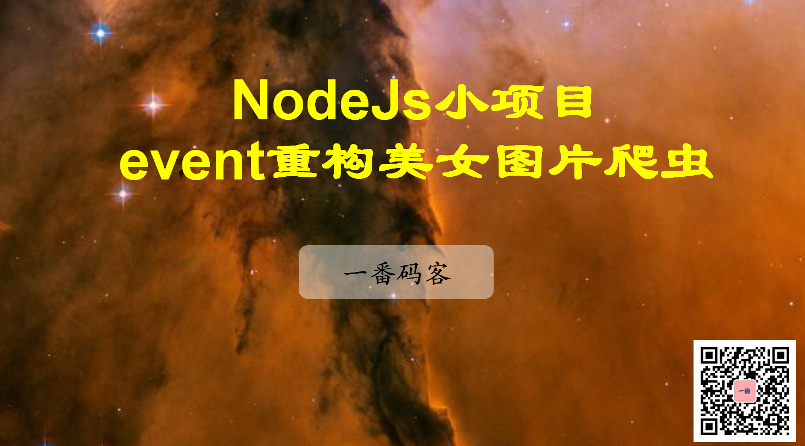

> **一番码客 : 挖掘你关心的亮点。**
> **http://www.efonmark.com**

本文目录：

[TOC]



<!--more-->

## 函数式编程、面向对象编程

前天我们用村函数的方式实现了图片的下载，今天通过封装类、event的方式，我们可以感受下面向对象的编程思想。
只要做好了对象化，就能更好的模块封装，减少重复造轮子，提高开发效率，让开发就像搭积木一样，而不是绕线团。

## 流程特点

每一步执行完了之后，执行下一步。可以很好的利用event的特点，完成整个过程。

## 重构实现

```js
'use strict'
// 使用events模块重构爬虫项目
let http = require('http');
let iconv = require('iconv-lite');
let cheerio = require("cheerio");
let fs = require('fs');
let path = require('path');
let EventEmitter = require('events');

class GirlSpider extends EventEmitter{

    /**
     * 下载html的
     */
    getHtml(){
        //1. 先拿到目标网址的html内容
        http.get("http://www.27270.com/ent/meinvtupian/", res => {
            let data = []; // 用来存放所有的chunk
            res.on('data', chunk => {
                data.push(chunk)
            });
            res.on('end', () => {
                //2. 如果网页内容有乱码，就进行乱码的处理
                // 对data进行解码
                let html = iconv.decode(Buffer.concat(data), "gbk");
                // console.log(html);
                // 解码完毕不去直接调用相关方法，而通过事件来通知
                this.emit("getHtmlFinish", html)
            });
        });
    }

    /**
     * 从html中提取数据
     * @param html
     */
    extraDataFromHtml(html) {
        let $ = cheerio.load(html);
        let arr = $('div.MeinvTuPianBox>ul>li>a>i>img').toArray();
        let imgData = []
        for (let i = 0; i < arr.length; i++) {
            let obj = arr[i];
            let src = $(obj).attr("src");
            let title = $(obj).attr("alt");
            // console.log(`src: ${src}  title: ${title}`);
            imgData.push({
                src, title
            })
        }
        // 使用事件通知的方式，去调用其他方法
        this.emit("extraDataFinish", imgData)
    }

    /**
     * 下载图片
     * @param imgData
     */
    downloadImage(imgData) {
        imgData.forEach(imgObj => {
            http.get(imgObj.src, res => {
                // res本质是一个reader
                let imgPath = path.join("imgs", imgObj.title + path.extname(imgObj.src))
                let writer = fs.createWriteStream(imgPath);
                res.pipe(writer);
            });
        });
    }

    /**
     * 用来初始化监听器的注册，
     */
    start(){
        //1. 注册监听器
        this.on('getHtmlFinish', (html)=>{
            // 调用抽取数据的函数
            this.extraDataFromHtml(html)
        });
        this.on('extraDataFinish', (imgData)=>{
            this.downloadImage(imgData)
        })

        //2. 启动
        this.getHtml()
    }
}


// 使用爬虫
let girlSpider = new GirlSpider();
girlSpider.start();
```


> 一番雾语：运用好面向对象的思想。

-------
<table>
<tr>
<td ><center></center></td>
<td width="50%" align=left><b>
    免费知识星球：<a href="http://www.efonmark.com/efonmark-blog/readme/zhishixingqiu1.png">一番码客-积累交流</a><br>
    微信公众号：<a href="http://www.efonmark.com/efonmark-blog/readme/guanzhu_1.jpg">一番码客</a><br>
    微信：<a href="http://www.efonmark.com/efonmark-blog/readme/weixin.jpg">Efon-fighting</a><br>
    网站：<a href="http://www.efonmark.com">http://www.efonmark.com</a><br></b></td>
</tr>
</table>