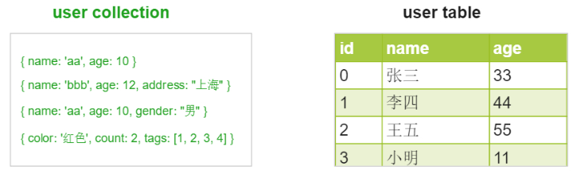

> **一番码客 : 挖掘你关心的亮点。**
> **http://www.efonmark.com**

本文目录：

[TOC]


<!--more-->

## 介绍

MongoDB是一个由C++编写的高性能的文档型数据库，为web应用提供可扩展数据库解决方案。

它和MySQL的区别如下：

|     项目     |                      MongoDB                       |                            MySQL                             |
| :----------: | :------------------------------------------------: | :----------------------------------------------------------: |
|   存储单元   | 按collection存储，一个collection中包含很多document |            按table存储，一个table中包含很多的记录            |
| 数据格式要求 |    非常灵活，document可以存储任意json格式的数据    |        row中的每一列的数据类型都是限定死的，不够灵活         |
| 数据字段扩展 |               对数据字段的扩展零消耗               | 数据扩展字段有很大的消耗。比如：上万条数据再增加一列就要消耗几十秒。 |
|   事务支持   |          在4.0之后版本支持，目前已经支持           |                             支持                             |
|   读写性能   |        一般情况下，读写性能都要略高于MySQL         |                           性能平稳                           |

区别举例：



## 下载与安装

下载地址：`https://www.mongodb.com/download-center/community`，然后傻瓜式安装（不需要安装compass组件）。

## 启动

- 为了方便执行命令，先将安装目录下的`bin`添加到环境变量中。

- 启动server端：`mongod --dbpath F:\xxx`

- 启动client端：`mongo`

- **为了方便，推荐将mongodb设置为Windows的开机启动服务**，做法如下：

    1. 在mongodb的根目录下创建mongo.config文件，内容如下：

        ```
        dbpath=F:\mongodb\data
        logpath=F:\mongodb\log\mongo.log
        ```

    2. 用管理员启动cmd，执行：

        ```bash
        mongod --config f:\mongodb\mongo.config --install --serviceName mongodb
        ```

        服务安装完毕，不要忘记启动服务。

    3. 启动和停止服务

        ```bash
        net start/stop mongodb
        ```

## 基本操作

* 查看可用数据库：`show dbs`
* 切换数据库：`use test`(如果不存在，则在操作数据库的时候会自动创建)
* 查看集合：`show collections`
* 增加数据：`db.users.insertOne(name:"一番",age:18)`
* 删除数据：`db.users.deleteOne({name:"一番"}})`
* 更新数据：`db.users.updateOne({name:"一番"}, {$set：{age: 16}})`
* 查找数据：`db.users.find()`

* GUI操作工具：robot3t


> 一番雾语：最适合爬虫的数据库。

-------
<table>
<tr>
<td ><center></center></td>
<td width="50%" align=left><b>
    免费知识星球：<a href="http://www.efonmark.com/efonmark-blog/readme/zhishixingqiu1.png">一番码客-积累交流</a><br>
    微信公众号：<a href="http://www.efonmark.com/efonmark-blog/readme/guanzhu_1.jpg">一番码客</a><br>
    微信：<a href="http://www.efonmark.com/efonmark-blog/readme/weixin.jpg">Efon-fighting</a><br>
    网站：<a href="http://www.efonmark.com">http://www.efonmark.com</a><br></b></td>
</tr>
</table>

