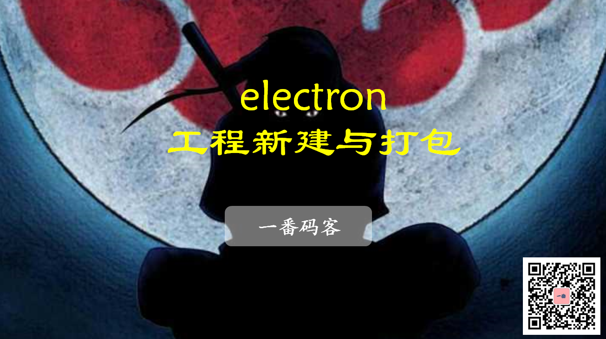
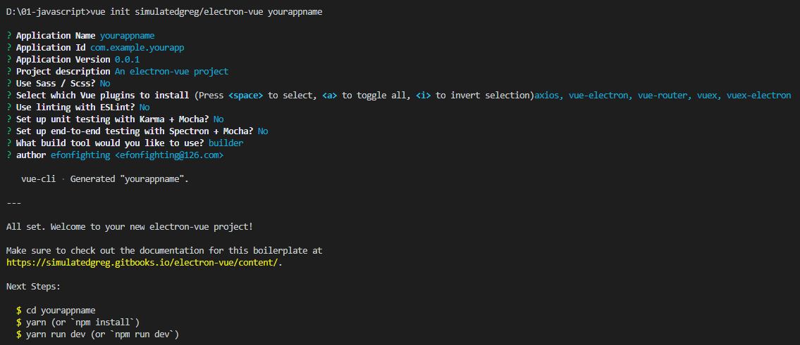

> **一番码客 : 挖掘你关心的亮点。**
> **http://www.efonmark.com**

本文目录：

[TOC]



<!--more-->

## 前言

经过前面一段时间对前端知识的学习，今天一番重新拾起electron，思路还是比之前开阔一些了，解决问题的方法也多一些了。

但发现里面涉及到的东西还是很多，nodejs、webpack、vue，看来这个坑有点深，几乎可以囊括前端所有的知识了吧。

不管怎样，先把这个开发平台搭起来，至于vue、webpack等等，边用边学吧。

## 环境搭建

### 安装Nodejs

进入Node官网下载页[http://nodejs.cn/download/](https://link.zhihu.com/?target=http%3A//nodejs.cn/download/)，然后下载对应系统的版本即可，然后一路默认安装。

接下来，为了使下载依赖包加快速度（否则奇慢难忍），需要将npm的源替换为淘宝镜像源，并且安装cnpm。

```text
npm install -g cnpm --registry=https://registry.npm.taobao.org
```

以后即可用`cnpm`代替`npm`命令。

### 安装/升级vue-cli

执行如下命令，全局安装。

```text
npm install -g vue-cli
```

执行以下命令，可以查看`vue-cli`版本并检验是否安装成功。

```text
vue -V
```

### 安装Electron

使用如下命令安装Electron插件。

```text
npm install -g electron
或者
cnpm install -g electron
```

为了验证是否安装成功，可以使用如下的命令。

```text
electron --version
```

## 创建工程

这里我们分别创建两个工程，一个最基本的electron工程，一个基于electron-vue的工程。

### 创建electron工程

Electron官方提供了一个简单的项目，可以执行以下命令将项目克隆到本地。

```text
git clone https://github.com/electron/electron-quick-start
```

然后在项目中执行如下命令即可启动项目。

```text
cd electron-quick-start
npm install 
npm start
```

### 创建electron-vue工程

使用vue-cli脚手架工具来创建项目。

```text
vue init simulatedgreg/electron-vue yourappname
```

选项配置如下：



然后进入创建的工程目录，安装依赖。

```text
cnpm install
```

接下来便可以执行package.json里的命令来运行、打包应用了。

* 运行

```text
"dev": "node .electron-vue/dev-runner.js",
```

* 打包

```text
"build": "node .electron-vue/build.js && electron-builder",
```

打包后可将整个`\build\win-unpacked\`目录打包发布。

> * 运行、打包的时候，可能遇到的问题：
>
> `Webpack ReferenceError: process is not defined`
>
> * 解决办法：
>
> 修改 `.electron-vue/webpack.renderer.config.js` 和 `webpack.web.config.js`如下：
>
> `webpack.web.config.js`:
>
> ```js
>     new HtmlWebpackPlugin({
>       filename: 'index.html',
>       template: path.resolve(__dirname, '../src/index.ejs'),
>       templateParameters(compilation, assets, options) {
>         return {
>           compilation: compilation,
>           webpack: compilation.getStats().toJson(),
>           webpackConfig: compilation.options,
>           htmlWebpackPlugin: {
>             files: assets,
>             options: options
>           },
>           process,
>         };
>       },
>       minify: {
>         collapseWhitespace: true,
>         removeAttributeQuotes: true,
>         removeComments: true
>       },
>       nodeModules: false
>     }),
> ```
>
> `webpack.render.config.js`:
>
> ```js
>     new HtmlWebpackPlugin({
>       filename: 'index.html',
>       template: path.resolve(__dirname, '../src/index.ejs'),
>       minify: {
>         collapseWhitespace: true,
>         removeAttributeQuotes: true,
>         removeComments: true
>       },
>       templateParameters(compilation, assets, options) {
>         return {
>           compilation: compilation,
>           webpack: compilation.getStats().toJson(),
>           webpackConfig: compilation.options,
>           htmlWebpackPlugin: {
>             files: assets,
>             options: options
>           },
>           process,
>         };
>       },
>       nodeModules: process.env.NODE_ENV !== 'production'
>         ? path.resolve(__dirname, '../node_modules')
>         : false
>     }),
> ```

## 应用工程目录

使用electron-vue模版创建的Electron工程结构：

- **electron-vue**：Electron模版配置。 

- **build**：文件夹，用来存放项目构建脚本。
- **config**：中存放项目的一些基本配置信息，最常用的就是端口转发。 
- **node_modules**：这个目录存放的是项目的所有依赖，即 npm install 命令下载下来的文件。
- **src**：这个目录下存放项目的源码，即开发者写的代码放在这里。对于开发者来说， 90% 的工作都是在 src 中完成，
- **static**：用来存放静态资源。
- **index.html**：则是项目的首页、入口页，也是整个项目唯一的HTML页面。
- **package.json**：中定义了项目的所有依赖，包括开发时依赖和发布时依赖。

## 应用结构

Electron应用程序分成三个基础模块：主进程、进程间通信和渲染进程。

### 主进程

Electron 运行 package.json 的 main 脚本（background.js）的进程被称为主进程。

在主进程中运行的脚本通过创建web页面来展示用户界面。 一个 Electron 应用总是有且只有一个主进程。

main目录会包含index.js和index.dev.js两个文件。

* **index.js**：应用程序的主文件，electron 也从这里启动的，它也被用作 webpack 产品构建的入口文件，所有的 main 进程工作都应该从这里开始。
* **index.dev.js**：此文件专门用于开发阶段，因为它会安装 electron-debug 和 vue-devtools。一般不需要修改此文件，但它可以扩展开发的需求。

### 渲染进程

由于 Electron 使用了 Chromium 来展示 Web 页面，所以 Chromium 的多进程架构也被使用到。 每个 Electron 中的 Web 页面运行在它自己的渲染进程中。在普通的浏览器中，Web页面通常在一个沙盒环境中运行，不被允许去接触原生的资源。 然而 Electron 允许用户在 Node.js 的 API 支持下可以在页面中和操作系统进行一些底层交互。

renderer是渲染进程目录，平时项目开发源码的存放目录，包含assets、components、router、store、App.vue和main.js。

- **assets**：assets下的文件如（js、css）都会在dist文件夹下面的项目目录分别合并到一个文件里面去。
- **components**：此文件用于存放应用开发的组件，可以是自定义的组件。
- **router**：如果你了解vue-router，那么Electron项目的路由的使用方式和vue-router的使用方式类似。
- **modules**：electron-vue 利用 vuex 的模块结构创建多个数据存储，并保存在 src/renderer/store/modules 中。

### 主进程与渲染进程通信

主进程使用 BrowserWindow 实例创建页面。 每个 BrowserWindow 实例都在自己的渲染进程里运行页面。 当一个 BrowserWindow 实例被销毁后，相应的渲染进程也会被终止。主进程管理所有的Web页面和它们对应的渲染进程。 每个渲染进程都是独立的，它只关心它所运行的 Web 页面。

## 结语

至此，我们即完成了一个electron/electron-vue工程的开发环境搭建，后面即可专心在这个工程的基础上搭建我们自己的应用了。

<table>
    <td>
    <font size="2" color="gray">参考：</font><br>
    <font size="2" color="gray">
        - Electron+Vue开发跨平台桌面应用：https://zhuanlan.zhihu.com/p/98989999
    </font><br>
    </td>
</table>


> 一番雾语：electron开发环境的搭建真是坑多的很。


-------
<table>
<tr>
<td ><center></center></td>
<td width="50%" align=left><b>
    免费知识星球：<a href="http://www.efonmark.com/efonmark-blog/readme/zhishixingqiu1.png">一番码客-积累交流</a><br>
    微信公众号：<a href="http://www.efonmark.com/efonmark-blog/readme/guanzhu_1.jpg">一番码客</a><br>
    微信：<a href="http://www.efonmark.com/efonmark-blog/readme/weixin.jpg">Efon-fighting</a><br>
    网站：<a href="http://www.efonmark.com">http://www.efonmark.com</a><br></b></td>
</tr>
</table>

