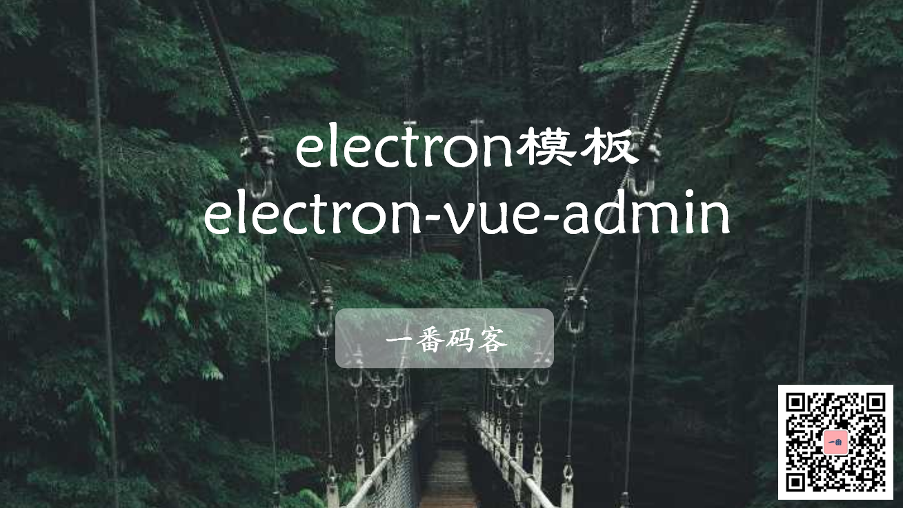
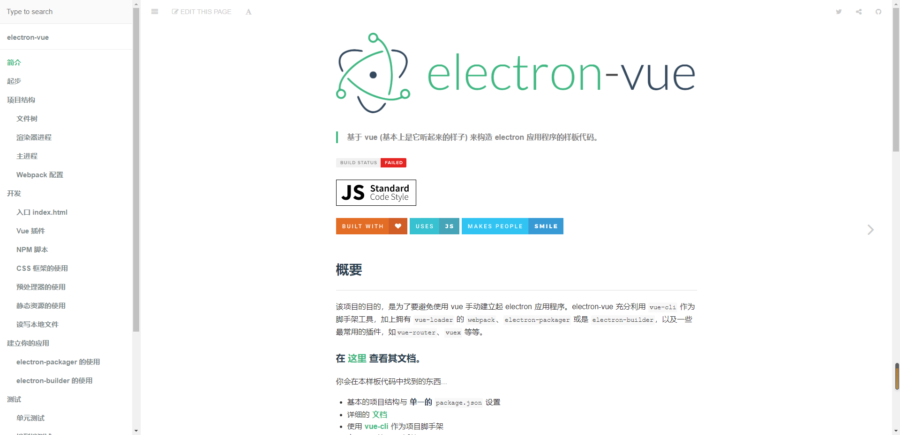

> **一番码客 : 挖掘你关心的亮点。**
> **http://www.efonmark.com**

本文目录：

[TOC]



<!--more-->

## 前言

无论作为个人还是公司，开发一款产品都不可能从无到有，一定是在现有技术基础之上去开发、优化、进步。

那么要想开发一个electron工具， 昨天文章里介绍到了两个工程模板——官方的`electron-quick-start`和`electron-vue`，但这两个还是比较简单。

今天一番又找到一个基于electron-vue的模板，这个模板应该是运用比较广的，很多个人开发者的electron应用都用到了这个模板。

## electron-vue-admin

* **项目地址**

```text
https://github.com/PanJiaChen/electron-vue-admin
```

* **项目描述**

这个electron项目是基于`vue-admin-template`项目的一个electron版本，是一个极简的 `vue admin` 管理后台。

它只包含了 `Element UI & axios & iconfont & permission control & lint`，这些搭建后台必要的东西。

比较好的是它帮我们构建了一个基本的层级关系页面，我们就可以再次基础上做二次开发。

* **项目展示**


* electron-vue官方文档

```text
https://simulatedgreg.gitbooks.io/electron-vue/content/cn/
```




## 其他

对于怎么找到这个项目的。一番之前看到一篇【Github上 10 个开源免费且优秀的后台控制面板】的文章，很多个人项目都是用的这里面的开源项目做的二次开发。一路下来，一番便找到了一个vue的electron项目，继续找到这个项目的eletron版本。

* Github上 10 个开源免费且优秀的后台控制面板

```text
https://www.jianshu.com/p/3bc7404af887
```


> 一番雾语：千万开发者在用的优秀electron模板。

-------
<table>
<tr>
<td ><center></center></td>
<td width="50%" align=left><b>
    免费知识星球：<a href="http://www.efonmark.com/efonmark-blog/readme/zhishixingqiu1.png">一番码客-积累交流</a><br>
    微信公众号：<a href="http://www.efonmark.com/efonmark-blog/readme/guanzhu_1.jpg">一番码客</a><br>
    微信：<a href="http://www.efonmark.com/efonmark-blog/readme/weixin.jpg">Efon-fighting</a><br>
    网站：<a href="http://www.efonmark.com">http://www.efonmark.com</a><br></b></td>
</tr>
</table>

