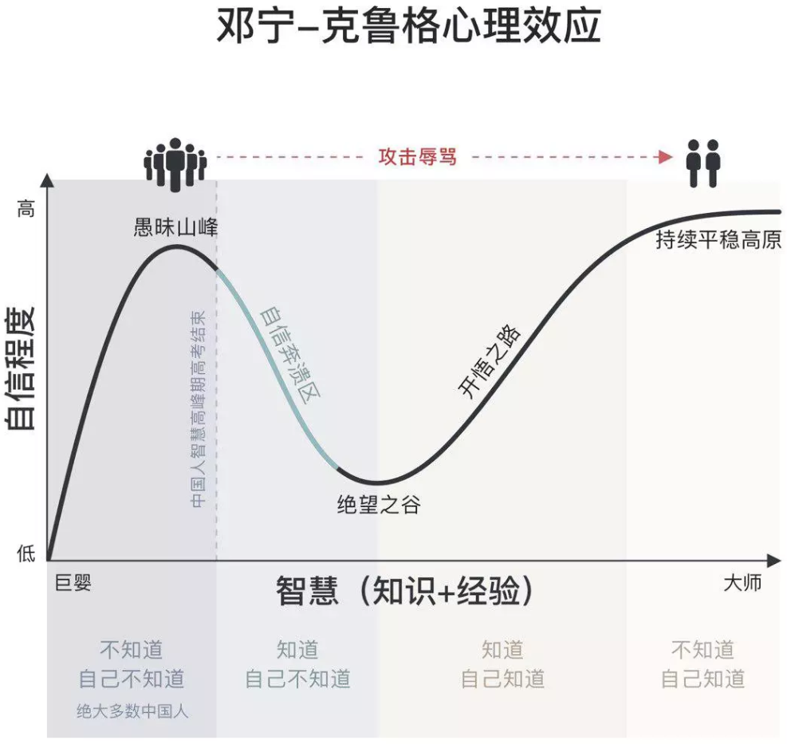

> **一番码客 : 挖掘你关心的亮点。**
> **http://efonfighting.imwork.net**

本文目录：

[TOC]

## 前言

昨天一番总结了过去30天里的更新的文章，有技术的，非技术的，差不多各占一半。

技术文章务实，非技术文章大多是务虚。务虚是抬头看天，务实是低头赶路。

低头赶路，大家赶路的速度有差异，可能起点不一样，有一段时间大家走在了同样的路上。

抬头看天，因为看到的目的地不一样，最终到达之所便有所差异。

赶路太久容易迷路，抬头看天太久耽误赶路，单重一点，都走不远。

今天继续务虚，抬头看看天。

<!--more-->

## 邓宁—克鲁格心理效应

美团王慧文之前在网上广为传播的一句话：“**有担当的管理者一个重要的责任，就是把下属从愚昧之巅推到绝望之谷，至于他能否爬上开悟之坡，就看各人造化了。**”

这其实就是借用了心理学里的邓 宁-克鲁格效应。

> 百度百科：
>
> 达克效应（D-K effect），全称为邓宁-克鲁格效应（Dunning-Kruger effect）。它是一种认知偏差现象，指的是能力欠缺的人在自己欠考虑的决定的基础上得出错误结论，但是无法正确认识到自身的不足，辨别错误行为。这些能力欠缺者们沉浸在自我营造的虚幻的优势之中，常常高估自己的能力水平，却无法客观评价他人的能力。 

<iframe src= "2019-10-10-抬头看天/达克效应_百度百科.mp4" height=600></iframe>

## 解读感悟

有一本书《巨婴》，有段时间也比较火，巨婴这个词也用来描述中国相当一部分成年人的认知状态，当然我们也要不断反思，自己的认知整体处在哪个阶段，或者说自己在某方面、某些时刻的表现处在哪个阶段。

在绝望的时候要有自信，在知道自己不知道的时候，要克服恐惧心理，相信一定有方法，有勇气去克服盲区，然后建立核心实力战胜盲区，才能一步一步走上开悟之路。

任重而道远，开悟之路是一条开悟之路，无数开悟之路汇总起来才会到达持续平稳高原。

## 参考

* 邓宁-克鲁格心理效应简介

  **（https://www.imtqy.com/dk-effect.html)**

* 达克效应

  **(https://baike.baidu.com/item/达克效应)**

## 一番今日

昨天睡得比较早一点，精神状态有所好转，也开始了日常锻炼，继续保持。

从今天的工作中的体悟，管理者要有能力把下属推向绝望之谷，但还要指明开悟之路，再看有没有能力爬上觉悟之路。

> 一番雾语：对未来最大的慷慨，便是把一切献给现在。

> **免费知识星球： [一番码客-积累交流]([wwww](https://t.zsxq.com/NRVBURr))**
> **微信公众号：一番码客**
> **微信：Efon-fighting**
> **网站： http://efonfighting.imwork.net**