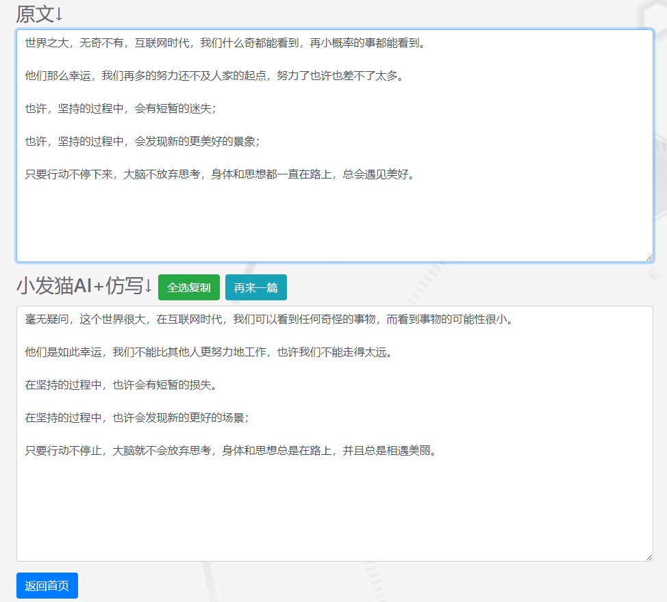
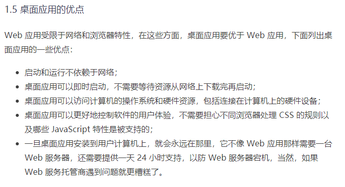
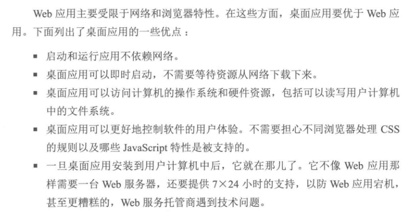

> **一番码客 : 挖掘你关心的亮点。**
> **http://efonfighting.imwork.net**

本文目录：

[TOC]

## 前言

之前早就听说智能写作的东西，很多我们网上看的文章有时词句不通，有时逻辑混乱，但总能表达一些大概意思。

后来听说现在很多文章都是机器人写的，才恍然大悟，自然人要想写出这种语法的文章确实还不是正常人能写的。

<!--more-->

## 看个例子

我们先来看看下面两段文字。

>  世界之大，无奇不有，互联网时代，我们什么奇都能看到，再小概率的事都能看到。
>
> 他们那么幸运，我们再多的努力还不及人家的起点，努力了也许也差不了太多。
>
> 也许，坚持的过程中，会有短暂的迷失；
>
> 也许，坚持的过程中，会发现新的更美好的景象；
>
> 只要行动不停下来，大脑不放弃思考，身体和思想都一直在路上，总会遇见美好。

这段话摘自一番之前写过的一篇《为什么要持续输出》。再看看下面的话。

> 毫无疑问，这个世界很大，在互联网时代，我们可以看到任何奇怪的事物，而看到事物的可能性很小。
>
> 他们是如此幸运，我们不能比其他人更努力地工作，也许我们不能走得太远。
>
> 在坚持的过程中，也许会有短暂的损失。
>
> 在坚持的过程中，也许会发现新的更好的场景；
>
> 只要行动不停止，大脑就不会放弃思考，身体和思想总是在路上，并且总是相遇美丽。

以上来自一个仿写网站，就这么一个简单的功能，有人把他做成了一个网站。

这个应该是一个比较简陋的产品了，仿写出来的质量并不高，之前也听说有人开发的AI写作，用来写科技论文并投稿杂志社成功的。

## 另一个例子

一番最近不是准备学electron么，于是会搜索一些相关的资料。就在早上一番准备学习的时候，发现一个付费课程和一本书“撞衫”了。截取一小段感受下。

这是付费教程的文章：

这是原书的文章：

信息差无处不在，但这个付费课程的实际案例中有一些内容的本地化，看来至少还是自己打磨过的，因为原书的原作者是国外的，所以看这个本地化过后的文章可能还要更易懂一些。

这便是互联网上信息爆炸带来的信息差，要想从浩如烟海的信息中找到自己的有效信息，可能这些信息有很多份。但原创的优势还是有的。

## 一番今日

这周末终于有个双休了，今天正准备学习的，结果偶遇了上面的文章“撞衫”事件。成长的过程会经历模仿的过程，但要长大做强，必须有创造和创新。

> 一番雾语：原创就像生命之源，活力从这里而来。

> **免费知识星球： [一番码客-积累交流]([wwww](https://t.zsxq.com/NRVBURr))**
> **微信公众号：一番码客**
> **微信：Efon-fighting**
> **网站： http://efonfighting.imwork.net**