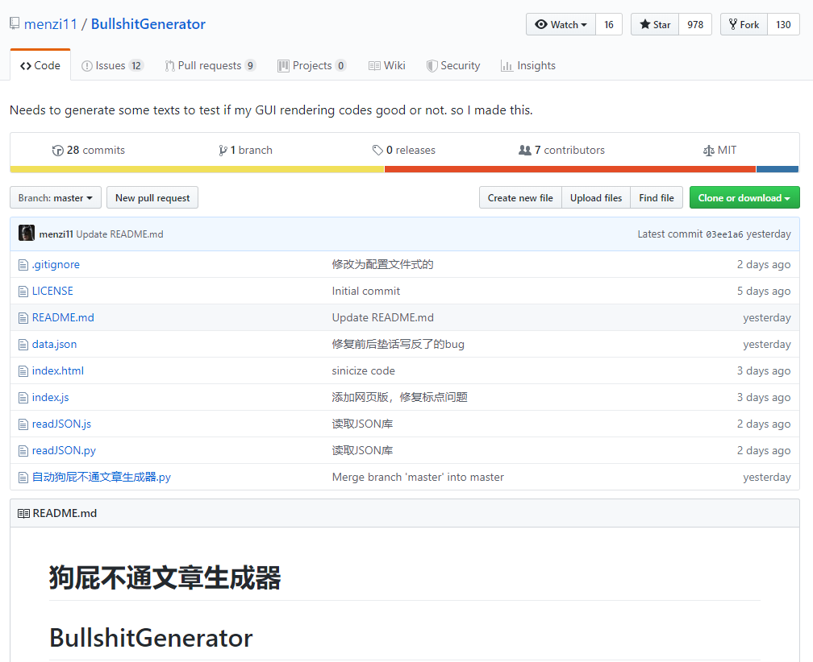
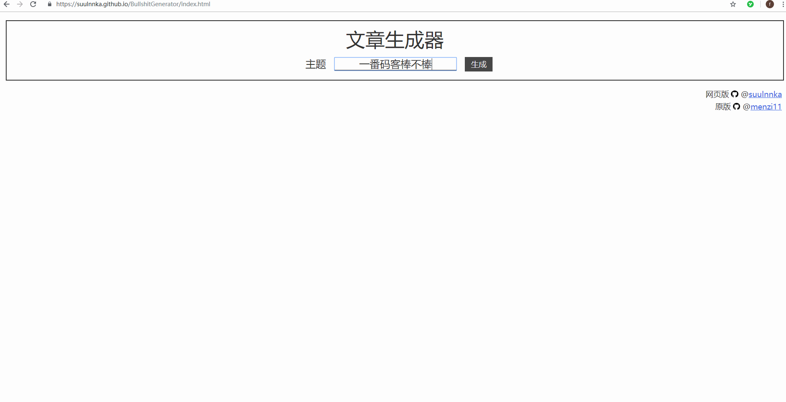
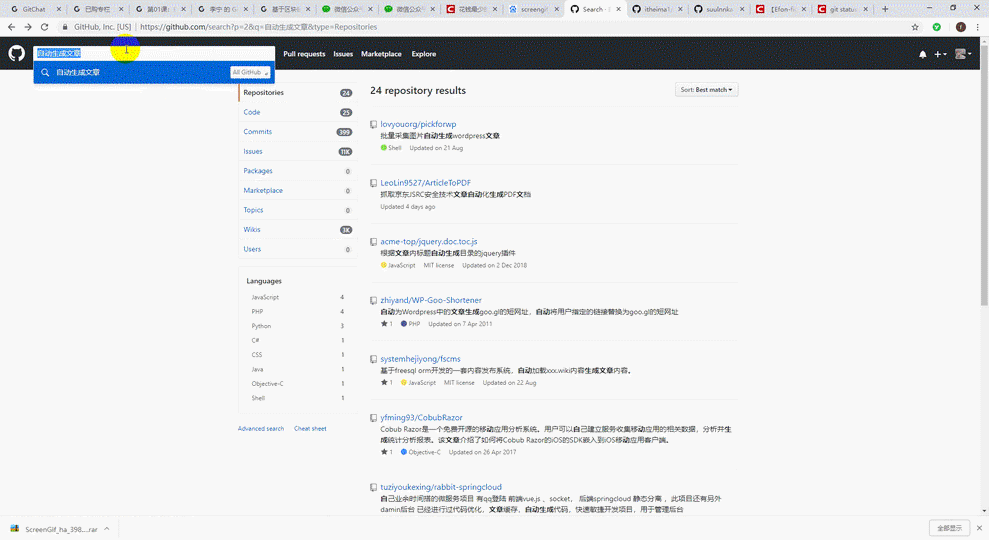
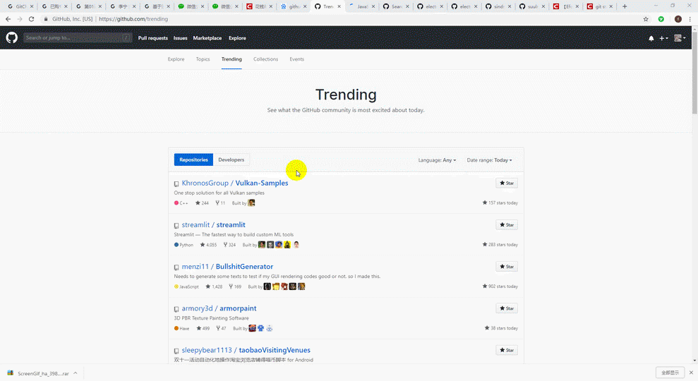

> **一番码客 : 挖掘你关心的亮点。**
> **http://www.efonmark.com**

本文目录：

[TOC]

## 前言

github是个大宝藏，就怕我们不消化。接着上一篇说到的机器人写作，一番找到了一个文章生成器的开源项目，本来也只是好玩，发现了github的一些有趣实用之处。程序员不愧是这个世界上最有趣、最踏实的一群人。

<!--more-->

## 入口

昨天在一个微信群里看到有人关于文章改写的讨论，发了个自动生成文章的github开源项目。当然这个开源项目存粹是搞笑的，没有任何实用价值，但就这个开源项目就有接近1k的star。不得不感叹，github的使用人群还是很庞大的，但真正用的好的人，挖掘出了它的价值的人，估计只占很小一部分。

## 探究

接下来，一番想再深挖一下一番最近在意的一些主题相关的资源。

### 区块链

全站搜索“blockchain”。发现了很多区块链汇总的知识，查看star最多的，都是精品。

### electron

全站搜索“electron”，资料最多的是英文资料，中文资料偏少，还存在一定的机会。

### github 趋势

## 参考

* how-to-use-github

  > https://github.com/xirong/my-git/blob/master/how-to-use-github.md

* BullshitGenerator

  > https://github.com/menzi11/BullshitGenerator

* github trending

  > https://github.com/trending

## 一番今日

今天和朋友小聚过后，聊到现在看文字的人越来越少，短视频越来越火。确实，视频和图片让表达更里立体、高效，也许是该学习学习视频和图片拍摄了。

> 一番雾语：github是个大宝藏，在于挖掘与整合的能力。

> **免费知识星球： [一番码客-积累交流]([wwww](https://t.zsxq.com/NRVBURr))**
> **微信公众号：一番码客**
> **微信：Efon-fighting**
> **网站： http://www.efonmark.com**