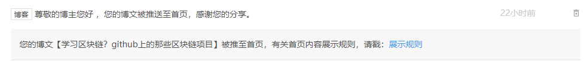
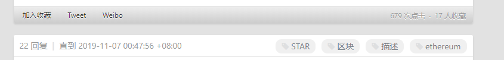

> **一番码客 : 挖掘你关心的亮点。**
> **http://www.efonmark.com**

本文目录：

[TOC]

## 前言

这两天在接触到一些建站、运营网站的文章，看了下挺受益的。自己之前也建了站，从零基础零知识到现在有一些浅薄的认知和经验了。

因为刚开始日更原创文章不到两个月，内容写的不是很好，公众号的阅读不高，一般写了一篇文章，如果还有更多的精力，一番会把一些文章同步到不同的平台，希望能多一些人看到，多产生一些交流。

昨天一番差不多花了两个半小时写了一篇《github上的那些区块链项目》的总结性文章，感觉还不错，应该对想学区块链的是一个不错的资料。这里写下这篇文章过去24小时的经历。

<!--more-->

## 公众号

公众号一直是一番文章日更的标准，昨天将《github上的那些区块链项目》文章发出去后，因为公众号粉丝不多，阅读量比较惨淡，目前只有33个阅读，是历史比较低的数据，看来公众号里对区块链技术不是很感冒。当然也有读者在群里鼓励说不错的，非常感谢。

## CSDN

奈何公众号的受众对这个话题不是很敏感，阅读量很小，于是一番把这篇文章同步到了CSDN并且使用了推荐卡（CSDN新推出了一个功能，每周有两张推荐卡，可以申请推荐到首页，如果通过了审核，就会推荐首页）。很快收到一条首页推送的消息，这是一番第一次推送首页。

刚开始还有点小兴奋，于是就去首页找啊找，想留个纪念啊。然而，并没有找到，不清楚这个逻辑是什么了，而且阅读量也不高，截至现在只有29次点击，蛮失望。

其实写一篇文章，对作者一大激励就是看的人多，评论的人多。

## 知乎

多找个平台吧，也许看到的人会多一点，于是一番又把这篇文章同步到了知乎专栏，不过短时间内也不报太大希望，截至现在又9个阅读量。

## V2EX

CSDN和知乎的曝光量和推荐机制一番都不能get到（虽然主要原因是因为文章写的不好，哈哈），看来要尝试新的平台了。于是一番开通了技术社区V2EX的账号，然后发了帖。

发了之后研究了下这个网站首页的曝光机制。整个网站的注册人数有45万+，一般在线人数最多会有5k人。这个网站的各个模块的首页就是有最新动态的主题，只要有动态，就会顶上来。

果然，已发了文就有人收藏了，慢慢有人评论了，阅读也很快破百了，截至今天早上已经有600多的点击，17人收藏，22条回复了。这是莫大的鼓舞啊。

可以看出来，V2EX里的用户都是技术圈的人，不然也不会知道这个网站，里面大家讨论也比较热情，氛围还是非常棒的，真是超喜欢里面的感觉。

## 中国最大的一些技术社区

最后一番收集了一下中国最大的一些技术社区和技术文章创作平台，一个可以拓宽自己的社交圈，一个也可以为以后文章的推广做好储备。

* CSDN
* 博客园
* V2EX
* SegmentFault
* 开源中国
* 开发者头条
* 掘金社区
* 开源中国
* 知乎
* 今日头条

## 一番今日

推广这篇文章让一番还是非常有收获，和不同的人交流真是一件非常有趣的事，也可以开阔眼界、获取多数人认知。经历挺有意思，也有很多新的感悟，但一番的文笔和思路还是有待提高。

> 一番雾语：交流产生价值。

------------

> **免费知识星球： [一番码客-积累交流](http://www.efonmark.com/efonmark-blog/readme/zhishixingqiu1.png)**
> **微信公众号：[一番码客](http://www.efonmark.com/efonmark-blog/readme/guanzhu_1.jpg)**
> **微信：[Efon-fighting](http://www.efonmark.com/efonmark-blog/readme/weixin.jpg)**
> **网站： [http://www.efonmark.com](http://www.efonmark.com)**