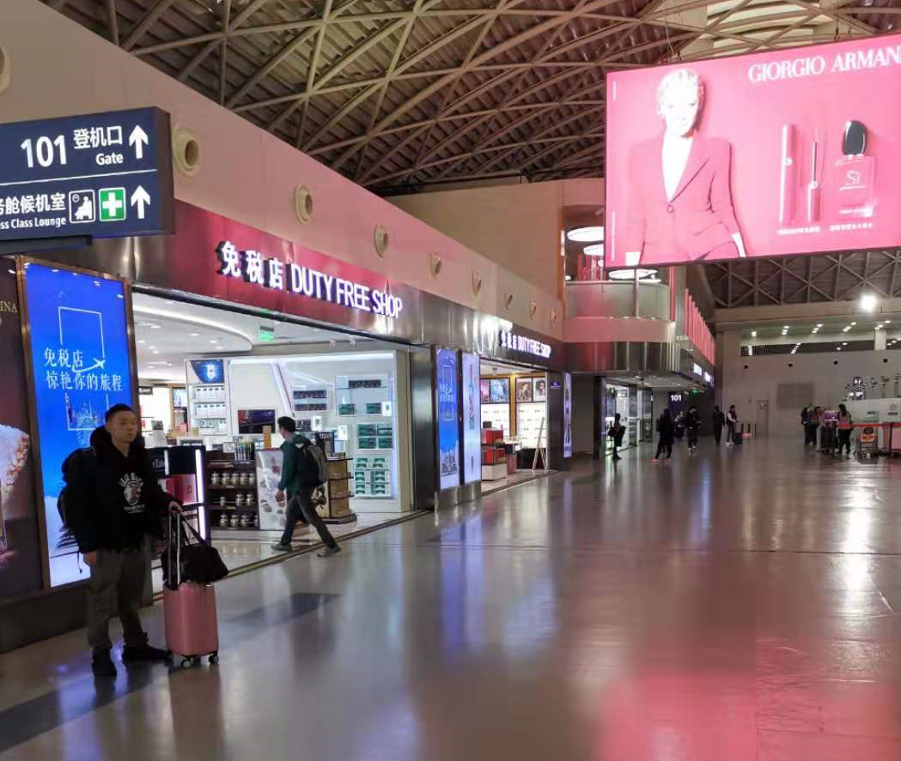
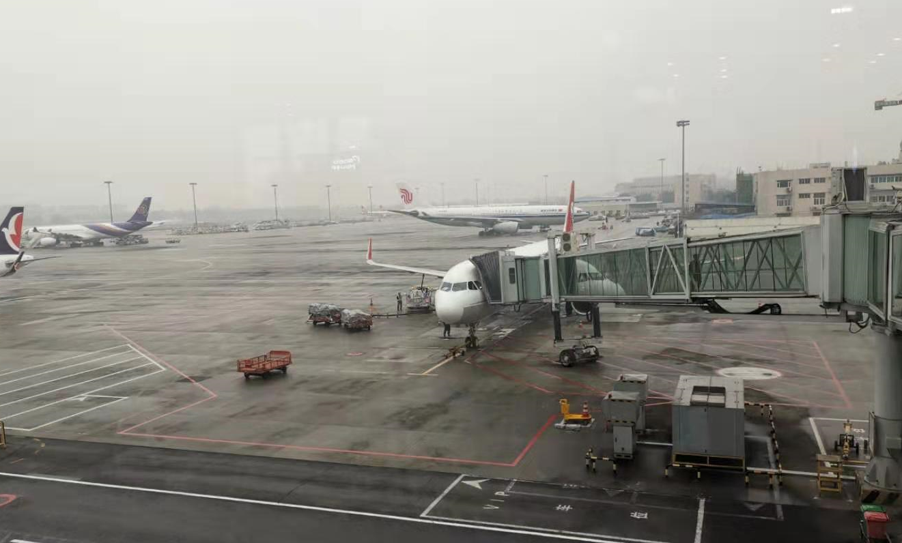
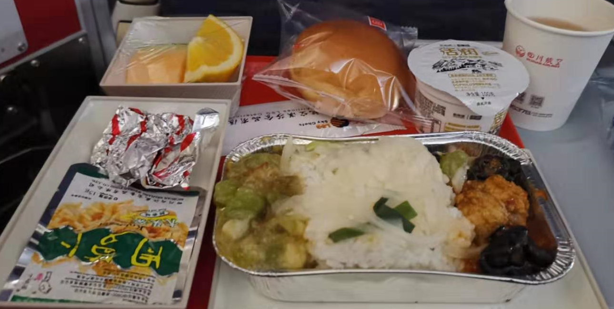
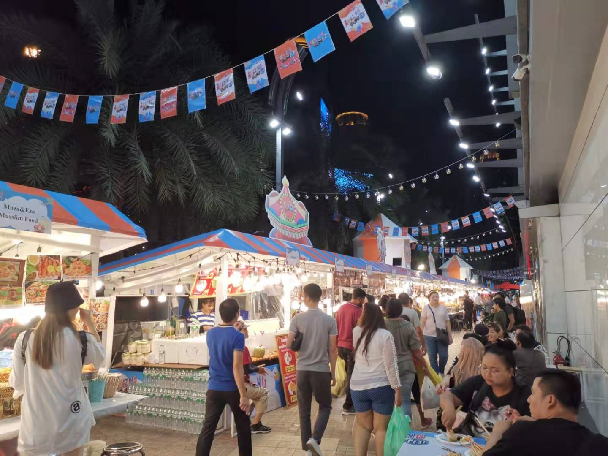

> **一番码客 : 挖掘你关心的亮点。**
> **http://www.efonmark.com**

本文目录：

[TOC]

## 一番今日

最近几天一番和几位同时在泰国曼谷出差，参加谷歌的安卓TV峰会，曼谷这边比国内晚一个小时，为了保证白天会议有一个比较好的状态，一番还是要保证充足的睡眠，今天一番就用一篇出差在路上的日记作为今天的日更了。

<!--more-->

### 护照签证与通信

现在来泰国还是很方便的，办护照在成都这边也非常简单方便，拿上身份证在政务中心花了120块10分钟就搞定了，差不多等了一周左右就可以到政务中心自助机上取护照了。

泰国有落地签，可以在泰国下飞机再排队办理签证，但据说排队要花一两个小时。可以在淘宝上找个代理办签证的店，一般两百到三百块左右，5个工作日即可完成普通签证。也可以让代理办理电子签证，2天内搞定。

去泰国可以打电话给电话卡运营商开通国际漫游，然后在淘宝上买泰国的流量，如果华为手机还可以用天际通直接买流量，35块3G，这样在泰国的通信问题就解决了。

### 路上

经过层层安检登机，从成都飞到曼谷大概三个小时，飞机票这个季节便宜的也就七八百，四川航空还不错，飞机餐味道还可以。在飞机上比较困，但经济舱又不太好睡觉。

入境泰国除了签证，还需要填一张移民卡（migration card），在飞机上乘务员会提供，如果没有填下飞机了也可以找机场人员拿了填写，会填写一些个人基本信息和来泰国的行程。

下了飞机，办理入境，机场有货币兑换点，可以直接用国内银联的银行卡在ATM机取泰铢，非常方便，每笔取现有10块的手续费，现在汇率在4.3左右。并没有说需要带5k人民币现金的要求。

出机场打了出租车，差不多花了三十多分钟到市中心的酒店，泰国的出租车体验还是比较好，比较干净。

在酒店办理入住，然后下楼找吃的，感觉跟国内城市差不多，在路边摊吃了碗海鲜面，花了250株，差不多50多人民币，还是好贵。不过超市比国内要便宜。

最后放几张图片吧。

> 一番雾语：不知不觉天就亮了。

------

> **免费知识星球： [一番码客-积累交流](http://www.efonmark.com/efonmark-blog/readme/zhishixingqiu1.png)**
> **微信公众号：[一番码客](http://www.efonmark.com/efonmark-blog/readme/guanzhu_1.jpg)**
> **微信：[Efon-fighting](http://www.efonmark.com/efonmark-blog/readme/weixin.jpg)**
> **网站： [http://www.efonmark.com](http://www.efonmark.com)**