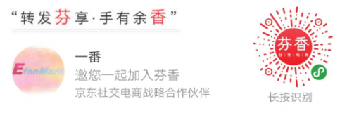

> **一番码客 : 挖掘你关心的亮点。**
> **http://www.efonmark.com**

本文目录：

[TOC]

<!--more-->

今天一番来聊一聊副业赚钱的事。

可能有小伙伴发现一番朋友圈这两天发了两条类似微商的朋友圈。一番一直以来还是比较反感做微商的，因为大部分都是诱导性消费，感觉被商业绑架。

但一番为什么也发了两条推广信息？因为最近知识星球一位大佬在研究社交电商，一番也跟着了解了下，并做了这样的尝试。大佬都在研究了，而且发现这个东西如果做好了确实可以很赚钱。

简单讲就是通过分享平台（比如上面的这个”芬香“）生成一个自己的专属推广链接，有人通过你的推广链接点击进去并产生了实际订单，那你就有一定的推广佣金，这跟打广告差不多。这种形式其实一直都是存在的，比如淘宝联盟、京东联盟等等。最近开始火起来的原因是因为京东最近在发力推广入住的商家，商家会因为没有流量订单而做一些活动让利，然后通过这样的推广平台发布，产生一定订单流量后恢复原价。

比如一番昨天在朋友圈发的超划算的纸巾，40包29块6，确实很划算，一番自己忍不住买了一箱。但考虑到大部分人对这种形式的反感，一番几个小时后就会删除这条朋友圈，保证这条信息在好友的朋友圈只出现有限次数，以后打开朋友圈的时候不会看到这条推广信息，保证朋友圈整洁。

每个人都有改善物质条件的需求，依赖京东的平台品质保证，推荐一些自己严格筛选的优惠又实用的物品，可以帮助大家把钱花在刀刃上，改善物质条件，自己又有收入，形成了一个商业闭环。因此一番准备遇到好的这种物品的时候增加一个专栏，叫做【一番物改】，就是物质改善的意思。需要的同学可以获得实惠，不需要的同学直接忽略就好了。

> 一番雾语：日更的好方法是项目效果驱动，忽略细节描述，给出代码。

------

> **免费知识星球： [一番码客-积累交流](http://www.efonmark.com/efonmark-blog/readme/zhishixingqiu1.png)**
> **微信公众号：[一番码客](http://www.efonmark.com/efonmark-blog/readme/guanzhu_1.jpg)**
> **微信：[Efon-fighting](http://www.efonmark.com/efonmark-blog/readme/weixin.jpg)**
> **网站： [http://www.efonmark.com](http://www.efonmark.com)**

