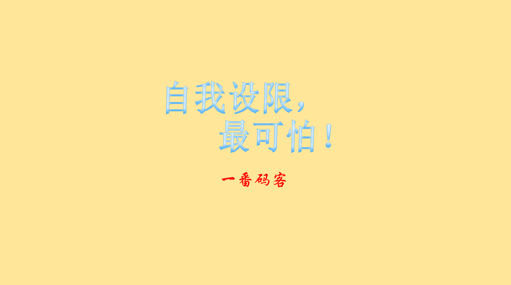
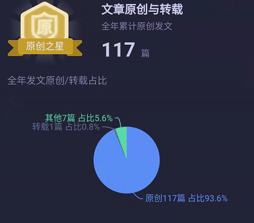
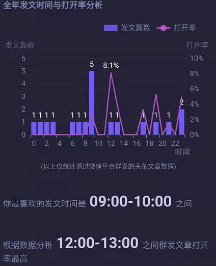

> **一番码客 : 挖掘你关心的亮点。**
> **http://efonfighting.imwork.net**

本文目录：

[TOC]

<!--more-->

## 2019发文回顾

今天12月29号了，2019马上就要结束了。一番生成了今年公众号的年报，这里稍稍回顾下今年的发文。

从九月份开始持续原创，一共原创117篇了。虽然一番原创的质量不及做得早的大佬，但一番从原创的过程中收获了不少成就感和认知提升，坚持原创也是自力更生。

因为一番都是早起写文，所以发文基本都是在早上。但从“壹伴”的数据统计来看，中午时间段大家打开的频率会更高一些。看来一番的发文时间还可以改一改，改到中午1点前。

## 自我设限

因为一番是个程序猿，由于惯性思维，一番的公众号一直是分享程序猿相关的。

我们一方面忍受着程序猿996的苦逼，一方面自我设限，觉得做其他很难，自己只能做程序，内心OS往往是，“卖不了货、推销不了产品、运营好丢脸。做XX那么容易了，大家不都去了，肯定不好做，放弃吧”。

自我设限，实际是一种认知设限。认知设限，便是限制了我们自身发展的多种可能性和选择性。

我们不愿踏出自己的认知区，强行将自己认知以外的陌生领域用自己的认知来解释，这是一种认知设限。衣食住行是人的基本物质基础，也是社会运转的核心，职业不分贵贱，分工不同而已。

突破自我设限的最好方法便是模仿、学习、反思、改进。

> 一番雾语：这是一个最好的时代，一个包容的时代。

------

> **免费知识星球： [一番码客-积累交流](http://efonfighting.imwork.net/efonmark-blog/%E7%AE%80%E4%BB%8B/zhishixingqiu1.png)**
> **微信公众号：[一番码客](http://efonfighting.imwork.net/efonmark-blog/%E7%AE%80%E4%BB%8B/guanzhu_1.jpg)**
> **微信：[Efon-fighting](http://efonfighting.imwork.net/efonmark-blog/%E7%AE%80%E4%BB%8B/weixin.jpg)**
> **网站： [http://efonfighting.imwork.net](http://efonfighting.imwork.net)**
