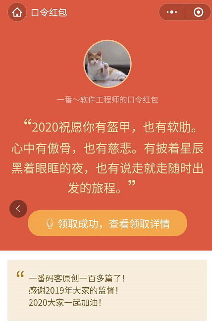
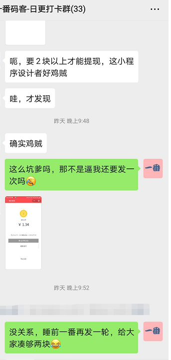
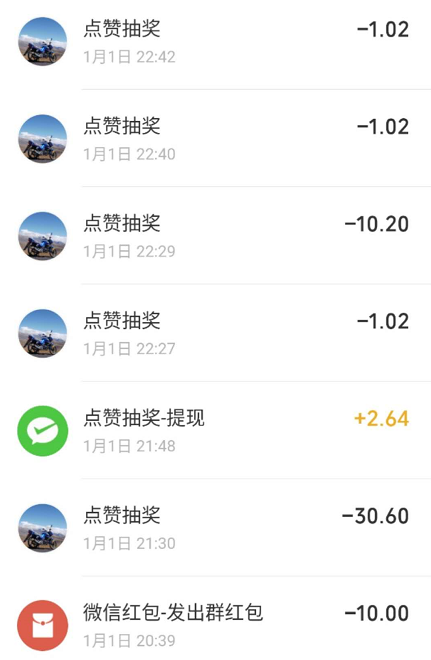

> **一番码客 : 挖掘你关心的亮点。**
> **http://efonfighting.imwork.net**

本文目录：

[TOC]

<!--more-->

## 为什么

昨天是新年第一天，在一番的日更打卡群里，一番照例给大家送上节假日的祝福，感谢大家过去的时间里的陪伴与监督。

一番写公众号以来，一直没有建立微信讨论群，因为维护一个群就像维护一个小的团体，怎么活跃不死群，建立什么样的群规等等，要想维护好，还是比较费时费力的。

一番建立日更打卡群的初衷，是一番定了一个连续原创日更300天的计划，希望通过这种方式反向监督一番日更。如果哪天一番没有完成日更，那必须在群里发100元红包惩罚。保持原创日更，也是保持持续进步，或快活慢。

一个人走的快，一群人走得远。

**关于群的维护，其实一番规则很简单：**

* 300天原创日更里，断更一天，发100元红包。
* 节假日问候，不定额红包感谢。

## 回顾

一番昨日为了活跃下气氛，把简单的发红包改成了口令红包，用慢慢的正能量的方式来领取，还是蛮有趣的。

> 2020祝愿你有盔甲，也有软肋。心中有傲骨，也有慈悲。有披着星辰黑着眼眶的夜，也有说走就走随时出发的旅程。

这些2019的一番好像也都有了，哈哈。。。

一轮下来小伙伴们收获还可以。

但接下来问题来了，有朋友说要满两元才能提现。

这么坑爹？小程序设计者真的不够良心啊，除了要收2%的手续费，还要满两元提现。一番差点就想自己开发一个了（算了算了，估计难度还是偏大😂）。

为了达到真实感谢的目的，一番不多不又发了几轮，让大家满足提现要求。最终的情况是零钱包急剧缩水啊。

能给监督陪伴一番日更的小伙伴带来一点趣味，本身也是有趣和值得的。

## 最后

后面一番除了每日日更，每日还会做这些事：

* 早起在群里和朋友圈发一句打卡语；
* 日更完成后发链接在群里；

希望更多的小伙伴加入，我们一起交流进步，一起养成好习惯。

> 一番雾语：2020祝愿你有盔甲，也有软肋。心中有傲骨，也有慈悲。有披着星辰黑着眼眶的夜，也有说走就走随时出发的旅程。

------

> **免费知识星球： [一番码客-积累交流](http://efonfighting.imwork.net/efonmark-blog/%E7%AE%80%E4%BB%8B/zhishixingqiu1.png)**
> **微信公众号：[一番码客](http://efonfighting.imwork.net/efonmark-blog/%E7%AE%80%E4%BB%8B/guanzhu_1.jpg)**
> **微信：[Efon-fighting](http://efonfighting.imwork.net/efonmark-blog/%E7%AE%80%E4%BB%8B/weixin.jpg)**
> **网站： [http://efonfighting.imwork.net](http://efonfighting.imwork.net)**
