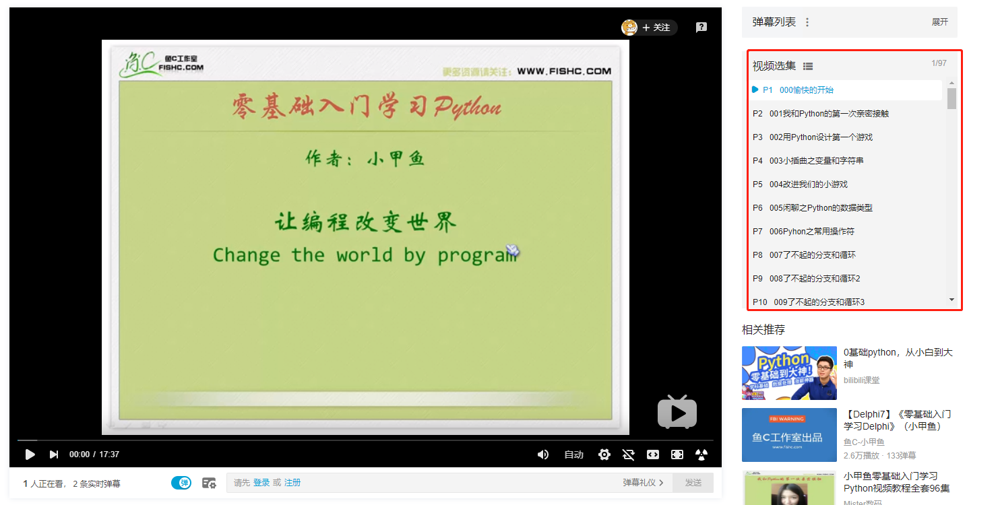

> **一番码客 : 挖掘你关心的亮点。**
> **http://www.efonmark.com**

本文目录：

[TOC]

<!--more-->

## 前言

生活总是充满希望，充满惊喜。

今天有一位小伙伴让我教他下载公众号，因为没有基础，我推荐了之前一番看过的一个python系列视频课程。

之前一番是在C站看的免费视频，但今天一番去看，没有了。于是一番度娘了一番，在这个过程中遇到了一个视频。

给人耳目一新，如果能遇到这样一群人，带着极客精神，为解决问题而工作，这真是非常棒的一件事。

**不为物所累，不为境所役。**这里推荐给大家。

<video src="2020-01-20-不要成为一名程序员！/为何不要成为一名程序员.mp4" controls="controls">
</video>

## 关于学习

我们知道，每个人的时间是有限的，精力也是有限的。

这也是我们为什么总是只能与自己同等级别的人对上话的原因——大家都需要与向更优秀的人学习，与自己水平相当的讨论可以产生共鸣，触发"跳一跳"能够得着的灵感。

当我们试图去学习一门技能、提升一方修养时，不要试图让大牛一直陪着你，而是应该靠自己，找途径，找方法，去执行，去坚持。大牛指点是修养，不指点才是常理。

自然生存法则：自力更生，才能丰衣足食。普通人如此，大牛也是如此。

当然，三人行，必有我师。每个人都有我们值得学习的地方，但学习什么，还在于每个人自己的选择。

## python小白入门视频教程

这里给想要学习python的朋友推荐一个非常适合小白入门的免费视频教程。

一番只在b站找到了完整版本：『https://www.bilibili.com/video/av49408698』。

> 一番雾语：
>
> 不要成为一名程序员，成为一个问题解决者！
>
> Don't be a programmer, be a problem solver！

------

<table>
<tr>
<td >

</td>
<td width="50%" align=left><b>
    免费知识星球：<a href="http://www.efonmark.com/efonmark-blog/readme/zhishixingqiu1.png">一番码客-积累交流</a> 
    微信公众号：<a href="http://www.efonmark.com/efonmark-blog/readme/guanzhu_1.jpg">一番码客</a> 
    微信：<a href="http://www.efonmark.com/efonmark-blog/readme/weixin.jpg">Efon-fighting</a> 
    网站：<a href="http://www.efonmark.com">http://www.efonmark.com</a> </b></td>
</tr>
</table>