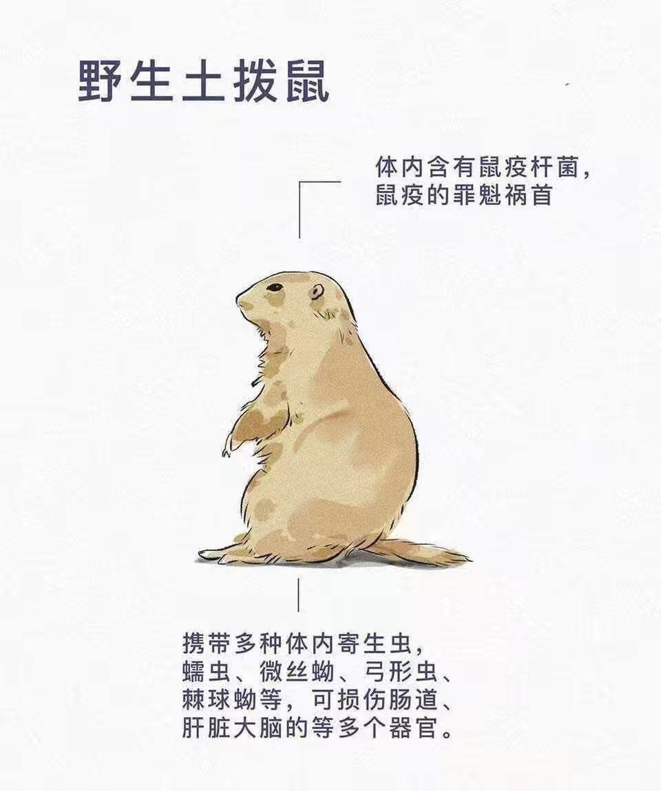
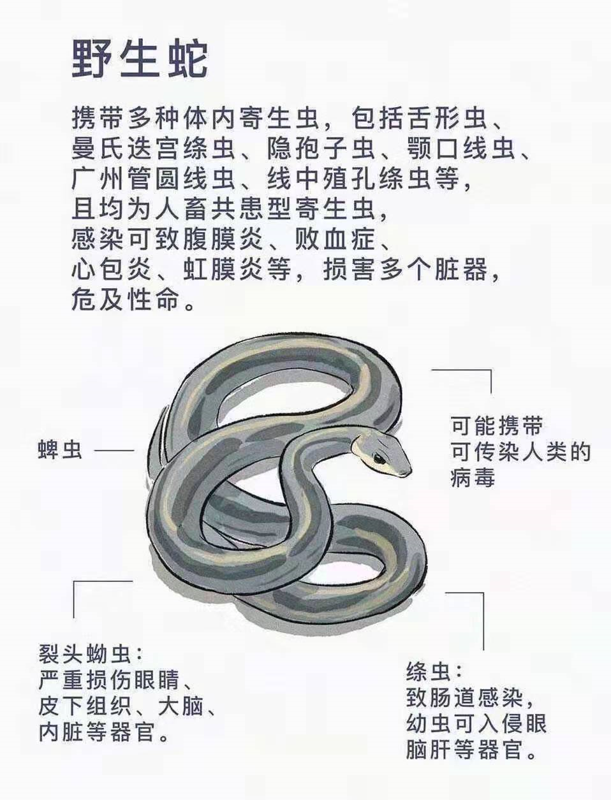
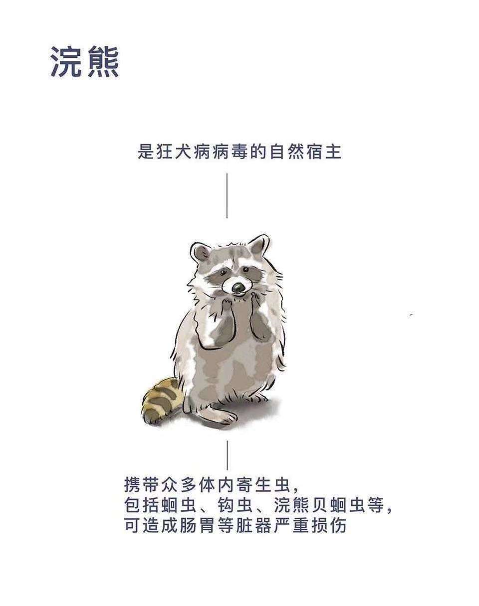
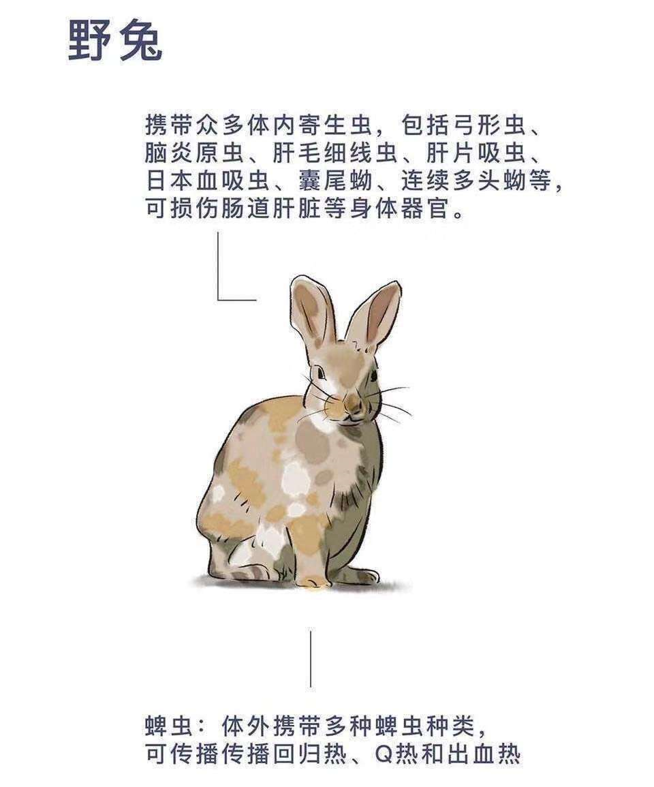
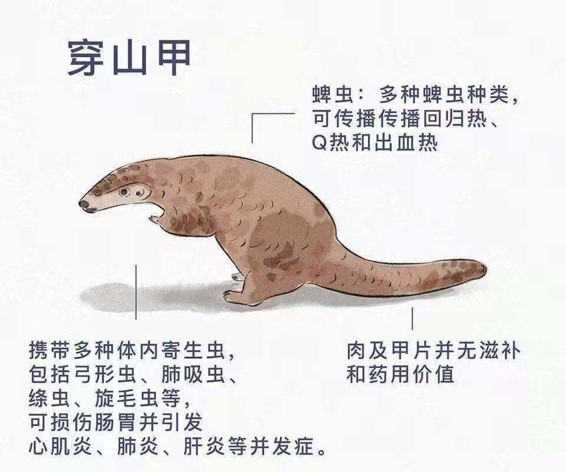
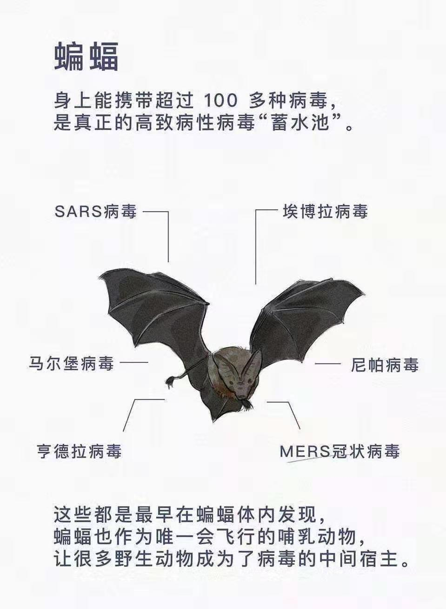

> **一番码客 : 挖掘你关心的亮点。**
> **http://efonfighting.imwork.net**

本文目录：

[TOC]

<!--more-->

## 今日一番

今天大年初一，应该是一番日更以来更新最晚的一篇文章了。

随着武汉疫情的发展，大家都紧张了起来。因为马上要到返程期了，很多人提前终止了假期，聚会也没有了。毕竟身体是革命的本钱，对自己负责，也对别人负责。留的青山在，来日方长。

很多地方口罩已经卖断货了，有货的地方也是有所涨价。

这次疫情的来源是野生动物。人们为了自己的口腹之欲，生出了祸端。口腹之欲，吃完也就过去了，吃大米饭一样可以果腹。欲望还是要节制。

## 野生动物病菌

## 口罩购买链接

因为很多地方已经买不到口罩了，这里一番找到了四款**京东自营**的口罩，一番自己也买了。

说是春节也配送，但可能配送时间稍长。总比买不到要好。
①『https://u.jd.com/UyN9yt』
②『https://u.jd.com/nX4luC』
③『https://u.jd.com/BuJoUG』
④『https://u.jd.com/wydRrq』

> 一番雾语：
>
> 走走停停，忙忙碌碌。

------

<table>
<tr>
<td >

</td>
<td width="50%" align=left><b>
    免费知识星球：<a href="http://efonfighting.imwork.net/efonmark-blog/%E7%AE%80%E4%BB%8B/zhishixingqiu1.png">一番码客-积累交流</a> 
    微信公众号：<a href="http://efonfighting.imwork.net/efonmark-blog/%E7%AE%80%E4%BB%8B/guanzhu_1.jpg">一番码客</a> 
    微信：<a href="http://efonfighting.imwork.net/efonmark-blog/%E7%AE%80%E4%BB%8B/weixin.jpg">Efon-fighting</a> 
    网站：<a href="http://efonfighting.imwork.net">http://efonfighting.imwork.net</a> </b></td>
</tr>
</table>