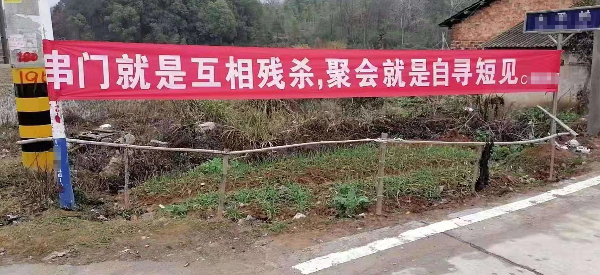
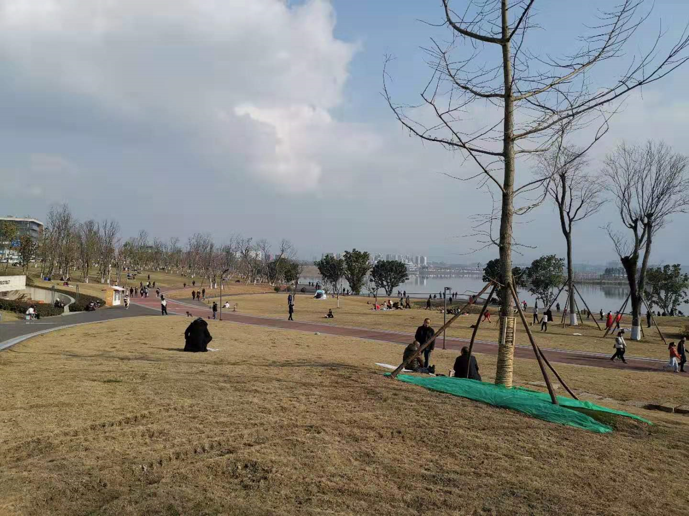
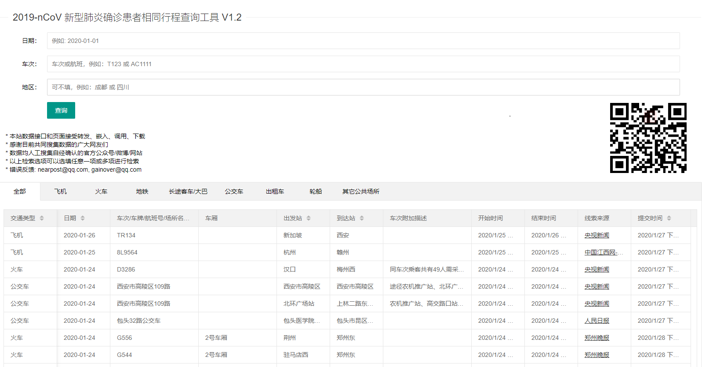
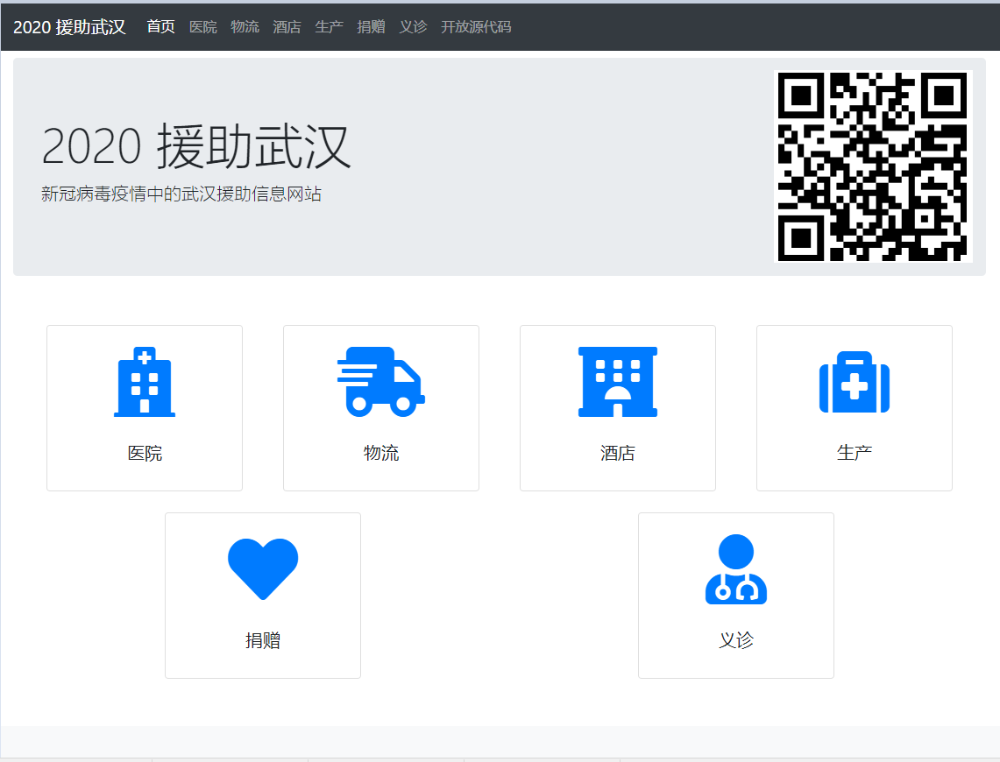

> **一番码客 : 挖掘你关心的亮点。**
> **http://www.efonmark.com**

本文目录：

[TOC]

<!--more-->

## 今日一番

这次疫情国家和人们都空前的重视，不管怎么样，小心驶得万年船，小心一点，没有什么坏处。

今天成都迎来来许久不见的阳光，天气非常好，可以想象，在长时间的宅生活过后，人们多么希望出去走走。

一番今天也带着一家人出去公园走了走，本想开车走远一点大一点的公园，应该人不多了吧。

然而，成都人民显然是“懂得科学”的，在空旷的公园里，大家隔远一点，加上太阳的紫外线，传染概率应该没那么大吧。管他呢，生活重要。

* 车都停满了：

> 

* 看看这人口密度：

> 

* 休闲生活：

> 

* 麻将不能少啊：

> 

## 行动中的程序员

* 新型肺炎确诊患者相同行程查询工具：『http://2019ncov.nosugartech.com/』

> 其实这些数据网上都有，但这个作者能在短时间内写出这个应用，而且布局还不错，还是比较专业的。可惜一番还在学习中，希望后面也能短时间内开发出这种工具。

* 武汉新型冠状病毒防疫信息收集平台：『https://github.com/wuhan2020/wuhan2020』

> 现在基本每次公共事件在程序员界都有github的身影，这个作者的开源项目做的也非常专业，协同流程也做的很好，登上了github趋势榜。其实这也是一个信息整合、收集的工具。
>
> 

## 宅生活娱乐资源

Netflix六集的纪录片：《流行病：如何预防大型传染病》（Pandemic: How to Prevent an Outbreak）。

百度网盘：『https://pan.baidu.com/s/1eM4ckx_Hj5gFPApOIzH2gQ#/ 』提取码：yjnb 。

## 互联网公司跳槽指南

> 部分素材源于网络，版权归原作者所有
>
> 如有侵权请留言联系删除，感谢合作

> 一番雾语：
>
> 快快学好前端，打造自己的好玩好工具。

------

<table>
<tr>
<td >

</td>
<td width="50%" align=left><b>
    免费知识星球：<a href="http://www.efonmark.com/efonmark-blog/readme/zhishixingqiu1.png">一番码客-积累交流</a> 
    微信公众号：<a href="http://www.efonmark.com/efonmark-blog/readme/guanzhu_1.jpg">一番码客</a> 
    微信：<a href="http://www.efonmark.com/efonmark-blog/readme/weixin.jpg">Efon-fighting</a> 
    网站：<a href="http://www.efonmark.com">http://www.efonmark.com</a> </b></td>
</tr>
</table>