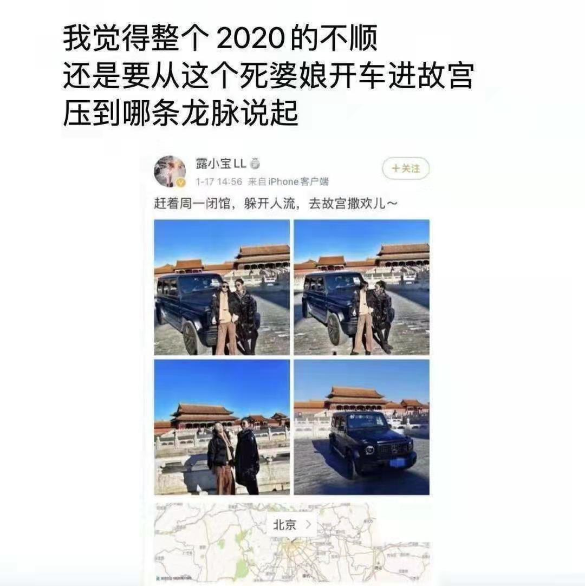
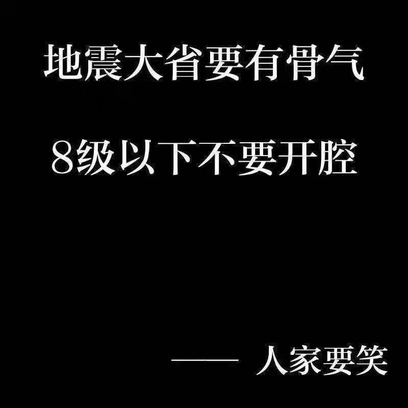
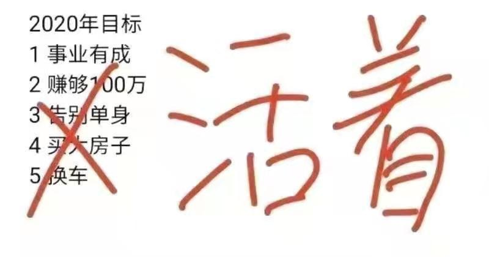
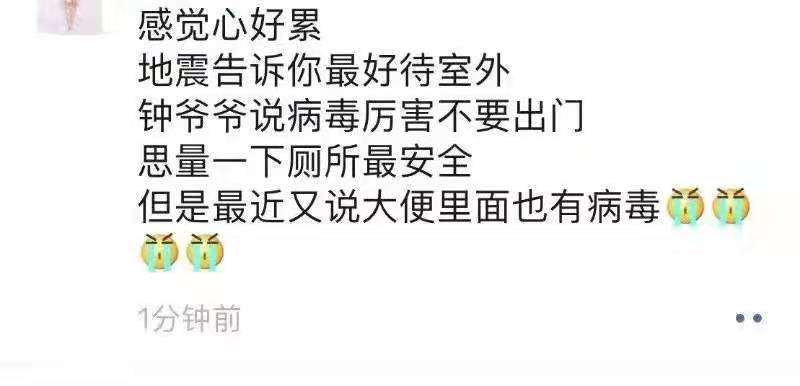
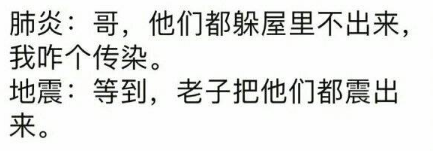
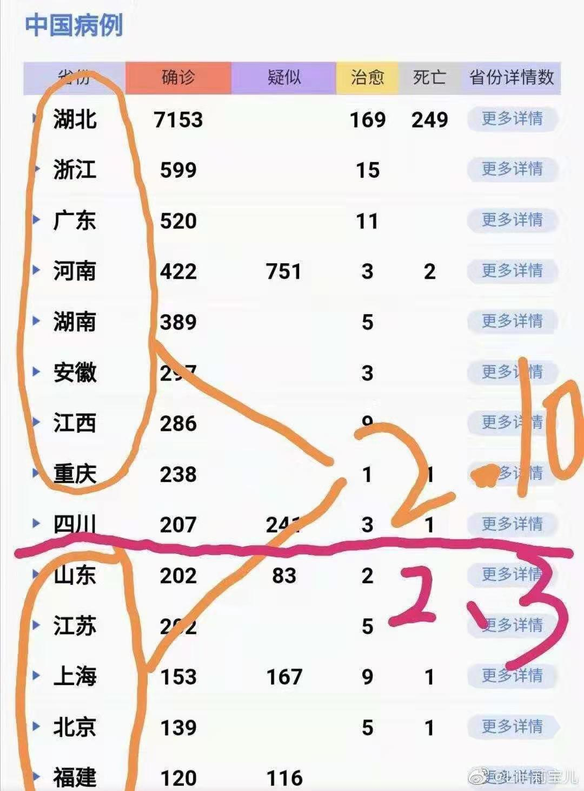
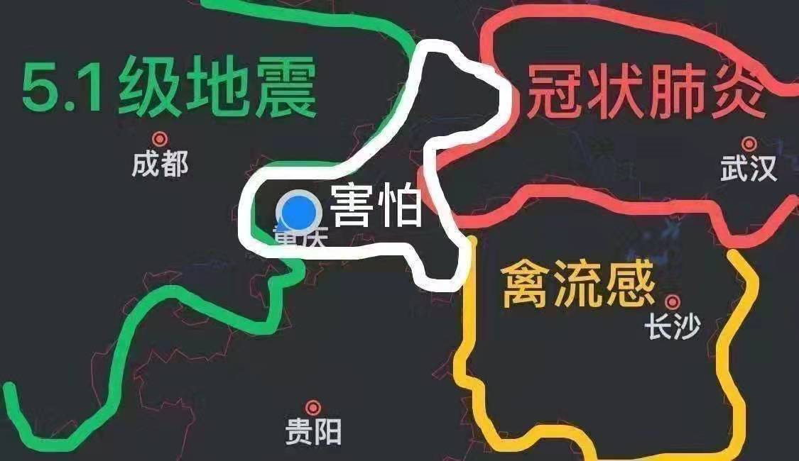
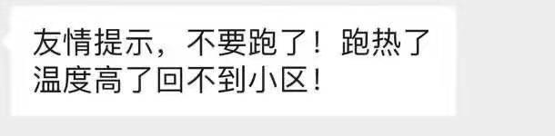
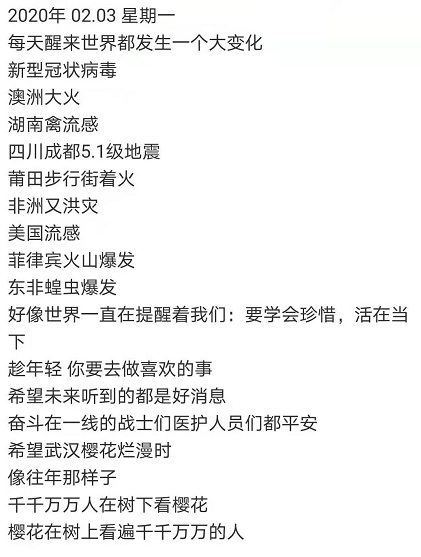

> **一番码客 : 挖掘你关心的亮点。**
> **http://www.efonmark.com**

本文目录：

[TOC]

<!--more-->

## 前言

今天就要正式上班了，虽然很多是远程办公，大家还是要防护好自己，不给前线战斗的战士们增添麻烦。

就在昨晚一番发完文章不久，成都市青白江区又发生了5.1级地震。说实话，每年小地震好几次，这次是时间比较久，震感比较强烈的，因为震源就在成都嘛。

但一番和家人也没有跑，13楼啊，跑也跑不赢，呆在家里是最安全的。实在凶了，厕所找个角落躲起来。

按照惯例，朋友圈里应该大家开始发段子了，今天我们一起来看看地震的时候，作为地震大省，大家都在朋友圈干什么。

## 朋友圈

* > 地震时况~

* > 2020年的不顺，要从这里说起~

* > 地震大省要有骨气，8级一下不要开腔，人家要笑~

* > 地震了要不要出门😂~

* > 2020年，活着就好~

* > 厕所都不安全，无处可逃啊~

* > 地震：四川我是老大，病毒你算老几？

* > 肺炎：哥，他们都躲屋里不出来，我咋个传染？
    >
    > 地震：等到，老子把他们都震出来。

* > 这就是在提醒四川省政府，2.3真的不适合上班。

* > 重庆在中间瑟瑟发抖~

* > 友情提示，不要跑了！跑热了温度高了回不到小区！

* > 真是糟糕的一年，是吧？
    >
    > 不，才二月份。

* > 2020，请珍惜自己，珍惜身边的每一位人~
    >
    > 武汉加油！待到樱花烂漫时，春暖花开~

> 一番雾语：
>
> 武汉加油！待到樱花烂漫时，春暖花开~

------

<table>
<tr>
<td >

</td>
<td width="50%" align=left><b>
    免费知识星球：<a href="http://www.efonmark.com/efonmark-blog/readme/zhishixingqiu1.png">一番码客-积累交流</a> 
    微信公众号：<a href="http://www.efonmark.com/efonmark-blog/readme/guanzhu_1.jpg">一番码客</a> 
    微信：<a href="http://www.efonmark.com/efonmark-blog/readme/weixin.jpg">Efon-fighting</a> 
    网站：<a href="http://www.efonmark.com">http://www.efonmark.com</a> </b></td>
</tr>
</table>