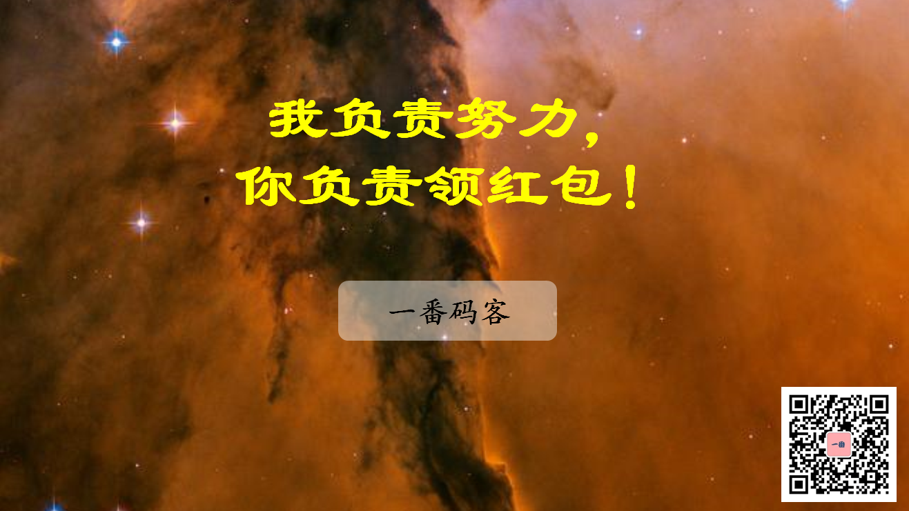
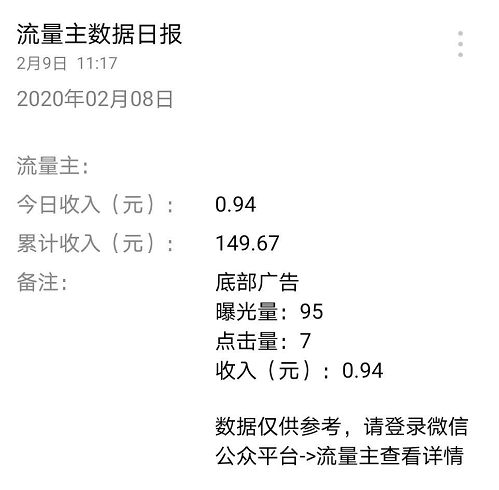

> **一番码客 : 挖掘你关心的亮点。**
> **www.efonmark.com**

本文目录：

[TOC]

<!--more-->

## 前言

昨天一番发了《日更152天，一夜回到解放前》的文章，里面除了说在群里兑现断更红包之外，还在里面跟大家分享了一番为什么开通流量主，以及开通以来的流量主营收情况。而且还提了下怎么反馈更多福利给朋友们，今天效果还不错。

结果这么一分析下来，一番倒是想到了一个很好的反馈读者的方法。

大家也知道，为了感谢读者监督，反馈给读者福利，一番立下**日更300天、断更一天在日更群里发100元红包**的规则。但直到第150天的一次意外出现之前，其实一番一直没有给大家机会😂。所以除了一番逢年过节发的红包之外，小伙伴们并没有获得太多实际的福利。

那么刚好一番开通了流量主，可以有广告收入，为什么不把这个广告收入拿出来反馈给读者呢？

bingo~，这个想法非常棒，这样就像是公司把股份分给员工，让大家觉得也是一个参与者，有所反馈。

**到目前为止，一番好像还没有遇到哪个公众号这么宠读者的**😀。

## 进群方式

扫码添加一番微信，通过后回复“打卡群”，一番拉你入群。

## 规则

所以这里，一番重新整理一下**『一番码客-日更打卡群』的规则**：

* **群用途：**①一番码客日更监督；②读者福利发放；③读者日常交流、闲谈。
* **群管理：**为了方便管理，尽量不要推送聊天内容无关或者其他带有广告性质的内容，转群专用，如果有其他需求，大家需求比较大了，一番可以单独拉个群。
* **福利一：**300天里，一番断更1天发100元红包，这个规则保持。
* **福利二：**所有流量主广告收入，反馈给『一番码客』公众号的读者。反馈方式为，**每周周日12点**（定好闹钟😁），本周流量主收入发放随机红包的方式，发送到群里。
* **运行时间：**暂定2020年7月6日前，也就是一番日更300天结束的时候。如果效果佳，读者朋友们满意，会将这个机制持续下去。
* **定期清理：**对于进了群，没有关注『一番码客』的朋友，为了维护群友一起努力的成果，这部分朋友需要退群哦。

## 其他

一番通过这个方式把福利反馈给亲爱的读者朋友们，也让读者朋友们有所收获，大家一起进步，真是一件很酷的事情。

当然，一番的重心还是在多多反思总结，提升自我认知，提高文章质量。关注的朋友越多，一番的动力也就越足啦。

今天一番在路上思考了一下视频问题，古人说『纸上得来终觉浅，觉知此事要躬行！』。一番想，视频是一个很不错的记录『躬行』的方式，也是一个更立体的表达方式。后面一番更新的内容可能还会考虑有一些视频的方式。毕竟现代社会，音视频已经是文化、思想的重要载体，也不存在保存和传播的问题。

**所以，为了让大家有更多的收获，欢迎大家带上更多小伙伴关注『一番码客』，除了看开心了的时候"在看"、“转发”、“广告点击”一条龙之外，记得每天看了文章之后，顺手点击文末小广告😁。**

> 一番雾语：
>
> 希望大家在一番码客同时收获知识和财富的双重进步，哈哈哈~

------

<table>
<tr>
<td >

</td>
<td width="50%" align=left><b>
    免费知识星球：<a href="http://www.efonmark.com/efonmark-blog/readme/zhishixingqiu1.png">一番码客-积累交流</a> 
    微信公众号：<a href="http://www.efonmark.com/efonmark-blog/readme/guanzhu_1.jpg">一番码客</a> 
    微信：<a href="http://www.efonmark.com/efonmark-blog/readme/weixin.jpg">Efon-fighting</a> 
    网站：<a href="http://www.efonmark.com">http://www.efonmark.com</a> </b></td>
</tr>
</table>