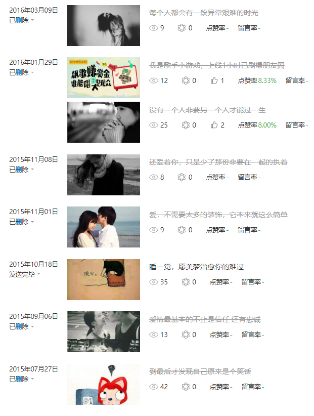
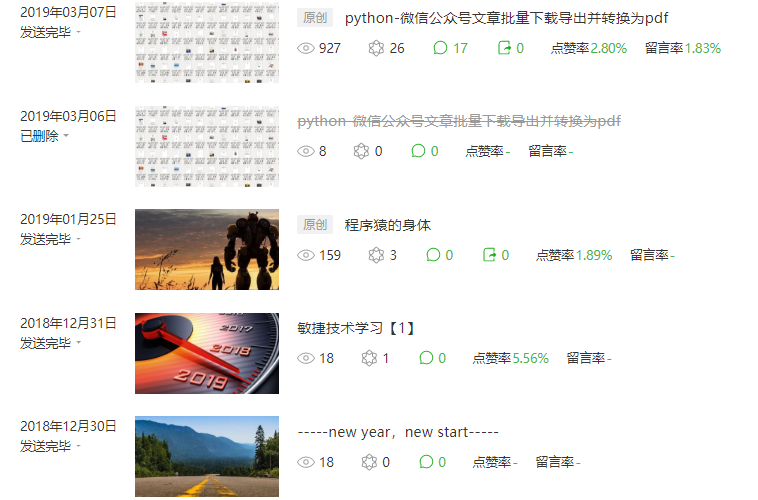
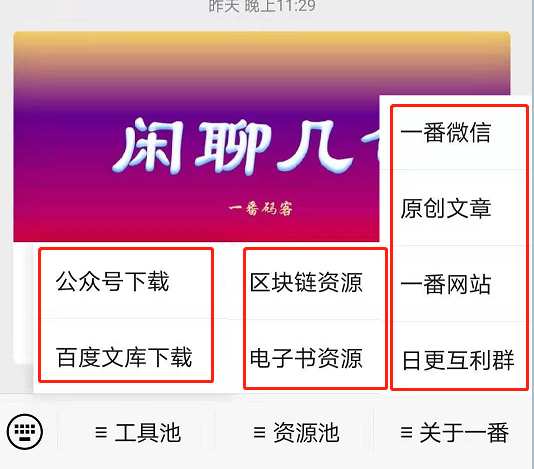
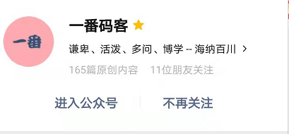

> **一番码客 : 挖掘你关心的亮点。**
> **www.efonmark.com**

本文目录：

[TOC]

<!--more-->

## 前言

这几天都是写的非技术类的文章，不满足于过去平淡的技术文章，一番这几天思考更多的是公众号的定位和发展问题。今天一番来回顾下一番做公众号以来的前因和发展。

## 一番码客的开端

一番12年刚工作的时候，微信、微信公众号也就刚出来不久，那时候就有一个一番的好朋友就开始做公众号了，应该是专门接广告打广告什么的，而且还借了我的身份证和手持照去注册了两个公众号。

那时，没经验、没技术的一番对未来一片迷茫，一心想着怎么提升技术，如何发展好自己的工作，对这些几乎是一窍不通。

过了几年，一番工作、技术有了一定积累后，开始思考怎么持续进步、拓宽视野、增强职业抗风险能力，于是想到了做公众号，可以通过分享技术扩大技术影响力、接触更多人、学习一些运营技巧、锻炼书面表达能力。然后一番就找朋友要回了公众号，其实过了疯狂扩张期的公众号，没有干货和持续运营就没有任何价值，朋友早就没有维护了。

一番拿到两个公众号后，一看两个，也用不了那么多啊，于是一番憨憨的注销了一个，留下了现在这个公众号。后来知道新注册的公众号没有了留言功能，现在一个有留言功能的公众号都价值2k+，一番真是真是后悔莫及。

好了，一番就开始了公众号的运营之路，初衷也就是想当写博客一样，给自己开一扇向外展示的窗。

后来陆陆续续在公众号上分享了一些微信公众号文章下载的技术文章，并且靠这个获得了第一批的读者。

到后来一番维护这个开源项目遇到了一些技术瓶颈、工作也异常的忙碌，所以断更了很久，直到后来一番决定日更300天。

## 一番码客的现在

现在想来，日更以来，其实文章质量确实如预料一样不高，也没有因为这些文章而收获更多读者。但一番还是从中收获了写文的进步、技术的进步、运营的进步和文章内容的沉淀。这些文章就像是第一桶金，是一张互联网IP的基本的入场券。

其实从文章内容来讲，原创有165篇了，一番身为一名智能硬件驱动开发工程师，与一番本职工作相关的内容不超过10篇。里面有了一些资源、一些服务，还有了我们的读者福利反馈方式。

但现在一番码客的定位还是不明确，更多的是分享技术、分享感悟。

## 一番码客的未来

一番码客还需要一些时间积累沉淀。希望在一番完成300天日更之后，沉淀出足够的前端技术，沉淀出更好的运营方式，沉淀出更好的服务型产品。

一番码客后面的日更的方向，大概有三个：

①推出更多更实用的有自主技术积累的软件小工具，就像之前的公众号下载工具、番茄时钟；

②分享更多python、js、前端相关的技术、实用代码；

③分享更多更好的互联网赚钱项目。

> 一番雾语：
>
> 回顾过去，认清现在，展望未来。

------

<table>
<tr>
<td >

</td>
<td width="50%" align=left><b>
    免费知识星球：<a href="http://www.efonmark.com/efonmark-blog/readme/zhishixingqiu1.png">一番码客-积累交流</a> 
    微信公众号：<a href="http://www.efonmark.com/efonmark-blog/readme/guanzhu_1.jpg">一番码客</a> 
    微信：<a href="http://www.efonmark.com/efonmark-blog/readme/weixin.jpg">Efon-fighting</a> 
    网站：<a href="http://www.efonmark.com">http://www.efonmark.com</a> </b></td>
</tr>
</table>